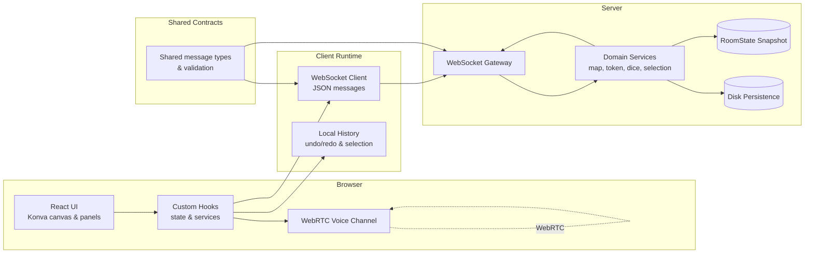

<div align="center">
  

# HeroByte

[](https://github.com/loshunter/HeroByte/actions/workflows/ci.yml)
[](https://app.codecov.io/gh/loshunter/HeroByte/tree/dev)
[](LICENSE)

**A retro-inspired virtual tabletop for epic adventures online**

> **🚧 BETA STATUS (v0.9.0-beta.1)**: HeroByte is feature-complete for live playtesting but not production-hardened. Core features are stable with 80%+ test coverage, but authentication and some polish items are still in development. Perfect for private game nights—expect occasional rough edges!

</div>

HeroByte is a retro-inspired virtual tabletop that brings 16-bit RPG nostalgia to modern online play—roll dice, move tokens, and tell stories together in your browser.

<!--
TODO: Add screenshot or GIF here after running a session with art assets
Example format:
<div align="center">
  
</div>
-->

**📚 Quick Navigation:** [Quick Start](#-quick-start) • [Features](#-features) • [Testing](#-testing) • [How to Play](#-how-to-play) • [Architecture](#%EF%B8%8F-architecture) • [Roadmap](TODO.md) • [Contributing](#-contributing)

---

## 🚀 Quick Start

```bash
./dev-start.sh
# Frontend: http://localhost:5173
# Backend: http://localhost:8787
```

**Prerequisites:** Node.js 18+ • pnpm 8+

<details>
<summary>📦 Full Installation & Setup Guide</summary>

### Installation

```bash
# Install dependencies
pnpm install
```

### Running Locally

**Recommended: One-Command Start**

```bash
# From project root - handles cleanup, build, and startup automatically
./dev-start.sh
```

This script cleans up stuck processes, builds the backend, and starts both servers in the correct order.

**Access the Application:**

- **Frontend:** http://localhost:5173
- **Backend:** http://localhost:8787
- **Default Room Password:** `Fun1` (change via DM Menu → Session → Room Security)
- **Default DM Password:** `FunDM` (use to elevate to Dungeon Master role)

**Alternative: Manual Start**

```bash
# Terminal 1: Start the backend
pnpm dev:server

# Terminal 2: Start the frontend
pnpm dev:client
```

**Port Issues?**

If you get "port already in use" errors:

```bash
./kill-ports.sh  # Cleans up stuck processes
```

See [PORT_MANAGEMENT.md](PORT_MANAGEMENT.md) for detailed troubleshooting.

### Network Access

To use on your local network:

- Find your IP address (e.g. `192.168.x.x`)
- Access at: `http://YOUR_IP:5173`
- The server automatically listens on all interfaces

### Security Configuration

Set environment variables in `.env`:

```bash
HEROBYTE_ROOM_SECRET="your-secure-room-password"
HEROBYTE_DM_PASSWORD="your-secure-dm-password"
HEROBYTE_ALLOWED_ORIGINS="https://yourdomain.com,https://staging.yourdomain.com"
```

- `HEROBYTE_ROOM_SECRET` – Override development fallback room password (`Fun1`)
- `HEROBYTE_DM_PASSWORD` – Override development fallback DM password (`FunDM`)
- `HEROBYTE_ALLOWED_ORIGINS` – Restrict HTTP/WebSocket origins (comma-separated)

### Common Scripts

| Command              | Description                                    |
| -------------------- | ---------------------------------------------- |
| `pnpm dev`           | Run client and server concurrently             |
| `pnpm dev:server`    | Start server in watch mode                     |
| `pnpm dev:client`    | Start client in watch mode                     |
| `pnpm build`         | Build both server and client bundles           |
| `pnpm test`          | Run full test suite (352 tests)                |
| `pnpm test:e2e`      | Run Playwright E2E tests (auto-starts servers) |
| `pnpm test:shared`   | Execute unit tests for shared domain models    |
| `pnpm test:coverage` | Generate coverage reports for all packages     |

### Troubleshooting

- **Dev server says port 5173 is busy** – Run `./kill-ports.sh` (or `./kill-client-port.bat` on Windows)
- **WebSocket refuses connections** – Confirm backend is running on `http://localhost:8787`
- **Voice chat fails in Chrome** – WebRTC requires secure origins; use `https://` (Cloudflare tunnel, `mkcert`, or hosted demo)
- **Tests fail with missing state file** – Delete `apps/server/herobyte-state.json` and re-run `pnpm test`
- **"Room secret not set" warning** – Set `HEROBYTE_ROOM_SECRET` in `.env`
- **Map images don't load (CORS errors)** – Use CORS-friendly hosting like Discord CDN, Imgur, or Cloudinary

</details>

---

## ✨ Features

### 🧠 Real-Time Multiplayer

- **WebSocket Synchronization** – All player actions sync in real-time with server-side validation
- **Persistent State** – Sessions auto-save to disk and restore on server restart
- **Rate Limiting** – 100 messages/second per client with token bucket algorithm
- **Session Management** – Heartbeat system prevents client timeouts
- **Error Resilience** – Error boundary component with graceful error handling and recovery options

### 🗺️ Interactive Map Canvas

- **Infinite Canvas** – Pan, zoom, and smooth interactions with performance optimization
- **Universal Transform System** – Photoshop-style gizmo for maps, tokens, and drawings
  - Click any object to select and show 8 resize handles (4 corners, 4 edges)
  - Drag rotation handle with 45° snap increments
  - Lock/unlock objects to prevent accidental changes
- **Token Management** – Drag-and-drop tokens with 6 size variants (tiny to gargantuan)
- **Grid System** – Adjustable grid (10-500px) with snap-to-grid and lock functionality

### 🎲 Dice & Combat

- **Visual Dice Roller** – Interactive dice interface with animated roll results
- **Multi-die Support** – Roll d4, d6, d8, d10, d12, d20, d100 with modifiers
- **Roll History** – Shared log with timestamps, player names, and expandable formulas
- **HP Tracking** – Real-time hit point management with visual indicators

### 🎨 Drawing & Visual Tools

- **Advanced Drawing** – Freehand pen, line, rectangle, circle, and eraser
- **Full Customization** – Adjustable color, width, opacity, and fill options
- **Undo/Redo** – Drawing history with keyboard shortcuts (Ctrl+Z)
- **Measure Tool** – Distance measurement between two points
- **Pointer Mode** – Temporary visual indicators for communication
- **CRT Filter** – Optional retro scanline effect with bloom and chromatic aberration

### 🎧 Voice & Characters

- **WebRTC Voice Chat** – Peer-to-peer voice communication
- **Animated Portraits** – Custom portraits that light up when you talk
- **Character System** – Server-side PC/NPC management with ownership tracking

---

## 🧪 Testing

HeroByte maintains **100% automated testing** with comprehensive coverage across all layers:

### Test Suite Status: ✅ **All Tests Passing**

| Package       | Test Files | Coverage        | Status     |
| ------------- | ---------- | --------------- | ---------- |
| **Shared**    | 3 files    | 99.57%          | ✅ Passing |
| **Server**    | ~50 files  | 80.99%          | ✅ Passing |
| **Client**    | 110 files  | Comprehensive   | ✅ Passing |
| **E2E Suite** | 10 tests   | Full user flows | ✅ Passing |

### Major Testing Achievements

- **Comprehensive Component Coverage** (November 2025) – Added 28,000+ LOC of test coverage across UI components, hooks, and features
- **Complete E2E Automation** (October 2025) – All critical user flows automated, eliminating 30-60 min manual testing workflows
- **CI Optimization** – Memory-optimized test execution with 8GB heap allocation and batched test runs
- **Enhanced Test Infrastructure** – Custom coverage scripts and improved vitest configuration for better reporting
- **10-20x Efficiency Gain** – Full test suite runs in ~3 minutes vs manual testing
- **Zero Regressions** – Systematic fire-and-forget pattern fixes with no breaking changes

### What's Tested

**E2E Coverage** (10 comprehensive tests, ~46 seconds):

- Authentication flow and WebSocket connection
- Drawing tools with persistence through page reload
- Partial erase and drawing segmentation
- Multi-select with marquee selection
- Dice rolling and result display
- Session save/load with DM export
- **Two-browser synchronization** – Real-time WebSocket sync validation
- Voice chat UI and controls
- Reconnection handling and state restoration
- Player state persistence (HP, tokens)

**Unit & Integration** (342 tests):

- Domain model validation (99.57% coverage)
- Server-side services and middleware (80.99% coverage)
- Client hooks and components (76 tests)

### Running Tests

```bash
# Run all tests (352 total, ~3 minutes)
pnpm test

# Run E2E tests only (10 tests, ~46 seconds)
pnpm test:e2e

# Run with coverage reports
pnpm test:coverage

# Run specific package tests
pnpm test:shared    # Domain models
pnpm test:server    # Server logic
pnpm test:client    # Client features
```

<details>
<summary>📖 Testing Documentation</summary>

- [docs/e2e-testing-success.md](docs/e2e-testing-success.md) - Complete E2E automation success story
- [docs/automated-testing-strategy.md](docs/automated-testing-strategy.md) - Testing architecture guide
- [docs/TESTING.md](docs/TESTING.md) - Comprehensive testing guide with Chrome DevTools MCP
- [TESTING_SETUP.md](TESTING_SETUP.md) - Original testing setup guide

</details>

---

## 📖 How to Play

1. **Join a Session** – Each player opens the app in a browser
2. **Set Up the Map** – Load a background image and adjust/lock the grid
3. **Manage Characters** – Update HP, set portraits, link tokens to characters
4. **Move Tokens** – Drag and drop your character around the map
5. **Use Drawing Tools**:
   - **Pointer Mode** 👆 – Place temporary visual indicators
   - **Measure** 📏 – Click two points for distance
   - **Draw Mode** ✏️ – Freehand, shapes, eraser with customization
   - **Select Mode** 🖱️ – Move and delete existing drawings
6. **Roll Dice** – Open dice roller, select dice types, add modifiers, and roll
7. **Voice Chat** – Toggle mic button for live talk with animated portraits
8. **Retro Mode** – Enable CRT filter for that classic arcade feel

---

## 🎮 Controls

### Map Navigation

- **Mouse Wheel** – Zoom in/out
- **Click + Drag** – Pan map canvas
- **Snap to Grid** – Toggle for precision token placement
- **Grid Lock** – Prevent accidental grid adjustments

### Tokens & Objects

| Action              | Control                         |
| ------------------- | ------------------------------- |
| **Move Token**      | Drag token                      |
| **Select Token**    | Click to show transform gizmo   |
| **Scale**           | Drag corner handles             |
| **Rotate**          | Drag rotation handle (45° snap) |
| **Deselect**        | Press ESC                       |
| **Lock/Unlock**     | Token settings menu             |
| **Randomize Color** | Double-click token              |
| **Context Menu**    | Right-click token               |

### Drawing Tools

- **Ctrl+Z / Cmd+Z** – Undo last drawing
- **Drawing Toolbar** – Adjust color, width, opacity, fill
- **Select Mode** – Click drawings to move or delete

### Keyboard Shortcuts

- **ESC** – Deselect active object
- **Ctrl+Z** – Undo last drawing action

---

## 🏗️ Architecture

HeroByte is a monorepo built with **domain-driven design** and strict separation between client, server, and shared contracts.

### Technology Stack

| Layer       | Technology                           | Purpose                            |
| ----------- | ------------------------------------ | ---------------------------------- |
| **Client**  | React 18 + TypeScript + Konva + Vite | UI + Canvas Rendering              |
| **Server**  | Node.js + ws + TypeScript            | Real-time Sync, Validation         |
| **Shared**  | TypeScript                           | Canonical message schemas and DTOs |
| **Testing** | Vitest + Playwright                  | Unit, Integration, E2E             |
| **Voice**   | SimplePeer (WebRTC)                  | Peer-to-peer voice communication   |

### High-Level Flow



### Key Architectural Decisions

- **Domain-Driven Design** – Business logic organized into domain services (Room, Player, Token, Map, Dice, Character)
- **Dependency Injection** – Container pattern for service orchestration
- **Message Validation** – All WebSocket payloads validated against `@shared` schemas
- **Optimistic Updates** – Client predictions confirmed by server (fire-and-forget patterns eliminated)
- **Middleware Pipeline** – Authentication, validation, and rate limiting layers

Contributors should familiarize themselves with the `@shared` schemas first—they define every WebSocket payload, ensuring the client and server stay in lockstep.

<details>
<summary>📁 Project Structure</summary>

```
HeroByte/
├── apps/
│   ├── client/          # React frontend
│   │   └── src/
│   │       ├── features/          # Feature modules (map, dice, drawing)
│   │       ├── hooks/             # Custom React hooks
│   │       ├── services/          # WebSocket, voice chat services
│   │       ├── theme/             # Styling and themes
│   │       └── ui/                # UI components
│   └── server/          # WebSocket server
│       └── src/
│           ├── domains/           # Domain services (Room, Player, Token, Map, Dice, Character)
│           ├── middleware/        # Validation, rate limiting
│           ├── http/              # HTTP routes (health checks)
│           ├── ws/                # WebSocket connection handler
│           ├── container.ts       # Dependency injection container
│           └── index.ts           # Bootstrap layer
├── packages/
│   ├── shared/          # Shared types between client/server
│   └── adapters-net/    # Network adapter
└── package.json
```

</details>

---

## 🤝 Contributing

We welcome pull requests—especially around the CRITICAL items in [TODO.md](TODO.md). Open issues use P0/P1/P2 labels for priority.

### Preferred PR Workflow

1. **Fork and branch** from `dev` (`feature/<short-name>`)
2. **Sync dependencies** (`pnpm install`) and verify environment (`pnpm dev`)
3. **Make focused commits** with clear messages; favor small, reviewable changes
4. **Add/update tests** covering new behavior (`pnpm test` or `pnpm test:<package>`)
5. **Run linting** (`pnpm lint`) to ensure codebase stays warning-free
6. **Update docs** (README/DEVELOPMENT/TESTING) when workflows change
7. **Open PR** against `dev` using template, link relevant TODO items/issues

Before requesting review, double-check CI status locally. Mention uncertainties in PR description.

### Code Standards

- **Conventional Commits** – Use `feat:`, `fix:`, `docs:`, `refactor:`, `test:` prefixes
- **Small PRs** – Prefer <400 LOC changes for faster review
- **Test Coverage** – Maintain 80%+ coverage on new code
- **TypeScript Strict** – No `any` types without justification

### Development Resources

- [DEVELOPMENT.md](DEVELOPMENT.md) – Branching, naming, and feature cadence
- [TESTING_SETUP.md](TESTING_SETUP.md) – Expanding automated coverage
- [PRODUCTION_CHECKLIST.md](PRODUCTION_CHECKLIST.md) – Pre-release validation
- [TODO.md](TODO.md) – Phased roadmap and contributor priorities

**Bug reports** → [GitHub Issues](https://github.com/loshunter/HeroByte/issues)

---

## 📚 Additional Documentation

- **[QUICK_REFERENCE.md](QUICK_REFERENCE.md)** – Common tasks and shortcuts
- **[docs/DEMO_SERVER_WORKFLOW.md](docs/DEMO_SERVER_WORKFLOW.md)** – Managing passwords and sessions for casual games
- **[DEVELOPMENT.md](DEVELOPMENT.md)** – Day-to-day workflow tips
- **[TESTING_SETUP.md](TESTING_SETUP.md)** – Step-by-step testing playbook
- **[docs/LOCAL_SYNC.md](docs/LOCAL_SYNC.md)** – Pull latest Playwright changes into `dev` branch
- **[TODO.md](TODO.md)** – Phased roadmap and contributor priorities
- **[DONE.md](DONE.md)** – Archive of completed phases and milestones
- **[DEPLOYMENT.md](DEPLOYMENT.md)** – Deployment instructions
- **[CLOUDFLARE_PAGES_DEPLOYMENT.md](CLOUDFLARE_PAGES_DEPLOYMENT.md)** – Cloudflare Pages deployment checklist

---

## 📄 License

Released under the [ISC License](LICENSE).

---

<div align="center">

⚡ **HeroByte: Where classic pixels meet modern play.**

Made with ❤️ by [Hunter / ScopicMedia](https://github.com/loshunter)

[Report Bug](https://github.com/loshunter/HeroByte/issues) • [Request Feature](https://github.com/loshunter/HeroByte/discussions) • [View Roadmap](TODO.md)

</div>
