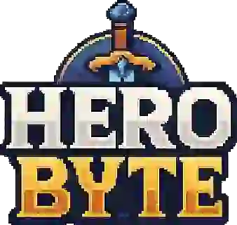

<div align="center">
  

# HeroByte

[](https://github.com/loshunter/HeroByte/actions/workflows/ci.yml)
[](https://app.codecov.io/gh/loshunter/HeroByte/tree/dev)

**A retro-inspired virtual tabletop for epic adventures online**

> **🚧 BETA STATUS (v0.9.0-beta.1)**: HeroByte is feature-complete for live playtesting but not production-hardened. Core features are stable with 80%+ test coverage, but authentication and some polish items are still in development. Perfect for private game nights—expect occasional rough edges!

</div>

HeroByte is a system-agnostic, real-time multiplayer VTT that brings the charm of classic NES/SNES RPGs into the modern web. With pixel menus, voice-synced character portraits, and moddable tools, it's designed for quick setup, smooth play, and endless creativity.

Play anywhere, with anyone—no installs, just browser-based fun. Build your maps, roll your dice, and bring your party together like it's cartridge night all over again.

## Recent Milestones

### Fire-and-Forget Pattern Fixes Complete (2025-01-11)

Eliminated **all 10 fire-and-forget patterns** causing state sync issues where UI actions appeared to do nothing until page refresh. This systematic initiative created **9 new hooks**, modified **30+ files**, and established a proven pattern for all async operations.

**Key Achievements:**

- 100% of identified fire-and-forget patterns addressed (7 HIGH + 3 MEDIUM priority)
- 9 custom hooks created for server-confirmed operations (`useCharacterCreation`, `useDMElevation`, `useInitiativeSetting`, `useNpcDeletion`, `useNpcCreation`, `usePropCreation`, `usePropDeletion`, `useNpcUpdate`, `usePropUpdate`, `useNpcTokenPlacement`)
- Consistent loading states and error handling across all user-facing async operations
- Professional UX with clear feedback ("Creating...", "Updating...", "Deleting...", etc.)
- Zero regressions introduced across all phases
- Pattern established for future async operations

See [CURRENT_WORK.md](CURRENT_WORK.md) and [DONE.md](DONE.md) for complete phase-by-phase documentation.

### App.tsx Refactoring Complete (2025-10-20)

Successfully reduced App.tsx from **1,850 to 519 LOC** (-72% reduction). This major refactoring initiative extracted **29 modules**, added **616 tests**, and achieved **SOLID compliance**. The application is now more maintainable, testable, and aligned with professional engineering standards.

**Key Achievements:**

- 29 custom hooks and services extracted from monolithic component
- 616 new tests added (100% coverage on extracted modules)
- SOLID principles applied throughout architecture
- Comprehensive documentation in `docs/refactoring/`

See [docs/refactoring/](docs/refactoring/) for detailed refactoring documentation, metrics, and methodology.

## Quick Links

- [QUICK_REFERENCE.md](QUICK_REFERENCE.md) – **⚡ common tasks and shortcuts**
- [docs/DEMO_SERVER_WORKFLOW.md](docs/DEMO_SERVER_WORKFLOW.md) – managing passwords and sessions for casual games
- [DEVELOPMENT.md](DEVELOPMENT.md) – day-to-day workflow tips
- [TESTING_SETUP.md](TESTING_SETUP.md) – step-by-step testing playbook
- [docs/LOCAL_SYNC.md](docs/LOCAL_SYNC.md) – pull the latest Playwright changes into your `dev` branch
- [TODO.md](TODO.md) – phased roadmap and contributor priorities
- [DONE.md](DONE.md) – archive of completed phases and milestones
- [CLOUDFLARE_PAGES_DEPLOYMENT.md](CLOUDFLARE_PAGES_DEPLOYMENT.md) – deployment checklist

## Features

### Core Gameplay

- **Real-time Multiplayer** – WebSocket-based synchronization keeps everyone in lockstep
- **Interactive Map Canvas** – Infinite canvas with pan, zoom, and smooth interactions
- **Token Management** – Drag-and-drop tokens with synced positions across players
- **Universal Transform System** – Visual Photoshop-style transform gizmo for maps, tokens, and drawings
  - Click any object to select and show transform handles
  - Drag corners to scale, drag rotation handle to rotate
  - 8 resize handles (4 corners, 4 edges) with visual feedback
  - Lock/unlock objects to prevent accidental changes
  - All transforms sync in real-time across all clients
- **Token Size System** – 6 size variants (tiny, small, medium, large, huge, gargantuan)
- **Character System** – Server-side foundation for PC/NPC management with ownership tracking
- **HP Tracking** – Real-time hit point management with visual indicators
- **Voice Chat** – Peer-to-peer voice communication with WebRTC
- **Player Portraits** – Custom portraits that light up when you talk

### Drawing & Visual Tools

- **Advanced Drawing Tools** – Freehand pen, line, rectangle, circle, and eraser
- **Drawing Customization** – Adjustable color, width, opacity, and fill options
- **Drawing Management** – Undo/redo, clear all, with keyboard shortcuts (Ctrl+Z)
- **Pointer Mode** – Temporary visual indicators for communication
- **Measure Tool** – Distance measurement between two points
- **Grid System** – Adjustable grid (10-500px) with snap-to-grid and lock functionality
- **CRT Filter** – Optional retro scanline effect with bloom and chromatic aberration

### Dice & Combat

- **Visual Dice Roller** – Interactive 3D-style dice with physics-based rolling animations
- **Multi-die Support** – Roll d4, d6, d8, d10, d12, d20, d100 with modifiers
- **Roll History** – Shared log of all dice rolls with timestamps and player names
- **Roll Breakdown** – Detailed per-die results with expandable formulas

### Technical Features

- **Persistent State** – Auto-save to disk, sessions restore on server restart
- **Input Validation** – Comprehensive message validation with size limits
- **Rate Limiting** – 100 messages/second per client with token bucket algorithm
- **Performance Optimized** – React.memo on map layers, prevents unnecessary re-renders
- **Session Management** – Heartbeat system prevents client timeouts

## Architecture

This is a monorepo built with **domain-driven design** and a strict separation between client, server, and shared contracts.

- **Client (`apps/client`)** – React + TypeScript + Konva
  - Feature-based folders with memoized map layers and context-aware hooks
  - WebSocket transport wrapper for real-time events and a WebRTC voice service
  - Local history managers for drawings, selections, and camera state
- **Server (`apps/server`)** – Node.js + ws + TypeScript
  - Domain modules (map, token, selection, dice, room, player) orchestrated via dependency injection
  - Middleware pipeline for authentication, validation, and rate limiting
  - Persistence layer writes snapshots to disk for crash-safe sessions
- **Shared (`packages/shared`)** – Canonical message schemas and DTOs consumed by both sides

### High-Level Flow

```mermaid
graph LR
  subgraph Browser
    UI[React UI\n(Konva canvas, panels)]
    Hooks[Custom Hooks\n(state & services)]
    Voice[WebRTC Voice Channel]
  end
  subgraph Client Runtime
    WSClient[WebSocket Client\n(JSON messages)]
    UndoRedo[Local History\n(undo/redo, selection)]
  end
  subgraph Server
    Gateway[WebSocket Gateway]
    Services[Domain Services\n(map, token, dice, selection)]
    State[(RoomState Snapshot)]
    Persistence[(Disk Persistence)]
  end
  subgraph Shared Contracts
    Schemas[@shared message types\n & validation]
  end

  UI --> Hooks
  Hooks --> WSClient
  Hooks --> Voice
  Hooks --> UndoRedo
  WSClient --> Gateway
  Gateway --> Services
  Services --> State
  Services --> Persistence
  Services --> Gateway
  Schemas --> WSClient
  Schemas --> Gateway
  Voice -. WebRTC .-> Voice
```

Contributors should familiarize themselves with the `@shared` schemas first—they define every WebSocket payload, ensuring the client and server stay in lockstep.

## Getting Started

### Prerequisites

- Node.js 18+
- pnpm 8+

### Recommended Global Setup

```bash
# Enable pnpm if you normally use npm/yarn
corepack enable pnpm
```

### Installation

```bash
# Install dependencies
pnpm install
```

### Running Locally

**Quick Start (Recommended):**

```bash
# From project root - automatically handles cleanup, build, and startup
./dev-start.sh
```

This script:

- Cleans up any stuck processes/ports
- Builds the backend
- Starts both servers in the correct order
- Shows you the URLs and PIDs

**Manual Start (Alternative):**

```bash
# Terminal 1: Start the backend
pnpm dev:server

# Terminal 2: Start the frontend
pnpm dev:client
```

**Port Issues?**

If you get "port already in use" errors:

```bash
./kill-ports.sh  # Cleans up stuck processes
```

See [PORT_MANAGEMENT.md](PORT_MANAGEMENT.md) for detailed troubleshooting.

**Access the Application:**

- Frontend: `http://localhost:5173`
- Backend: `http://localhost:8787`
- Default Room Password: `Fun1` (change it via DM Menu ▶ Session ▶ Room Security or by setting `HEROBYTE_ROOM_SECRET`)
- Default DM Password: `FunDM` (use this to elevate to Dungeon Master role, or set `HEROBYTE_DM_PASSWORD` to customize)

### Network Access

To use on your local network:

- Find your IP address (e.g. `192.168.x.x`)
- Access at: `http://YOUR_IP:5173`
- The server automatically listens on all interfaces

### Security Configuration

- Set `HEROBYTE_ROOM_SECRET` in `.env` to override the development fallback room password (`Fun1`).
- Set `HEROBYTE_DM_PASSWORD` in `.env` to override the development fallback DM password (`FunDM`).
- Restrict HTTP/WebSocket origins with `HEROBYTE_ALLOWED_ORIGINS` (comma-separated list). Defaults cover local development (`http://localhost:5173`, `http://127.0.0.1:5173`) and the hosted demo (`https://herobyte.pages.dev`). Example:

```bash
HEROBYTE_ROOM_SECRET="your-secure-room-password"
HEROBYTE_DM_PASSWORD="your-secure-dm-password"
HEROBYTE_ALLOWED_ORIGINS="https://yourdomain.com,https://staging.yourdomain.com"
```

### Common Project Scripts

| Command                               | Description                                              |
| ------------------------------------- | -------------------------------------------------------- |
| `pnpm dev`                            | Run client and server concurrently (uses `concurrently`) |
| `pnpm dev:server` / `pnpm dev:client` | Start a single target in watch mode                      |
| `pnpm build`                          | Build both server and client bundles                     |
| `pnpm test:shared`                    | Execute unit tests for shared domain models              |
| `pnpm test:e2e`                       | Run Playwright smoke tests (auto-starts dev servers)     |

### Running Tests

```bash
# Run the full monorepo suite (shared + server + client)
pnpm test

# Focus on a single package
pnpm test:shared
pnpm test:server
pnpm test:client

# Generate coverage reports for all packages
pnpm test:coverage
```

Tests rely on Vitest across packages, so the first run may take a moment while caches warm. The suite can be executed headlessly in CI, and it is safe to interrupt with `Ctrl+C` when running locally—partial results are discarded automatically.

### Troubleshooting

- **Dev server says port 5173 is busy** – Run `./kill-ports.sh` (or `./kill-client-port.bat` on Windows). If the port keeps reappearing, switch the client to use 5174 by exporting `VITE_PORT=5174` before running `pnpm dev:client`.
- **WebSocket refuses connections** – Confirm the backend is running on `http://localhost:8787`. When tunneling or using a non-default origin, set `VITE_WS_URL` so the client knows the correct WebSocket endpoint.
- **Voice chat fails in Chrome** – WebRTC requires secure origins; use `https://` (Cloudflare tunnel, `mkcert`, or run against the hosted demo). Self-signed certificates must be trusted locally.
- **Tests fail with missing state file** – Delete `apps/server/herobyte-state.json` if a previous run left a partial snapshot, then re-run `pnpm test`. The server suite stubs disk access and will regenerate a clean file.
- **"Room secret not set" warning** – Set `HEROBYTE_ROOM_SECRET` in `.env` to avoid falling back to the insecure development secret when running long-lived sessions.
- **Map images don't load (CORS errors)** – Some image hosts block cross-origin requests. Use CORS-friendly hosting like Discord CDN, Imgur, or Cloudinary. Upload your image to Discord, right-click → "Copy Link", and paste that URL as your map background.

## Project Structure

```
HeroByte/
├── apps/
│   ├── client/          # React frontend
│   │   └── src/
│   │       ├── features/          # Feature modules (map, dice, drawing)
│   │       ├── hooks/             # Custom React hooks
│   │       ├── services/          # WebSocket, voice chat services
│   │       ├── theme/             # Styling and themes
│   │       └── ui/                # UI components
│   └── server/          # WebSocket server
│       └── src/
│           ├── domains/           # Domain services (Room, Player, Token, Map, Dice, Character)
│           ├── middleware/        # Validation, rate limiting
│           ├── http/              # HTTP routes (health checks)
│           ├── ws/                # WebSocket connection handler
│           ├── container.ts       # Dependency injection container
│           └── index.ts           # Bootstrap layer
├── packages/
│   ├── shared/          # Shared types between client/server
│   └── adapters-net/    # Network adapter
└── package.json
```

## How to Play

1. **Join a Session**: Each player opens the app in a browser
2. **Set Up the Map**: Load a background image and adjust/lock the grid
3. **Manage Characters**: Update HP, set portraits, link tokens to characters
4. **Move Tokens**: Drag and drop your character around the map
5. **Use Drawing Tools**:
   - **Pointer Mode** 👆 – Place temporary visual indicators
   - **Measure** 📏 – Click two points for distance
   - **Draw Mode** ✏️ – Freehand, shapes, eraser with customization
   - **Select Mode** 🖱️ – Move and delete existing drawings
6. **Roll Dice**: Open dice roller, select dice types, add modifiers, and roll
7. **Voice Chat**: Toggle mic button for live talk with animated portraits
8. **Retro Mode**: Enable CRT filter for that classic arcade feel

## Controls

### Map Navigation

- **Mouse Wheel**: Zoom in/out
- **Click + Drag**: Pan map canvas
- **Snap to Grid**: Toggle for precision token placement
- **Grid Lock**: Prevent accidental grid adjustments

### Tokens & Objects

- **Drag Token**: Move your character
- **Click Token**: Select token to show transform gizmo
- **Transform Gizmo**:
  - Drag corner handles to scale
  - Drag rotation handle to rotate (45° snap increments)
  - ESC to deselect
- **Token Settings**:
  - Size selector (tiny to gargantuan)
  - Lock/unlock to prevent transforms
  - Custom portraits and colors
- **Double-click Token**: Randomize color
- **Right-click Token**: Context menu (delete, etc.)

### Drawing Tools

- **Ctrl+Z / Cmd+Z**: Undo last drawing
- **Drawing Toolbar**: Adjust color, width, opacity, fill when in draw mode
- **Select Mode**: Click drawings to move or delete them

### Shortcuts

- **Toolbar Buttons**: Quick access to all modes (pointer, measure, draw, select, dice, CRT)
- **Grid Controls**: Adjust size (10-500px) and toggle snap/lock

## Testing

HeroByte maintains comprehensive test coverage across all layers with **100% automated testing**:

### 🎉 Complete Test Automation - **352/352 Tests Passing**

- ✅ **Unit & Integration**: 342/342 tests passing
- ✅ **End-to-End**: 10/10 comprehensive E2E tests
- ✅ **Execution Time**: ~3 minutes (vs 30-60 min manual)
- ✅ **Efficiency Gain**: 10-20x faster than manual testing
- ✅ **CI/CD**: Automated testing on all PRs via GitHub Actions

**Major Achievement (October 2025)**: Complete automation of manual testing workflows. All critical user flows now covered by automated E2E tests including authentication, drawing tools, multi-select, dice rolling, two-browser synchronization, and session persistence.

### Test Coverage

- ✅ **Shared package**: 99.57% coverage (31 tests)
- ✅ **Server package**: 80.99% coverage (235 tests)
- ✅ **Client package**: 76/76 tests passing
- ✅ **E2E Suite**: 10 comprehensive user flow tests

### Running Tests

```bash
# Run all tests (unit + integration + E2E)
pnpm test

# Run E2E tests only (10 comprehensive tests, ~46 seconds)
pnpm test:e2e

# Run tests with coverage
pnpm test:coverage

# Run specific package tests
pnpm test:shared    # Shared models (99.57% coverage)
pnpm test:server    # Server logic (80.99% coverage)
pnpm test:client    # Client features
```

### What's Tested in E2E Suite

All critical MVP features are covered by automated tests:

1. **Authentication Flow** - Password validation, WebSocket connection, game UI loading
2. **Drawing Tools** - Freehand drawing, persistence through page reload
3. **Partial Erase** - Drawing segmentation and eraser tool
4. **Multi-Select** - Marquee selection, multi-object operations
5. **Dice Rolling** - Die selection, roll execution, result display
6. **Session Save/Load** - DM session export and validation
7. **Two-Browser Sync** ⭐ - Real-time WebSocket synchronization between clients
8. **Voice Chat** - Microphone UI and controls
9. **Reconnection Handling** - Disconnect/reconnect flow, state restoration
10. **Player State Persistence** - HP changes, token state survival

### Test Documentation

- [docs/e2e-testing-success.md](docs/e2e-testing-success.md) - **Complete E2E automation success story** (recommended read!)
- [docs/automated-testing-strategy.md](docs/automated-testing-strategy.md) - Testing architecture and guide
- [docs/playtest-setup-guide.md](docs/playtest-setup-guide.md) - DM and player setup instructions
- [TESTING.md](docs/TESTING.md) - Comprehensive testing guide with Chrome DevTools MCP integration
- [TESTING_SETUP.md](TESTING_SETUP.md) - Original testing setup guide

### Quick Test Commands

```bash
# Prerequisites (start dev servers first)
pnpm dev:server  # Terminal 1
pnpm dev:client  # Terminal 2

# Run tests
pnpm test        # All tests (352 total, ~3 min)
pnpm test:e2e   # E2E only (10 tests, ~46 sec)

# Debug E2E tests
npx playwright test comprehensive-mvp.spec.ts --headed  # Show browser
PWDEBUG=1 npx playwright test comprehensive-mvp.spec.ts  # Inspector

# Specific test
npx playwright test comprehensive-mvp.spec.ts -g "Authentication"
```

### Chrome DevTools MCP Integration

For advanced E2E testing with browser automation, HeroByte supports Chrome DevTools MCP:

- Performance profiling and benchmarking
- Visual regression testing
- Multi-client synchronization validation
- Automated UI interaction testing

See [docs/TESTING.md](docs/TESTING.md) for setup instructions and example test prompts.

## Development

### Building for Production

```bash
# Build client
cd apps/client
pnpm build

# Build server
cd apps/server
pnpm build
```

### Technologies Used

- React 18 (with React.memo for performance)
- TypeScript (strict mode with NodeNext resolution)
- Konva (Canvas rendering)
- WebSockets (ws) with input validation and rate limiting
- SimplePeer (WebRTC for voice chat)
- Vite (Build tool)
- Domain-Driven Design with Dependency Injection

### Additional References

- [DEVELOPMENT.md](DEVELOPMENT.md) for branching, naming, and feature cadence.
- [PRODUCTION_CHECKLIST.md](PRODUCTION_CHECKLIST.md) before shipping major releases.
- [TESTING_SETUP.md](TESTING_SETUP.md) for expanding automated coverage.

## License

ISC

## Contributing

We welcome pull requests—especially around the CRITICAL items called out in [TODO.md](TODO.md). Open issues use P0/P1/P2 labels so you can quickly gauge priority.

### Preferred PR Workflow

1. Fork and branch from `dev` (`feature/<short-name>`).
2. Sync dependencies (`pnpm install`) and run the app (`pnpm dev`) to verify your environment.
3. Make focused commits with clear messages; favor small, reviewable changes.
4. Add or update tests that cover the new behavior (`pnpm test`, or `pnpm test:<package>` when editing a single package).
5. Run `pnpm lint` to ensure the codebase stays warning-free.
6. Update affected docs (README/DEVELOPMENT/TESTING) when workflows or user-facing behavior change.
7. Open a PR against `dev` using the template, summarizing the change and linking relevant TODO items or issues.

Before requesting review, double-check the CI status locally. If you are unsure how to validate something, mention it in the PR description so maintainers know what still needs attention.

See [DEVELOPMENT.md](DEVELOPMENT.md) for day-to-day workflow norms and [TESTING_SETUP.md](TESTING_SETUP.md) for detailed testing expectations.

---

## Deployment

HeroByte is designed for easy deployment:

- **Client**: Deployed on [Cloudflare Pages](https://pages.cloudflare.com/) with automatic builds from main branch
- **Server**: Deployable on [Render](https://render.com/) or any Node.js hosting platform
- **Live Demo**: [herobyte.pages.dev](https://herobyte.pages.dev) (client) connects to production server

See [DEPLOYMENT.md](DEPLOYMENT.md) for detailed deployment instructions.

---

⚡ **HeroByte: Where classic pixels meet modern play.**
