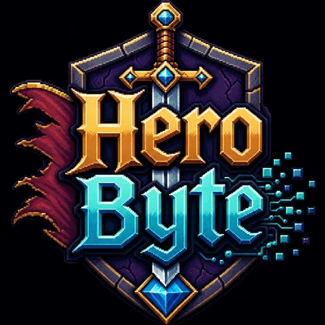
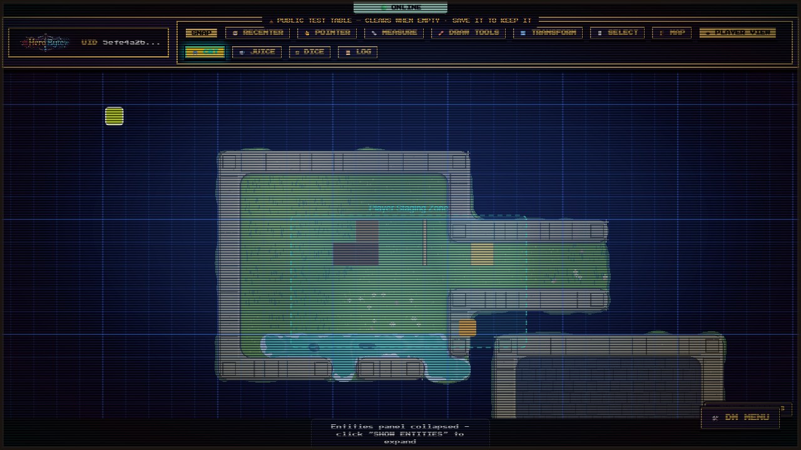
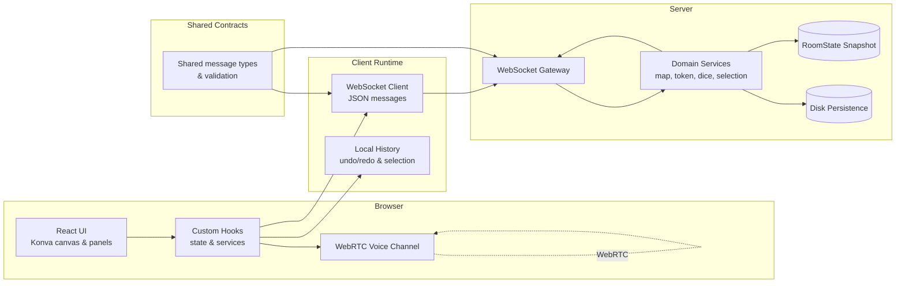

<div align="center">
  

# HeroByte

[](https://github.com/loshunter/HeroByte/actions/workflows/ci.yml)
[](https://app.codecov.io/gh/loshunter/HeroByte/tree/dev)
[](LICENSE)

**A retro-inspired virtual tabletop for epic adventures online**

> **🚧 BETA STATUS (v0.9.0-beta.1)**: HeroByte is feature-complete for live playtesting but not production-hardened. Core features are stable and covered by 6,753 automated tests, but authentication and some polish items are still in development. Perfect for private game nights—expect occasional rough edges!

</div>

HeroByte is a retro-inspired virtual tabletop that brings 16-bit RPG nostalgia to modern online play—roll dice, move tokens, and tell stories together in your browser, while the DM builds the battlemap live in front of the party.

<div align="center">
  
</div>

**📚 Quick Navigation:** [Quick Start](#-quick-start) • [User Guide](#-documentation) • [Features](#-features) • [Testing](#-testing) • [Architecture](#%EF%B8%8F-architecture) • [Roadmap](TODO.md) • [Contributing](#-contributing)

---

## 🚀 Quick Start

```bash
pnpm install
pnpm dev
# Frontend: http://localhost:5174
# Backend: http://localhost:8787
```

**Prerequisites:** Node.js 20+ • pnpm 10 via Corepack (`corepack enable pnpm`)

Then open http://localhost:5174, enter the development table password `Fun1`, and you're at the table. To unlock DM tools, use the DM password `FunDM` — the [Getting Started guide](docs/user-guide/getting-started.md) walks through it.

<details>
<summary>📦 Full Installation & Setup Guide</summary>

### Installation

```bash
# Enable the pinned pnpm version from package.json
corepack enable pnpm

# Install dependencies
pnpm install
```

### Running Locally

**Recommended: One-Command Start**

```bash
# From project root - handles prior dev processes and starts both servers
pnpm dev
```

This command checks the fixed HeroByte dev ports, releases stale HeroByte-owned processes when safe, and starts the backend and frontend together.

**Windows Double-Click Option**

```batch
start-server-dev.bat
start-client-dev.bat
```

**Bash/WSL Alternative**

```bash
./dev-start.sh
```

The bash script is optional. It is useful in Unix-like shells, but WSL is not required to run HeroByte on Windows.

**Access the Application:**

- **Frontend:** http://localhost:5174
- **Backend:** http://localhost:8787
- **Default Table Password:** `Fun1` (change via DM Menu → Session → Table Security)
- **Default DM Password:** `FunDM` (use to elevate to Dungeon Master role)
- **Playtest Guide:** [docs/playtest-setup-guide.md](docs/playtest-setup-guide.md)

**Alternative: Manual Start**

```bash
# Terminal 1: Start the backend
pnpm dev:server

# Terminal 2: Start the frontend
pnpm dev:client
```

**Port Already in Use?**

If you get "port already in use" errors:

```bash
pnpm dev:doctor  # Shows what owns the HeroByte dev ports
pnpm dev:free    # Safely stops stale HeroByte dev processes
```

See [PORT_MANAGEMENT.md](PORT_MANAGEMENT.md) for detailed troubleshooting.

### Network Access

To use on your local network:

- Find your IP address (e.g. `192.168.x.x`)
- Access at: `http://YOUR_IP:5174`
- Add that origin to `HEROBYTE_ALLOWED_ORIGINS`, for example `http://YOUR_IP:5174`
- The server automatically listens on all interfaces

### Security Configuration

Set environment variables in `.env`:

```bash
HEROBYTE_ROOM_SECRET="your-secure-room-password"
HEROBYTE_DM_PASSWORD="your-secure-dm-password"
HEROBYTE_ALLOWED_ORIGINS="https://yourdomain.com,https://staging.yourdomain.com"
```

- `HEROBYTE_ROOM_SECRET` – Override development fallback table password (`Fun1`)
- `HEROBYTE_DM_PASSWORD` – Override development fallback DM password (`FunDM`)
- `HEROBYTE_ALLOWED_ORIGINS` – Restrict HTTP/WebSocket origins (comma-separated)

The server reads more variables than these (storage paths, table limits, feature flags). The complete reference — including `HEROBYTE_DATA_DIR`, the single lever that points all on-disk stores at a persistent disk — lives in [DEPLOYMENT.md](DEPLOYMENT.md), section 1F.

### Common Scripts

| Command                 | Description                                             |
| ----------------------- | ------------------------------------------------------- |
| `pnpm dev`              | Run client and server concurrently on `5174` and `8787` |
| `pnpm dev:server`       | Start server in watch mode                              |
| `pnpm dev:client`       | Start client in watch mode                              |
| `pnpm dev:doctor`       | Inspect the normal dev ports without stopping anything  |
| `pnpm dev:free`         | Safely release stale HeroByte dev processes             |
| `pnpm build`            | Build both server and client bundles                    |
| `pnpm test`             | Run full test suite (6,753 tests)                       |
| `pnpm test:e2e`         | Run Playwright E2E tests on isolated `5175` and `8788`  |
| `pnpm e2e:doctor`       | Inspect the E2E ports without stopping anything         |
| `pnpm test:shared`      | Execute unit tests for shared domain models             |
| `pnpm test:coverage`    | Generate coverage reports for all packages              |
| `pnpm docs:screenshots` | Re-record every user-guide screenshot from a live app   |

### Troubleshooting

- **Dev server says port 5174 is busy** – Run `pnpm dev:doctor`; `pnpm dev` and `pnpm dev:free` safely release stale HeroByte owners
- **E2E says port 5175 or 8788 is busy** – Run `pnpm e2e:doctor`; `pnpm test:e2e` preflights those isolated ports automatically
- **WebSocket refuses connections** – Confirm backend is running on `http://localhost:8787`
- **Voice chat fails in Chrome** – WebRTC requires secure origins; use `https://` (Cloudflare tunnel, `mkcert`, or hosted demo)
- **Tests fail with missing state file** – Delete `apps/server/herobyte-state.json` and re-run `pnpm test`
- **"Room secret not set" warning** – Set `HEROBYTE_ROOM_SECRET` in `.env`
- **Map images don't load (CORS errors)** – Use CORS-friendly hosting like Discord CDN, Imgur, or Cloudinary

</details>

---

## 📖 Documentation

**The [User Guide](docs/user-guide/README.md) is the front door** — a full walkthrough of everything a player or DM can do, with screenshots captured from the real app:

| Guide                                                       | What it covers                                                                                           |
| ----------------------------------------------------------- | -------------------------------------------------------------------------------------------------------- |
| **[Getting Started](docs/user-guide/getting-started.md)**   | Joining a table, private tables & invite links, becoming the DM                                          |
| **[Player Guide](docs/user-guide/player-guide.md)**         | The table UI, your character card, tokens, dice, drawing, voice chat, fog & doors, mobile play           |
| **[DM Guide](docs/user-guide/dm-guide.md)**                 | The DM Menu: map setup, NPCs & props, combat, session save/load, table security, the player lens         |
| **[Map Editor Guide](docs/user-guide/map-editor-guide.md)** | Live map authoring: rooms, halls, doors, terrain painting, lighting, set dressing, the dungeon generator |

Screenshots are regenerated in one command (`pnpm docs:screenshots`) by a Playwright harness that drives real player and DM sessions — so the docs can't quietly drift from the app.

**[Browse all documentation →](docs/README.md)**

**For operators and contributors:**

- [DEPLOYMENT.md](DEPLOYMENT.md) – Production hosting (Render + Cloudflare Pages) and the full environment-variable reference
- [QUICK_REFERENCE.md](QUICK_REFERENCE.md) – Password/session cheat sheet for hosts
- [DEVELOPMENT.md](DEVELOPMENT.md) – Branching, naming, and feature cadence
- [docs/TESTING.md](docs/TESTING.md) – Testing guide • [docs/testing-architecture.md](docs/testing-architecture.md) – How the suite stays fast
- [TODO.md](TODO.md) / [DONE.md](DONE.md) – Roadmap and shipped milestones

---

## ✨ Features

### 🧠 Real-Time Multiplayer

- **WebSocket Synchronization** – All player actions sync in real-time with server-side validation
- **Private Tables** – Spin up password-protected tables with shareable invite links and per-table DM passwords
- **Persistent State** – Sessions auto-save to disk and restore on server restart
- **Error Resilience** – Automatic reconnection with seamless re-authentication, rate limiting, and heartbeat supervision
- **Performance Optimized** – ~86 KB entry bundle (gzipped) against a CI-enforced 175 KB budget; DM tooling, the Konva map canvas, the map-edit toolbar, and the terrain baker all load as lazy chunks

### 🗺️ Interactive Map Canvas

- **Infinite Canvas** – Pan, zoom, and smooth interactions with performance optimization
- **Universal Transform System** – Photoshop-style gizmo for maps, tokens, and drawings with 45° rotation snapping and lock/unlock
- **Token Management** – Drag-and-drop tokens with 6 size variants, custom art, status-effect medallions, and live drag previews
- **Grid System** – Adjustable grid (10-500px) with snap-to-grid, feet-per-square, and a two-click alignment wizard for background images

### 🏰 Live Map Building

- **In-Table Map Editor** – Rooms, hallways, walls, doors (locked & secret), and lights authored on the live table — players watch it appear
- **Procedural Terrain** – 34 paintable terrain families (grass, water, lava, stone, canopy, crystal…) baked in a background worker
- **Quick Wheel & Brush Deck** – Right-click radial tool picker; searchable, pinnable brush palette
- **Set Dressing** – Place/scatter/row tools, one-click room population, custom image uploads
- **Dungeon Generator** – Seeded server-side generation: rooms, corridors, doors, and dressing in one undo step

### 🔦 Lighting, Fog & Visibility

- **Fog of War** – Per-player line-of-sight from walls and doors; players see exactly what their tokens see
- **Light Pools & Night Grade** – Torch pools, emissive props, and an ambient slider that grades the whole map from day to night
- **Player Lens** – One toggle shows the DM exactly what players can see

### 🎲 Dice & Combat

- **Visual Dice Roller** – d4–d100 with modifiers, animated rolls, crit/fumble banners, and a shared roll log
- **Initiative & Turn Order** – Roll or type initiative, auto-starting combat, turn banners, and NPC batch rolls
- **HP Tracking** – Click-to-edit or drag-to-scrub HP with temp HP and floating damage numbers

### 🎨 Drawing & Visual Tools

- **Advanced Drawing** – Freehand, line, rect, circle with color/width/opacity/fill; partial erase on freehand strokes
- **Measure & Pointer** – Grid-aware distance readouts (squares + feet) and broadcast pings
- **CRT Filter** – Optional retro scanline effect with bloom and chromatic aberration

### 🎧 Voice & Characters

- **WebRTC Voice Chat** – Peer-to-peer voice with speaking-glow portraits
- **Character System** – Portraits, token art, multi-character support, per-player state export/import
- **NPCs & Props** – DM-managed monsters with visibility toggles; ownable map objects

### 📱 Presentation & Feel

- **Mobile Layout** – Touch-first dock, party drawer, dice roller, and pinch-zoom for phones and tablets
- **SNES-Style SFX** – Sample-based sound effects, dice rattle, door creaks, and a game-feel panel (motion/sound controls)

---

## 🧪 Testing

**6,753 unit/integration tests plus 60 Playwright E2E tests, all passing.** CI runs a 4-spec smoke subset on every push and the full E2E suite nightly.

| Package       | Test Files    | Tests | Status     |
| ------------- | ------------- | ----- | ---------- |
| **Shared**    | 19 files      | 268   | ✅ Passing |
| **Server**    | 90 files      | 1,697 | ✅ Passing |
| **Client**    | 222 files     | 4,788 | ✅ Passing |
| **E2E Suite** | 25 spec files | 60    | ✅ Passing |

```bash
pnpm test          # full unit/integration suite
pnpm test:e2e      # Playwright E2E on isolated ports (5175/8788)
pnpm test:coverage # coverage reports
```

E2E coverage spans auth, drawing persistence, partial erase, multi-select, undo/redo, dice, session save/load, two-browser and four-session sync, reconnection, initiative, the live map toolbar, dungeon generation, and mobile layout. The full inventory and Playwright setup live in [docs/TESTING.md](docs/TESTING.md); the batching/parallelization strategy that keeps it fast lives in [docs/testing-architecture.md](docs/testing-architecture.md).

---

## 🏗️ Architecture

HeroByte is a monorepo built with **domain-driven design** and strict separation between client, server, and shared contracts.

### Technology Stack

| Layer       | Technology                           | Purpose                            |
| ----------- | ------------------------------------ | ---------------------------------- |
| **Client**  | React 18 + TypeScript + Konva + Vite | UI + Canvas Rendering              |
| **Server**  | Node.js + ws + TypeScript            | Real-time Sync, Validation         |
| **Shared**  | TypeScript                           | Canonical message schemas and DTOs |
| **Testing** | Vitest + Playwright                  | Unit, Integration, E2E             |
| **Voice**   | SimplePeer (WebRTC)                  | Peer-to-peer voice communication   |

### Performance Architecture

HeroByte uses **role-based code splitting** to optimize bundle size:

- **Entry Bundle**: ~86 KB (gzipped) – Core game features load immediately for all users
- **DM/voice tooling**: ~18 KB lazy chunk – Only loads when a user elevates to Dungeon Master
- **Map Rendering**: ~32 KB lazy chunk – Konva-based canvas split separately
- **Map-edit toolbar**: ~7 KB lazy chunk – Live authoring UI loads only in map-edit mode
- **Vendor splits**: Konva, React, and WebRTC ship as separate cacheable chunks

**Performance Monitoring**:

- **Bundle Guard**: `apps/client/scripts/check-bundle-size.mjs` fails CI if the entry bundle exceeds 175 KB gzipped (currently ~86 KB, roughly half the budget)
- **Lighthouse CI**: Tracks Web Vitals (LCP <3s, TBT <250ms, CLS <0.1) on PRs touching `apps/client`, `packages/shared`, or the Lighthouse config, plus a weekly baseline run
- **Reports**: Available in GitHub artifacts and PR comments (7-day retention)
- **Philosophy**: Non-blocking warnings encourage optimization without blocking features

### High-Level Flow


```mermaid
graph LR
  subgraph Browser
    UI[React UI<br/>Konva canvas & panels]
    Hooks[Custom Hooks<br/>state & services]
    Voice[WebRTC Voice Channel]
  end
  subgraph Client Runtime
    WSClient[WebSocket Client<br/>JSON messages]
    UndoRedo[Local History<br/>undo/redo & selection]
  end
  subgraph Server
    Gateway[WebSocket Gateway]
    Services[Domain Services<br/>map, token, dice, selection]
    State[(RoomState Snapshot)]
    Persistence[(Disk Persistence)]
  end
  subgraph Shared Contracts
    Schemas[Shared message types<br/>& validation]
  end

  UI --> Hooks
  Hooks --> WSClient
  Hooks --> Voice
  Hooks --> UndoRedo
  WSClient --> Gateway
  Gateway --> Services
  Services --> State
  Services --> Persistence
  Services --> Gateway
  Schemas --> WSClient
  Schemas --> Gateway
  Voice -. WebRTC .-> Voice
```

### Key Architectural Decisions

- **Domain-Driven Design** – Business logic organized into domain services (Room, Player, Token, Map, Dice, Character)
- **Dependency Injection** – Container pattern for service orchestration
- **Message Validation** – All WebSocket payloads validated against `@herobyte/shared` schemas
- **Optimistic Updates** – Client predictions confirmed by server (fire-and-forget patterns eliminated)
- **Middleware Pipeline** – Authentication, validation, and rate limiting layers

Contributors should familiarize themselves with the `@herobyte/shared` schemas first—they define every WebSocket payload, ensuring the client and server stay in lockstep.

<details>
<summary>📁 Project Structure</summary>

```
HeroByte/
├── apps/
│   ├── client/          # React frontend
│   │   └── src/
│   │       ├── components/        # Shared UI primitives and layout chrome
│   │       ├── features/          # Feature modules (map, map-edit, render, dice, drawing, dm, initiative, juice, rooms)
│   │       ├── hooks/             # Custom React hooks
│   │       ├── layouts/           # Desktop and mobile layout shells
│   │       ├── services/          # WebSocket, voice chat services
│   │       ├── theme/             # Styling and themes
│   │       ├── utils/             # Shared helpers
│   │       └── ui/                # App shell and MapBoard canvas
│   ├── server/          # WebSocket server
│   │   └── src/
│   │       ├── domains/           # Domain services (Room, Player, Token, Map, Dice, Character, Generation, Assets)
│   │       ├── middleware/        # Validation orchestrator + per-domain validators, rate limiting
│   │       ├── http/              # HTTP routes (health checks)
│   │       ├── ws/                # Connection handler, router, dispatchers, handlers, lifecycle
│   │       ├── container.ts       # Dependency injection container
│   │       └── index.ts           # Bootstrap layer
│   └── e2e/             # Playwright end-to-end specs + docs screenshot harness
├── packages/
│   ├── shared/          # Shared types between client/server
│   └── adapters-net/    # Network adapter
└── package.json
```

</details>

---

## 🤝 Contributing

We welcome pull requests—especially around the CRITICAL items in [TODO.md](TODO.md). Open issues use P0/P1/P2 labels for priority.

### Preferred PR Workflow

1. **Fork and branch** from `dev` (`feature/<short-name>`)
2. **Sync dependencies** (`pnpm install`) and verify environment (`pnpm dev`)
3. **Make focused commits** with clear messages; favor small, reviewable changes
4. **Add/update tests** covering new behavior (`pnpm test` or `pnpm test:<package>`)
5. **Run linting** (`pnpm lint`) to ensure codebase stays warning-free
6. **Update docs** (README/user guide/TESTING) when workflows change — and `pnpm docs:screenshots` if the UI changed
7. **Open PR** against `dev` using template, link relevant TODO items/issues

Before requesting review, double-check CI status locally. Mention uncertainties in PR description.

### Code Standards

- **Conventional Commits** – Use `feat:`, `fix:`, `docs:`, `refactor:`, `test:` prefixes
- **Small PRs** – Prefer <400 LOC changes for faster review
- **Test Coverage** – Maintain 80%+ coverage on new code
- **TypeScript Strict** – No `any` types without justification

**Bug reports** → [GitHub Issues](https://github.com/loshunter/HeroByte/issues)

---

## 📄 License

Released under the [ISC License](LICENSE).

---

<div align="center">

⚡ **HeroByte: Where classic pixels meet modern play.**

Made with ❤️ by [Hunter / ScopicMedia](https://github.com/loshunter)

[Report Bug](https://github.com/loshunter/HeroByte/issues) • [Request Feature](https://github.com/loshunter/HeroByte/discussions) • [View Roadmap](TODO.md)

</div>
