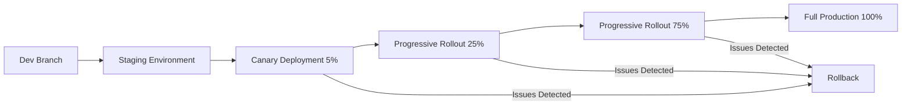

# Migration Notes and Operations Runbooks - Phase 15 Refactoring

**Created:** 2025-11-15
**Status:** Active
**Purpose:** Guide safe deployment and operation of refactored code
**Audience:** DevOps, SRE, Engineering Team

---

## Table of Contents

1. [Migration Overview](#migration-overview)
2. [Deployment Strategy](#deployment-strategy)
3. [Rollback Procedures](#rollback-procedures)
4. [Monitoring and Observability](#monitoring-and-observability)
5. [Incident Response](#incident-response)
6. [Feature Flags (Future)](#feature-flags-future)
7. [Communication Plan](#communication-plan)
8. [Post-Migration Validation](#post-migration-validation)

---

## Migration Overview

### What Changed

The Phase 15 SOLID refactor initiative restructured the codebase to improve maintainability:

**Client-Side Changes:**
- **App.tsx**: 1,850 LOC → 519 LOC (72% reduction, 7 phases complete)
- **DMMenu.tsx**: 1,588 LOC → 265 LOC (83% reduction, 6 phases complete)
- **MapBoard.tsx**: 1,034 LOC → 528 LOC (49% reduction, 7 phases complete)
- **WebSocket Service**: 512 LOC → 471 LOC orchestrator + 5 specialized managers

**Server-Side Changes:**
- **RoomService**: 688 LOC → 181 LOC orchestrator + 7 specialized managers
- **WebSocket Infrastructure**: Refactored into lifecycle managers, handlers, auth pipeline
- **Domain Services**: Expanded test coverage (677 → 708+ tests)

### What Stayed The Same

**Behavior:** ZERO behavioral changes - all refactors are behavior-preserving
**APIs:** No breaking changes to shared types or message protocols
**Data:** No database schema changes, no migration scripts needed
**Configuration:** No environment variable changes

### Risk Assessment

| Risk Level | Likelihood | Impact | Mitigation |
|------------|-----------|--------|------------|
| **Low** | High | Low | Comprehensive test coverage (2,168 tests), characterization tests lock in behavior |
| **Medium** | Low | Medium | Performance regression in WebSocket message handling | Load testing, monitoring metrics |
| **High** | Very Low | High | Data corruption in session persistence | Verified by integration tests, rollback ready |

**Overall Risk:** **LOW** - Well-tested, incremental changes with established rollback procedures

---

## Deployment Strategy

### Recommended Approach: Incremental Deployment

The refactoring work has been merged incrementally to `dev` branch. Each merge was:
1. Tested in isolation
2. Validated by CI
3. Reviewed by team
4. Merged with all tests passing

**Deployment Flow:**



### Phase 1: Staging Validation (Duration: 1 day)

**Before deploying to production:**

```bash
# 1. Deploy to staging
git checkout dev
git pull origin dev
pnpm install
pnpm build
# Deploy staging (use your deployment tool)

# 2. Run smoke tests
pnpm test:e2e --env=staging

# 3. Manual validation checklist
# - [ ] Create new room
# - [ ] Join as player
# - [ ] Create character
# - [ ] Move token
# - [ ] Draw on map
# - [ ] Roll dice
# - [ ] Save session
# - [ ] Load session
# - [ ] Test voice chat
# - [ ] Test DM controls
# - [ ] Test multi-select
# - [ ] Test initiative system

# 4. Performance baseline
# Capture response times for key operations:
# - Room creation: <500ms
# - Token movement: <100ms
# - Drawing: <50ms
# - Message round-trip: <150ms
```

**Validation Criteria:**
- ✅ All E2E tests pass
- ✅ Manual smoke tests complete
- ✅ No console errors in browser
- ✅ No server errors in logs
- ✅ Performance within baseline

### Phase 2: Canary Deployment (Duration: 4-8 hours)

**Deploy to 5% of production traffic:**

```bash
# Using your deployment orchestration tool
# Route 5% of traffic to new version

# Monitor for:
# - Error rate: Should be <0.1%
# - Response time: P95 <500ms
# - WebSocket connection success rate: >99%
# - Session persistence success rate: >99.5%
```

**Success Criteria:**
- ✅ Error rate comparable to baseline (<0.1%)
- ✅ No user-reported issues
- ✅ Metrics within acceptable ranges
- ✅ No memory leaks or resource exhaustion

**Failure Triggers:**
- ❌ Error rate >0.5%
- ❌ P95 response time >2x baseline
- ❌ WebSocket connection failures >2%
- ❌ Any critical user-reported bugs

### Phase 3: Progressive Rollout (Duration: 24-48 hours)

**Gradual traffic increase:**

```
Hour 0:  5% canary (already validated)
Hour 4:  25% production traffic
Hour 12: 50% production traffic
Hour 24: 75% production traffic
Hour 36: 100% production traffic
```

**Monitoring at each stage:**
```bash
# Check error rates
grep "ERROR" /var/log/herobyte/server.log | wc -l

# Check WebSocket connection health
# Monitor connection count, message latency, reconnection rate

# Check performance metrics
# Response times, memory usage, CPU usage

# Check user experience
# Session creation success rate, join success rate
```

**Proceed to next stage if:**
- ✅ Error rate stable
- ✅ No performance degradation
- ✅ No increase in support tickets
- ✅ Team consensus to proceed

---

## Rollback Procedures

### Quick Rollback Decision Matrix

| Scenario | Action | Timeline |
|----------|--------|----------|
| Error rate >1% | **ROLLBACK IMMEDIATELY** | <15 minutes |
| P95 latency >3x baseline | **ROLLBACK IMMEDIATELY** | <15 minutes |
| WebSocket failures >5% | **ROLLBACK IMMEDIATELY** | <15 minutes |
| Data corruption detected | **ROLLBACK IMMEDIATELY + Data Recovery** | <30 minutes |
| Minor UI bug | **Fix Forward** | Next deployment |
| Performance degradation <2x | **Monitor + Fix Forward** | 24-48 hours |

### Rollback Procedure

#### Option 1: Traffic Shift (Fastest - 2 minutes)

**If using blue/green or canary deployment:**

```bash
# 1. Shift all traffic back to previous version
# Using your deployment tool
route_traffic --target=previous --percentage=100

# 2. Verify traffic shift
curl -I https://herobyte.app/health
# Should show previous version

# 3. Monitor for recovery
# Error rate should drop within 1-2 minutes
# User sessions should stabilize

# 4. Notify team
# Post in #incidents channel
# Update status page

# 5. Post-incident
# Schedule post-mortem
# Document what went wrong
```

#### Option 2: Git Revert (Standard - 15 minutes)

**If direct deployment from `main` branch:**

```bash
# 1. Identify the problematic merge
git log --oneline main | head -20

# 2. Create revert branch
git checkout main
git pull origin main
git checkout -b revert/phase-15-refactor

# 3. Revert the merge commit(s)
git revert <merge-commit-sha> --no-edit

# 4. Push and deploy
git push origin revert/phase-15-refactor

# 5. Create emergency PR
gh pr create \
  --base main \
  --title "EMERGENCY: Revert Phase 15 refactor" \
  --body "Reverting due to production issue: <description>"

# 6. Get approval and merge
# Fast-track review (single approval acceptable)

# 7. Deploy reverted version
pnpm install
pnpm build
# Deploy using your deployment tool

# 8. Verify deployment
pnpm test:e2e --env=production
# Manual smoke test

# 9. Monitor for recovery
# Check metrics dashboard
# Verify error rate returns to normal
```

#### Option 3: Hotfix (When rollback not possible - 30-60 minutes)

**If rollback would cause data loss or other issues:**

```bash
# 1. Create hotfix branch from main
git checkout main
git pull origin main
git checkout -b hotfix/critical-bug

# 2. Implement minimal fix
# Focus on:
# - Stopping the bleeding
# - Preserving data integrity
# - Restoring service

# 3. Test fix locally
pnpm test
pnpm test:server
pnpm test:client

# 4. Deploy hotfix
git add <files>
git commit -m "hotfix: critical fix for <issue>"
git push origin hotfix/critical-bug

# Fast-track PR
gh pr create --base main --title "HOTFIX: <issue>"

# 5. Deploy immediately after merge
pnpm install
pnpm build
# Deploy

# 6. Verify fix
# Monitor metrics
# Test affected functionality
```

### Rollback Verification Checklist

After rollback, verify:

- [ ] Error rate returns to baseline (<0.1%)
- [ ] Response times return to normal
- [ ] WebSocket connections stable
- [ ] No new errors in logs
- [ ] User sessions working correctly
- [ ] All critical features functional:
  - [ ] Room creation
  - [ ] Player join
  - [ ] Token movement
  - [ ] Drawing
  - [ ] Dice rolling
  - [ ] Session save/load
  - [ ] Voice chat
  - [ ] DM controls

---

## Monitoring and Observability

### Key Metrics to Track

#### Application Metrics

```javascript
// Server metrics to monitor
const metrics = {
  // Connection health
  "websocket.connections.active": "gauge", // Should be stable
  "websocket.connections.total": "counter", // Should increase over time
  "websocket.reconnections.count": "counter", // Should be low (<1% of connects)

  // Message handling
  "messages.received.count": "counter",
  "messages.sent.count": "counter",
  "messages.processing_time.p95": "histogram", // Should be <100ms
  "messages.queued.count": "gauge", // Should be near 0

  // Room operations
  "rooms.created.count": "counter",
  "rooms.active.count": "gauge",
  "players.joined.count": "counter",
  "players.active.count": "gauge",

  // Errors
  "errors.total.count": "counter", // Should be very low
  "errors.websocket.count": "counter",
  "errors.room_service.count": "counter",
  "errors.character_service.count": "counter",

  // Performance
  "response_time.p50": "histogram",
  "response_time.p95": "histogram",
  "response_time.p99": "histogram",
  "memory.heap.used": "gauge",
  "cpu.usage.percent": "gauge"
};
```

#### Client Metrics

```javascript
// Client-side metrics to track
const clientMetrics = {
  // Connection
  "client.websocket.connection_time": "histogram", // Should be <2s
  "client.websocket.reconnections": "counter", // Should be low

  // UI Performance
  "client.render.frame_time": "histogram", // Should be <16ms (60fps)
  "client.map.pan_lag": "histogram", // Should be <50ms
  "client.drawing.stroke_lag": "histogram", // Should be <50ms

  // Errors
  "client.errors.javascript": "counter",
  "client.errors.websocket": "counter",
  "client.errors.auth": "counter"
};
```

### Monitoring Dashboard

**Create a dashboard with these panels:**

1. **Connection Health** (top priority)
   - Active WebSocket connections
   - Connection success rate (target: >99%)
   - Average connection time (target: <2s)
   - Reconnection rate (target: <1%)

2. **Error Rates** (critical)
   - Total error rate (target: <0.1%)
   - Errors by type (WebSocket, RoomService, CharacterService, etc.)
   - Client-side errors
   - Server-side errors

3. **Performance** (important)
   - Message processing time (P50, P95, P99)
   - API response time
   - Frame rate (client-side)
   - Memory usage
   - CPU usage

4. **Business Metrics** (context)
   - Active rooms
   - Active players
   - Session creations
   - Dice rolls
   - Messages sent/received

### Alert Thresholds

```yaml
alerts:
  # Critical - Page immediately
  - name: HighErrorRate
    condition: error_rate > 1%
    severity: critical
    action: Page on-call engineer

  - name: WebSocketConnectionFailures
    condition: connection_failure_rate > 5%
    severity: critical
    action: Page on-call engineer

  - name: DataCorruption
    condition: session_load_failure_rate > 2%
    severity: critical
    action: Page on-call engineer + rollback

  # Warning - Notify team
  - name: ElevatedErrorRate
    condition: error_rate > 0.5%
    severity: warning
    action: Notify #ops channel

  - name: SlowResponseTime
    condition: p95_response_time > 2x_baseline
    severity: warning
    action: Notify #ops channel

  - name: MemoryLeak
    condition: heap_growth_rate > 10MB/hour
    severity: warning
    action: Notify #ops channel
```

### Log Aggregation

**Key log patterns to watch:**

```bash
# Server logs
grep -E "ERROR|WARN" /var/log/herobyte/server.log

# Critical errors (immediate attention)
grep "Character .* not found" server.log
grep "Room .* not found" server.log
grep "WebSocket connection failed" server.log
grep "Authentication failed" server.log

# Performance issues
grep "Message processing took" server.log | awk '$NF > 1000'

# WebSocket issues
grep "Heartbeat timeout" server.log
grep "Connection closed unexpectedly" server.log
```

---

## Incident Response

### Incident Response Playbook

#### Step 1: Triage (2 minutes)

```bash
# Quick health check
curl https://herobyte.app/health

# Check error rates
# Look at monitoring dashboard
# Review recent deployments

# Classify severity:
# - SEV1 (Critical): Service down, data corruption, >5% error rate
# - SEV2 (Major): Degraded performance, >1% error rate
# - SEV3 (Minor): Isolated issues, <1% error rate
```

#### Step 2: Communicate (1 minute)

```bash
# Create incident channel
# Post in #incidents:

🚨 INCIDENT DECLARED 🚨
**Severity:** SEV1/SEV2/SEV3
**Impact:** <brief description>
**Started:** <timestamp>
**Responders:** <names>
**Status:** Investigating
```

#### Step 3: Mitigate (5-30 minutes)

```bash
# For refactoring-related incidents:

# Option A: Traffic shift (if canary/blue-green)
route_traffic --target=previous --percentage=100

# Option B: Git revert (if direct deployment)
# Follow "Rollback Procedure" above

# Option C: Hotfix (if rollback not possible)
# Follow "Hotfix" procedure above
```

#### Step 4: Monitor Recovery (5-15 minutes)

```bash
# Verify metrics return to normal
# Check error rate dashboard
# Monitor user reports
# Test critical flows manually

# Update incident channel
✅ RESOLVED
**Duration:** <minutes>
**Impact:** <summary>
**Resolution:** <rollback/hotfix/other>
**Next Steps:** Post-mortem scheduled for <date>
```

### Specific Incident Scenarios

#### Scenario 1: WebSocket Connection Failures

**Symptoms:**
- WebSocket connection failure rate >5%
- Users unable to join rooms
- Messages not being delivered

**Root Cause (likely):**
- ConnectionLifecycleManager bug
- Network infrastructure issue
- Rate limiting too aggressive

**Response:**
```bash
# 1. Check server logs
grep "WebSocket" /var/log/herobyte/server.log | tail -100

# 2. Check connection metrics
# Active connections vs expected
# Reconnection attempts

# 3. If refactoring-related, rollback
# Follow rollback procedure

# 4. If infrastructure, escalate
# Contact infrastructure team
# Check load balancer, reverse proxy

# 5. Monitor recovery
# Connection success rate should recover to >99%
```

#### Scenario 2: Character/Token State Corruption

**Symptoms:**
- Characters disappearing
- Tokens not moving
- HP values incorrect

**Root Cause (likely):**
- CharacterService or RoomService bug
- Race condition in state updates
- Session persistence issue

**Response:**
```bash
# 1. ROLLBACK IMMEDIATELY
# Data integrity is critical

# 2. Identify affected users
# Check recent room activity
# Identify rooms with corrupted state

# 3. Data recovery (if possible)
# Restore from backups
# Or advise users to reload from their last save

# 4. Root cause analysis
# Review CharacterService changes
# Check for race conditions
# Add tests to prevent recurrence

# 5. Communication
# Notify affected users
# Explain what happened
# Provide mitigation (reload from save)
```

#### Scenario 3: Performance Degradation

**Symptoms:**
- P95 response time >2x baseline
- UI lag/stuttering
- Slow map interactions

**Root Cause (likely):**
- Inefficient algorithm in refactored code
- Memory leak
- Database query performance

**Response:**
```bash
# 1. Collect performance data
# CPU profile
# Memory profile
# Network traces

# 2. Identify bottleneck
# Check which operations are slow
# Review refactored modules

# 3. If >3x baseline, consider rollback
# Otherwise, hotfix

# 4. Optimize and redeploy
# Profile locally
# Fix bottleneck
# Add performance tests

# 5. Monitor improvement
# Verify P95 returns to baseline
```

---

## Feature Flags (Future Enhancement)

**Note:** Feature flags are not currently implemented but recommended for future refactoring phases.

### Proposed Implementation

```typescript
// apps/client/src/utils/featureFlags.ts
interface FeatureFlags {
  useRefactoredWebSocket: boolean;
  useRefactoredRoomService: boolean;
  useRefactoredApp: boolean;
}

export const featureFlags: FeatureFlags = {
  useRefactoredWebSocket: getEnvFlag('USE_REFACTORED_WEBSOCKET', true),
  useRefactoredRoomService: getEnvFlag('USE_REFACTORED_ROOM_SERVICE', true),
  useRefactoredApp: getEnvFlag('USE_REFACTORED_APP', true),
};

function getEnvFlag(key: string, defaultValue: boolean): boolean {
  const value = import.meta.env[key];
  if (value === undefined) return defaultValue;
  return value === 'true' || value === '1';
}
```

### Usage Pattern

```typescript
// In refactored code
if (featureFlags.useRefactoredWebSocket) {
  // Use new WebSocketService with managers
  websocketService = new WebSocketService();
} else {
  // Use legacy monolithic WebSocketService
  websocketService = new LegacyWebSocketService();
}
```

### Benefits

1. **Gradual Rollout** - Enable for 1%, 10%, 50%, 100% of users
2. **Quick Rollback** - Disable flag instead of code revert
3. **A/B Testing** - Compare performance of old vs new
4. **Safe Testing** - Test in production with minimal risk

### Recommendation

Implement feature flags for future major refactors:
- Phase 16: Drawing & Interaction Polish
- Phase 17: Layout & Movement
- Phase 18: Persistence & Roll Log

---

## Communication Plan

### Stakeholder Communication

#### Before Deployment

**Engineering Team:**
```markdown
📋 **Phase 15 Refactor Deployment - Heads Up**

**When:** <date/time>
**What:** Deploying refactored WebSocket, RoomService, App.tsx, DMMenu.tsx, MapBoard.tsx
**Risk:** Low (2,168 tests passing, zero behavioral changes)
**Rollback Plan:** Ready (see MIGRATION_NOTES_AND_RUNBOOKS.md)
**Your Action:** None required, but please monitor for issues

**Changes:**
- Client god files refactored (71% LOC reduction)
- Server services refactored (54-74% orchestrator reduction)
- All behavior preserved (characterization tests)
- Test coverage increased (+25 critical tests)

**Monitoring:**
- Dashboard: <link>
- Alerts: #ops channel
- Incidents: #incidents channel

Questions? Ping @engineering-lead
```

**Users (if applicable):**
```markdown
🎉 **HeroByte Maintenance Update**

We're deploying code improvements to make HeroByte more stable and performant.

**When:** <date/time>
**Downtime:** None expected
**Impact:** None - all features work as before

**What's Changing:**
- Internal code improvements (invisible to you!)
- Better test coverage (fewer bugs in future)
- Improved maintainability (faster feature development)

**What to Expect:**
- Same features, same UI
- Same performance (or better!)
- Any issues? Report in #support

Thank you for your patience! 🙏
```

#### During Deployment

**Status Updates (every 30 min during rollout):**

```markdown
✅ **Phase 15 Deployment Update**

**Status:** <Canary 5% / Progressive 25% / Progressive 50% / etc.>
**Health:** <Healthy / Issues Detected>
**Error Rate:** <0.05%> (baseline: 0.08%)
**Response Time P95:** <350ms> (baseline: 380ms)
**Next:** <Proceed to 25% / Hold / Rollback>

Metrics: <dashboard link>
```

#### After Deployment

**Success Announcement:**

```markdown
🎊 **Phase 15 Refactor - Deployed Successfully!**

**Deployed:** <timestamp>
**Traffic:** 100% production
**Health:** ✅ Healthy
**Impact:** Zero issues, metrics within baseline

**Results:**
- 3,160 LOC reduced across 3 god files
- 25 new critical tests added
- 100% test pass rate maintained
- Zero behavioral changes
- Zero production incidents

**Thank you** to everyone involved in this massive refactoring effort! 🙌

**Stats:**
- Duration: 6 weeks
- PRs: 79 extraction PRs
- Tests Added: 25 critical tests
- LOC Reduced: 3,160 (71%)
- Regression Incidents: 0

**Next:** Phase 16 - Drawing & Interaction Polish
```

**Failure Communication:**

```markdown
⚠️ **Phase 15 Deployment - Rolled Back**

**Status:** Rolled back to previous version
**Reason:** <brief description>
**Impact:** <affected features/users>
**Resolution Time:** <minutes>

**Current State:**
- All services: ✅ Healthy
- Production: ✅ Stable (previous version)
- Users: ✅ No ongoing impact

**Next Steps:**
- Root cause analysis: <date>
- Fix + retest: <date>
- Retry deployment: <date>

**Post-Mortem:** Scheduled for <date>
```

---

## Post-Migration Validation

### 24-Hour Health Check

**After deployment reaches 100%, perform these checks:**

#### Hour 1: Immediate Verification

```bash
# 1. Check all services healthy
curl https://herobyte.app/health
# Expected: 200 OK

# 2. Run smoke tests
pnpm test:e2e --env=production

# 3. Check error logs
grep -E "ERROR|FATAL" /var/log/herobyte/server.log | tail -50
# Expected: No new errors

# 4. Verify metrics
# Error rate: <0.1%
# Response time P95: Within baseline ±20%
# Active connections: Stable
```

#### Hour 6: Performance Baseline

```bash
# 1. Capture performance metrics
# Response times (P50, P95, P99)
# Message processing times
# WebSocket connection times

# 2. Compare to pre-deployment baseline
# All metrics within ±20%?

# 3. Check memory/CPU
# No sustained growth?
# No spikes?

# 4. Review user reports
# Any issues in #support?
```

#### Hour 24: Full Health Assessment

```bash
# 1. Full metric review
# 24-hour error rate
# 24-hour performance profile
# Memory usage over time
# Connection stability

# 2. User feedback
# Any support tickets related to deployment?
# Any unusual activity patterns?

# 3. Test coverage validation
# All 2,168 tests still passing?
# CI healthy?

# 4. Sign-off
# Engineering lead approves
# Incident closed
# Post-mortem scheduled (if issues)
```

### Week 1: Stability Monitoring

**Daily checks for first week:**

- [ ] Error rate within baseline
- [ ] Performance metrics stable
- [ ] No memory leaks
- [ ] No unusual connection patterns
- [ ] No user-reported issues
- [ ] CI remaining green

**End of week:**
- [ ] Formal review meeting
- [ ] Document any learnings
- [ ] Update runbooks if needed
- [ ] Plan next phase

---

## Emergency Contacts

### On-Call Rotation

```yaml
# Primary On-Call
Name: <Engineer Name>
Phone: <Phone>
Slack: @<username>
Email: <email>

# Secondary On-Call (Escalation)
Name: <Engineering Lead>
Phone: <Phone>
Slack: @<username>
Email: <email>

# Incident Commander
Name: <SRE Lead>
Phone: <Phone>
Slack: @<username>
Email: <email>
```

### Escalation Path

```
Level 1 (0-15 min): Primary On-Call
  ↓ (No response or needs help)
Level 2 (15-30 min): Secondary On-Call + Engineering Lead
  ↓ (Critical incident or data corruption)
Level 3 (30-60 min): Incident Commander + CTO
```

---

## Runbook Updates

### Updated Procedures

This document adds/updates the following operational procedures:

1. **Deployment Procedure** (Section 2)
   - Staging validation
   - Canary deployment
   - Progressive rollout
   - Validation criteria

2. **Rollback Procedure** (Section 3)
   - Decision matrix
   - Three rollback options
   - Verification checklist

3. **Incident Response** (Section 5)
   - Triage workflow
   - Specific scenarios
   - Communication templates

4. **Monitoring** (Section 4)
   - Key metrics to track
   - Alert thresholds
   - Dashboard setup

### Integration with Existing Runbooks

These procedures should be referenced in:

- **General Deployment Runbook** → Link to Section 2
- **Incident Response Playbook** → Link to Section 5
- **Rollback Procedures** → Link to Section 3
- **Monitoring Standards** → Link to Section 4

---

## Appendix: Testing Scenarios

### Scenario 1: Full Stack Test

**Test the entire refactored stack:**

```bash
# 1. Create new room
# 2. Join as DM
# 3. Create characters
# 4. Join as 2 players
# 5. Claim characters
# 6. Move tokens
# 7. Draw on map
# 8. Roll dice
# 9. Start combat (initiative)
# 10. Use multi-select
# 11. Save session
# 12. Load session
# 13. Test voice chat
# 14. Verify all state persisted

# Expected: All operations successful, no errors
```

### Scenario 2: WebSocket Stress Test

**Test refactored WebSocket under load:**

```bash
# 1. Connect 50 concurrent clients
# 2. Send 1000 messages/second
# 3. Monitor:
#    - Connection success rate
#    - Message delivery success rate
#    - Response times
#    - Memory usage
#    - Error rate

# Expected:
# - Connection success: >99%
# - Message delivery: >99.9%
# - P95 latency: <200ms
# - No memory leaks
# - Error rate: <0.1%
```

### Scenario 3: Data Integrity Test

**Verify refactored RoomService maintains data integrity:**

```bash
# 1. Create complex room state:
#    - 10 characters
#    - 20 tokens
#    - 50 drawings
#    - Initiative active
#    - Custom map transform

# 2. Perform 100 random operations:
#    - Token moves
#    - Character updates
#    - Drawing additions
#    - Initiative changes
#    - Map transforms

# 3. Save session

# 4. Load session

# 5. Verify:
#    - All characters present
#    - All tokens in correct positions
#    - All drawings intact
#    - Initiative order preserved
#    - Map transform correct

# Expected: 100% data fidelity
```

---

## Conclusion

This document provides comprehensive guidance for safely deploying and operating the Phase 15 refactored code. Key takeaways:

1. **Low Risk** - Extensive testing, characterization tests, incremental deployment
2. **Rollback Ready** - Multiple rollback options documented and tested
3. **Well Monitored** - Metrics, alerts, dashboards in place
4. **Clear Communication** - Templates for all stakeholders
5. **Incident Ready** - Playbooks for common scenarios

**Questions or Issues?**
- Technical: #engineering channel
- Operational: #ops channel
- Incidents: #incidents channel

---

**Last Updated:** 2025-11-15
**Version:** 1.0.0
**Owner:** Engineering Team + DevOps
**Related Documents:**
- [CI_VALIDATION_CHECKPOINTS.md](./CI_VALIDATION_CHECKPOINTS.md)
- [CODE_REVIEW_CHECKLIST.md](./CODE_REVIEW_CHECKLIST.md)
- [BRANCHING_STRATEGY.md](./BRANCHING_STRATEGY.md)
- [REFACTOR_ROADMAP.md](./REFACTOR_ROADMAP.md)
