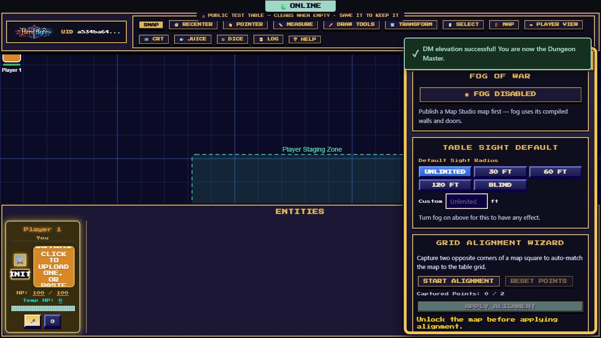
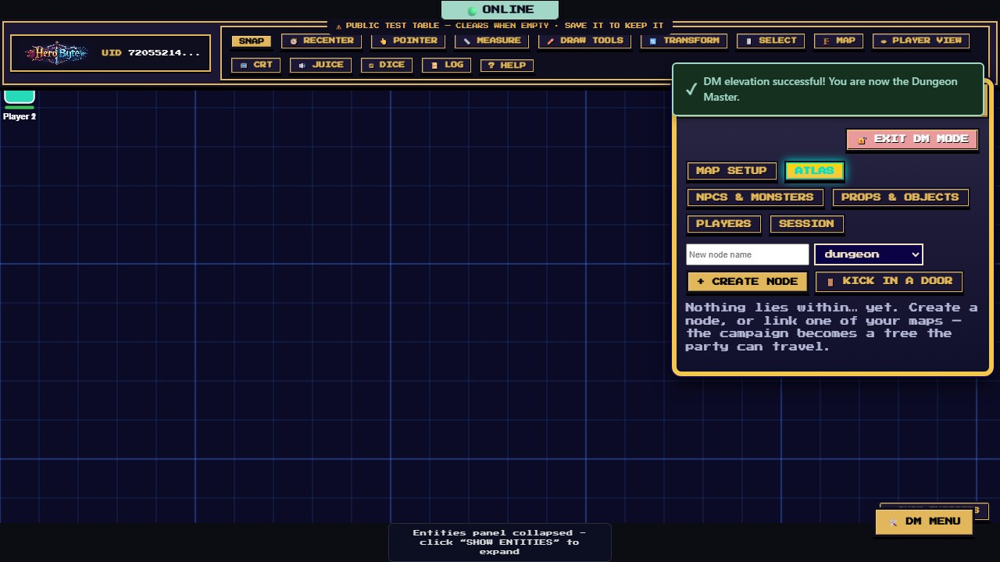
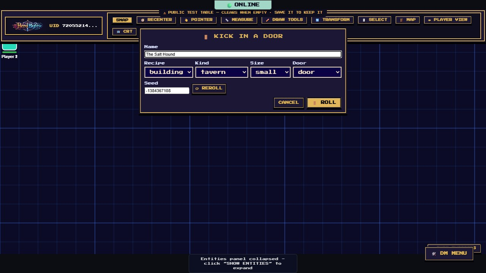
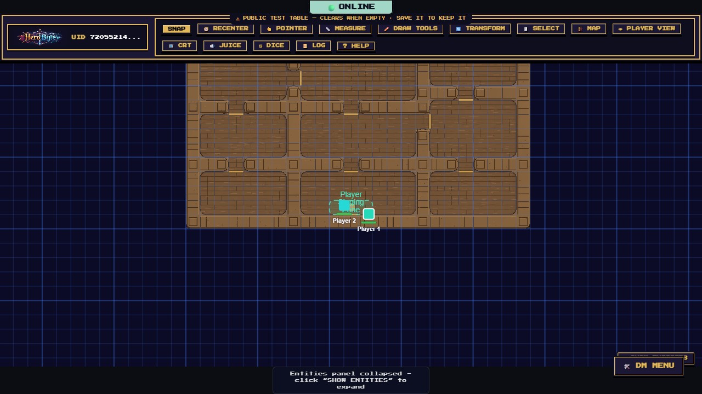

# DM Guide

Everything the Dungeon Master runs from — [elevate to DM](getting-started.md#becoming-the-dm) first, then open the **🛠️ DM MENU** (bottom-right). This guide covers the DM Menu's five tabs plus the DM-only toolbar powers. Building the map itself has [its own guide](map-editor-guide.md), and if you are deciding **how** to run a map at all — your own art, built by hand, or generated on the spot — start with [Running a Game](running-a-game.md).

## Map Setup

Top to bottom:

- **Map Background** — **⬆ UPLOAD IMAGE** to use any battlemap image from your own device as the table; it's stored on your table's server and stays with the game. Or paste an image URL and **APPLY BACKGROUND** for art already online (the image's host must allow cross-origin loading). If you're authoring terrain with the [live map editor](map-editor-guide.md) instead, skip the background — a raster background underneath live terrain gets messy, and the editor will warn you.
- **HeroByte Map Studio** — the editable-map store behind the live editor: create a named blank map, reopen a **saved map**, **IMPORT JSON BACKUP**, or delete. (Day-to-day you'll rarely touch this — **▶ START LIVE MAP** in the editor creates and binds one for you.)
- **Map Transform** — scale, rotate, and offset the background image; **Map is locked** prevents anyone dragging the map by accident. Unlock only while adjusting.
- **Grid Controls** — grid cell size in pixels (10–500), **Square Size** in feet (what the measure tool reports per square), and **Diagonals**, the rule the whole table measures by: **5e** (every square costs the same — a two-square diagonal is 10 ft), **Pathfinder** (diagonals alternate 5-10, so the same diagonal is 15 ft), or **Euclidean** (straight-line distance in fractions of a square). The setting is per table and reaches every player, so nobody is measuring by a different rule. **🔒 GRID LOCKED** freezes the sizes.
- **Fog of War** — the master switch. Fog needs a built map with walls and doors (it computes line-of-sight from them), so publish something with the live editor first; until then the button explains itself. Once on, players see only what their tokens see — you keep X-ray vision unless you flip on the [player lens](#the-player-lens). Two things are worth knowing about what fog does for you: entities outside a player's sight are never _sent_ to them at all, so there is nothing to find in the browser's devtools; and once a player has seen a patch of ground it stays dimly lit for them afterwards, so nobody has to re-map a dungeon they already walked. That memory is theirs alone, it covers the ground only, and a monster that moves into a remembered room is still invisible until they can actually see it.
- **Sight Radius** — how far one token can see, in feet, set from that token's settings (the ⚙ on a player's card; on a phone, **PARTY** → **⚙ EDIT** on the row). It appears on player tokens only — fog is worked out from the tokens each player owns, so a radius on a monster would change nothing, and there is no control for it rather than one that quietly does nothing. Presets for **Table Default**, **30/60/120 ft** and **Blind**, plus a custom value. **Table Default** is where a token starts and means it follows the table-wide setting below — and the empty box tells you what that currently is, reading **Table default — 60 ft** (or **— unlimited** when none is set, which is sight stopped only by walls, exactly how fog behaved before). So you can see what a token can actually see without leaving its card. This is the control that makes a dark dungeon dark: give the party 30 ft and a corridor becomes something they have to walk down. It is DM-only on purpose; a radius can only narrow what a player sees, so letting them clear their own would simply undo it. Setting one also makes fog dramatically cheaper to compute on a big generated map, so reach for it on large dungeons even for the performance alone.
- **Table Sight Default** — the same thing for the whole table at once, on the Map tab just under Fog of War. Set **30 ft** here and every token that has no radius of its own sees 30 ft; it is the quickest way to say "this dungeon is dark" without visiting five character cards. A token you set individually always wins, in both directions — a character with darkvision keeps their 120 ft, and one you deliberately blinded stays blind even if the table default is generous. Clearing it (**Unlimited**, or emptying the custom box) lifts the darkness everywhere in one go. It also closes a gap the per-token control cannot: a player who deletes their only token and rejoins gets a fresh one with no radius on it, and before this setting existed that token could see the whole dungeon with nothing to warn you.
- **Movement** — a character's speed in feet per turn, set from the same settings (the ⚙ on a player's card; on a phone, **PARTY** → **⚙ EDIT**; a monster's in **DM Menu → NPCs**). In combat the token's plate reads what is left of it, refilled when the character's turn starts. The budget is advisory: an overspend turns the plate red and refuses nothing — this is a VTT, not a rules engine. Beside the speed, the settings also show what the character has used this turn and a **Reset** that zeroes it, for a mis-press or a spell that restores movement; it appears during combat for a character in the order, or for one that has already spent movement. A character you run yourself (the one you joined with, or one you add with **➕ Add Character** on your own card — it gets a token like anyone's) joins a fight the way a monster does: give it an initiative (from its own card — **⚔️ ROLL MISSING INITIATIVE** covers NPCs only) and it takes its place in the order, its token wears the budget, and its turn start refills it; when combat ends it returns to your own group at the left of the panel even though its roll stays on file. Without an initiative it stays in that group with no plate budget — and if you move it during a fight the server still counts that, so its card shows the spend and a **Reset** until you clear it or combat ends. A character on your card is a party member as far as the table is concerned — and the table can see it is yours (its card wears the DM's gold face and reads "Dungeon Master"): its HP, its speed, its spend and its place in the order are visible to everyone, so run a creature whose numbers must stay secret as an NPC — there is no way to convert an existing character, so make it an NPC from the start (**DM Menu → NPCs**) or delete and recreate it there. (On a phone there is no group, no turn order and no initiative control for a character — the roll itself needs the desktop panel; the row's **⚙ EDIT** still carries the spend and the Reset.) The readout turns red past the speed, like the plate.
- **Grid Alignment Wizard** — matching the table grid to a background image: **START ALIGNMENT**, click two opposite corners of one map square on the image, **APPLY ALIGNMENT**. The map scales and shifts so its grid meshes with the table's.
- **Player Staging Zone** — where new players spawn. Set center/size/rotation in tiles and **APPLY ZONE**; joining players appear at random spots inside it. Use the Transform tool to nudge the zone on the canvas; **ZONE UNLOCKED** toggles accidental-edit protection, **CLEAR ZONE** removes it.
- **Clear All Drawings** — wipes every player's ink from the map (confirmation required; cannot be undone).

## NPCs & Monsters

**+ ADD NPC** creates a monster with a full stat row:

- **Name, HP / Max HP / Temp HP, Init Mod, Portrait, Token Image** — same character plumbing as players. Both image fields take an **⬆ UPLOAD IMAGE** from your device or a pasted URL.
- **PLACE ON MAP** drops its token at the map's top-left corner cell — not at the center of your
  view — so recenter or drag it across from there. Pressing it again relocates that same token back
  to the corner rather than adding a second one.
- **⚔️ ROLL MISSING INITIATIVE** asks the server to roll a d20 + modifier for every NPC that doesn't have initiative yet — one click to get the whole opposing side into the turn order. Each creature gets its own named line in the roll log, so you can see which goblin rolled what. A creature you've hidden with the **👁️ eye** rolls into **your** log only — the ambush stays an ambush until you reveal it. NPCs that already have a value are left alone.
- NPC cards appear in the Entities panel labeled **Enemy**. The **👁️ eye button** on an NPC's card toggles whether players can see it at all — prep an ambush hidden, reveal it on the pounce. (Hidden NPCs stay visible to you.)
- **DELETE** removes the NPC and its token.

### Adding a pack at once

The **×N** field next to **+ ADD NPC** is how you stage an encounter: set it to 5, press the button (it renames itself **+ ADD 5 NPCS** so there's no doubt), and five arrive together — **numbered**, so the table can tell Goblin 3 from Goblin 5. Up to 20 at a time.

A second batch **carries on from the first** rather than repeating it: five goblins then three more gives you Goblin 1 through Goblin 8, never two sets fighting over the same numbers. Leave the field at 1 and the button behaves exactly as it always did.

**⧉ DUPLICATE** on any NPC card copies that monster — HP, portrait, token art and all — under the next free number. Build one goblin the way you want it, then press Duplicate four times. Duplicating **Goblin 3** gives you **Goblin 4** (or 9, if you're already up to 8): it continues the series rather than starting a new one.

A few notes worth knowing:

- **Names are the server's**, not yours to collide with — two DMs adding goblins at the same moment still get distinct numbers.
- A table stops at **500 characters**. If a batch would cross that line you get as many as fit rather than an error, because a table past the limit produces a session save that won't load back in.
- A duplicate of a **hidden** NPC is hidden too, so staging an ambush three deep doesn't reveal it.

NPCs are yours alone to edit: players can't rename, damage, or move them.

## Props & Objects

**+ ADD PROP** creates a map object (a chest, a boulder, a cart…):

- **Label** and **Image** — any image becomes a draggable map piece: **⬆ UPLOAD IMAGE** from your device, or paste a URL.
- **Ownership** — **DM Only** (players see it but can't touch), **Everyone**, or a specific player (hand the wizard their familiar).
- **Size** — the same six token sizes.
- **×N** — type a count before pressing add and that many copies scatter around your view centre in one go, numbered (`Crate 1`…`Crate 6`). Made for crate piles and market stalls; the ceiling is 20 per press.

For _built-in_ scenery art (crates, tables, boats, standing stones…) you'll usually place assets with the [map editor's Place tool](map-editor-guide.md#-place--scatter-and--row--set-dressing) instead; Props shine for custom images and player-ownable objects.

## Players

- **Combat Controls** — **⚔️ START COMBAT** / **🏁 END COMBAT** and **🗑️ CLEAR ALL INITIATIVE**. (Combat also auto-starts the moment the first initiative is saved.) While combat runs, everyone sees the turn banner and ordered cards; see [the player guide](player-guide.md#initiative-and-combat).
- **Monster HP Display** — how much of a monster's health players see: **Exact** (numbers and bars), **Bloodied** (a coarse healthy/bloodied dot, 5e-style at half HP), or **Hidden** (nothing). Enforced on the server — in Bloodied and Hidden the numbers never reach a player's connection, so devtools show nothing either.
- **Player Token Shortcuts** — **SELECT ALL** grabs every token a player owns; useful for moving a whole party or checking what someone's left scattered around.

## Session

### Saving and loading sessions

**SAVE GAME STATE** downloads the entire table as one JSON file — tokens, characters (PCs _and_ NPCs), props, drawings, dice history, grid, fog state, the full live map with every terrain cell and door, and any uploaded images (inlined, up to 64 MB). The **Session Name** field just names the file. Private dice rolls (**DM** or **ME**) and whispers are left out on purpose: a save file is made to be handed to other people.

**LOAD GAME STATE** restores a save. Read the confirmation carefully: loading **replaces the table for everyone connected**. Players currently at the table keep their live connection and their own characters; everything else becomes the file's contents.

**How big can a campaign get?** A save has to load back in one message, and the server accepts 1 MB per message. So a table holds at most 64 maps, and everything that mints a map — **NEW MAP**, **IMPORT JSON BACKUP**, a generated dungeon or building, a kicked-in door — is weighed first: a mint that would push the campaign's export past 0.75 MB is refused, and the refusal tells you both numbers. The weigh counts the scene the new map installs when the party stands on it (its compiled walls, terrain and scenery) in place of the scene they are leaving, so a mint can be refused up to about 0.18 MB before the readout reaches 0.75 MB — less when the party is already on a large map. A generated map costs its own bytes plus that scene: a `large` warehouse is about 400 KB all in, a `large` tavern about 200 KB, a `large` shop or house about 135 KB, a `large` high-density dungeon about 280 KB. So a fresh campaign holds two large warehouses, five large taverns (four to six by the roll), seven or eight large shops or houses, or three high-density large dungeons; medium maps: four or five warehouses, nine or ten taverns, ten or eleven shops or houses, twelve dungeons. The **Campaign** readout beside the map list tells you where you are. Delete a map you are done with to make room. **SAVE GAME STATE** says two sizes: what the table weighs on the wire (what a load sends — the images are saved too but not counted) and what the file takes on disk; if play has carried a table past the wire limit anyway, the save warns that the file will not load back — delete a map or two and save again.

Habits that save campaigns:

- Save before ending every session, and name files by date (`heist-2026-07-31.json`).
- Save before risky experiments (mass-deleting, big map surgery).
- On free-tier hosting the server's disk can reset when it idles — a session file in your downloads folder is your real persistence.
- The save is a **DM artifact**: it contains secret doors, hidden NPCs, and GM notes in plain text. Don't hand it to players.

### Rolls entered by hand

Ticking **Players can enter rolls by hand** is for tables that roll physical dice. Players can type what they threw — for initiative, in the dice roller, or over a result the app already gave — and the entry lands in the shared log wearing a **BY HAND** badge, in its own colour, with anything it replaced struck through beside it. Nothing typed is disguised as an app roll, which is the point: your table is not being deceived by a number it watched someone throw, only by one it cannot tell apart.

Who may correct what: a player can rewrite **their own** rolls, and you can rewrite anybody's, because you adjudicate the table. Correcting the same roll twice keeps the **original** app roll struck through rather than the intermediate guess.

Untick it and the app's dice become the only way in **for players**. You keep hand entry either way — the switch exists for you to grant, not to take a vow.

### Player props

Ticking **Players can add props** opens a **📦 PROPS** window for everyone at your table (on a phone it's **Tools → Props**): upload or paste an image, name it, pick a size, optionally scatter **×N** copies. It's made for shared set dressing — a player conjures a chest in an image generator and places it for you while you narrate.

Player props belong to whoever made them. A player can re-label, re-image, resize, move, scale, rotate, and delete **their own props only** — the server refuses everything else, whatever their client claims. They never gain any part of the map editor, and you can always edit, re-home, or delete anything they add from the Props tab above.

Untick it to close the tools again. Anything already placed stays on the table, and owners can still _move_ what's theirs (prop ownership has always worked that way) — they just can't add, edit, or remove props until you re-enable it.

### Invite Players

Your table's code and a shareable link, with a one-click copy. Send the link to your party; **it deliberately carries no password**, so send that by a different channel. On a non-secure origin (a plain `http://192.168.x.x` LAN address, where browsers disable clipboard access) the link is shown in a selectable box to copy by hand.

This lives here rather than on the join screen because that's the only place it can be right: before you've joined a table there's nothing to invite anyone to.

### Table Security (private tables)

**UPDATE PASSWORD** changes this table's password live: everyone already connected stays, new joiners need the new password. **RESET TO DEFAULT** puts the development default back. Change the password when a table code leaks, or after a public one-shot.

### Save as a Private Table (the test table)

On the **Main Hall** this panel appears instead, because that table's passwords are fixed — both the table password and the DM password are the published defaults and cannot be changed, so the test table always stays open for everyone and is wiped once it has sat empty for an hour.

So if something you built there is worth keeping, copy it out: give it a **name**, a **table password** (6+ characters) and optionally a **DM password** (8+), then **SAVE & GO THERE**.

That mints a brand-new private table and copies the whole thing across — room state, the live map and all its documents, and the uploaded images — then drops you into it. Specifics worth knowing:

- **The Main Hall is untouched.** It carries on exactly as it was, and still clears on schedule.
- **The copy is yours**: its own passwords, its own code, and never auto-cleared.
- It's the DM's view that gets copied, so **secret doors and hidden NPCs come with it** rather than being quietly dropped.
- Images are shared by content, so the copy claims them too — clearing the Main Hall later can't delete pictures your new table is using.

## The Atlas, travel, and the Kicked-In Door

Your campaign is a **tree of maps**, and HeroByte can travel the whole table between them — or build a new one for you on the spot.

### The Atlas tab

**DM Menu → Atlas.** Every place in your campaign is a node. A node with no map yet is a **promise** (⬒) — about a hundred bytes of "there is a tavern here", costing nothing until the party actually walks in. A node with a map is **mapped** (▣).

- **+ CREATE NODE** — name it, pick a kind, and it hangs under the node you have selected.
- **🎲 Generate…** on a promise — pick a recipe and its dials, then **🎲 GENERATE**, and the engine builds the map into it.
- **🔗 Link existing map** — cash a promise with a map you built yourself. Nodes and maps pair one to one.
- **🚩 TRAVEL** — moves the _whole table_ to that node. The scene you leave is suspended exactly as it stands: tokens, open doors, drawings, initiative, fog. Come back and it resumes.
- **👁 Discovered** — players only ever see nodes you have marked discovered. Undiscovered ones do not reach their screens at all: not the name, not the kind, not the fact that anything is there. Traveling somewhere discovers it automatically.

### 🚪 The Kicked-In Door

The party just kicked in a door you never prepped. **Press G.** ([Running a Game](running-a-game.md#c--kick-in-a-door) walks this one step by step, and shows how it combines with the other two ways of putting a map on the table.)

A small panel opens with the name prefilled, the recipe's dials, and a seed. Change what you like and hit **ROLL** (or Enter). Seconds later the whole table is standing in a new, stocked place — fog on, the camera on the party, and the party _inside the entrance_ rather than in solid rock.

- The new node hangs **under the one you were on**, and it is already discovered, so the players see its name the moment they arrive.
- On the map you left there is now a 🚪 sprite where the party was standing. On the new map there is one at the entrance leading **back** — click it, confirm, and the old scene resumes as you left it: open doors, drawings, initiative, fog.
- **Travel re-places the travelling party**, there and back. The scene resumes, but the party tokens are set down together at the destination's entrance — or, on a map with no entrance marked, at its centre. Coming back from a kicked-in door that means the middle of the old map rather than the doorway you left by; drag them where you want them.
- **A table that was never on the Atlas is adopted by its first kick**: the map you are on becomes the campaign's first node, named after its document and discovered. You do not have to set anything up beforehand.
- **You need a live map to kick from** — there is nothing to suspend and nothing to put a door on without one. A background image does not count. If the table has no live map, the panel says so and offers **▶ START LIVE MAP** in place of a dead ROLL button; click it and ROLL enables itself a moment later.
- If the door does not budge within twenty seconds you get a toast; press ROLL again and it retries safely, without building the place twice.

The same panel is on the Atlas tab as **🚪 KICK IN A DOOR**, and on a phone it is the second verb on the DM screen (**♛ DM → 🚪 Kick in a door**), with a **⏳ Kicking…** chip over the dock while it works.

### The recipes

- **Dungeon** — rooms joined by corridors, doors between them, a brazier in most rooms, and a DM-only key on the notes layer saying what lives there. Dials: theme (stone/wood) and density.
- **Building** — a **tavern**, **shop**, **warehouse** or **house**: a footprint partitioned into rooms by real, visible walls, interior doors, exactly one front door with the party arriving just inside it, a light per room, DM-only room keys written for that kind, and the furniture the catalog can offer — tables in a tavern's common room, crates along a warehouse's walls, a counter in a shop.

Every recipe is **deterministic**: the same seed and dials always produce the same place. Note a seed down and you can rebuild that tavern exactly, forever.

That cuts both ways, so treat a generated room key as a **prep note, not a secret**. Players never receive the keys — they are stripped from every frame that reaches a player's browser — but the map they _can_ see is built from the same seed, so someone determined enough to read HeroByte's source could work back to what the keys say. Anything that must stay hidden belongs in your own notes.

## DM-only toolbar powers

### The player lens

**👁 PLAYER VIEW** shows you _exactly_ what players see — fog computed from the party's vision, secret doors hidden, DM overlays gone — while you keep every DM power. One click on, one click off.

Use it constantly while prepping: it's the difference between "I think that corridor is hidden" and "it is".

### The live map editor

**🏗️ MAP** opens the live authoring palette — rooms, walls, doors, terrain painting, lighting, and the dungeon generator, all appearing for players in real time. It has [its own guide](map-editor-guide.md).

### Everything else you now own

- **Move and transform anyone's tokens**, and lock/unlock objects (select several and use the Lock/Unlock bar).
- **Delete a player's token** from their card settings (⚙️ on their card → **🗑️ DELETE TOKEN**).
- **Edit any player's name, portrait, HP, and status effects** from their card.
- **Clear all drawings** (Map Setup tab) — the players' erasers only touch their own ink.
- **Doors**: click toggles open/closed like anyone, but **Alt-click** cycles the lock — and Alt-clicking a **secret** door reveals it to the table. Secret doors show for you as a dashed seam.
- **🔓 EXIT DM MODE** (top of the DM Menu) steps you back down to player.
