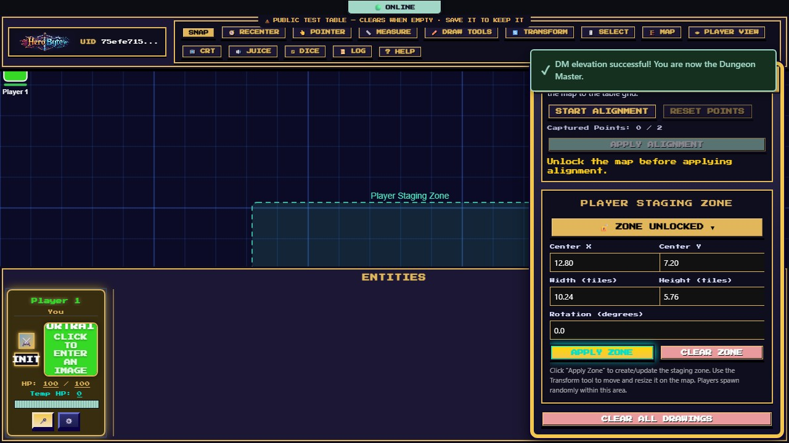
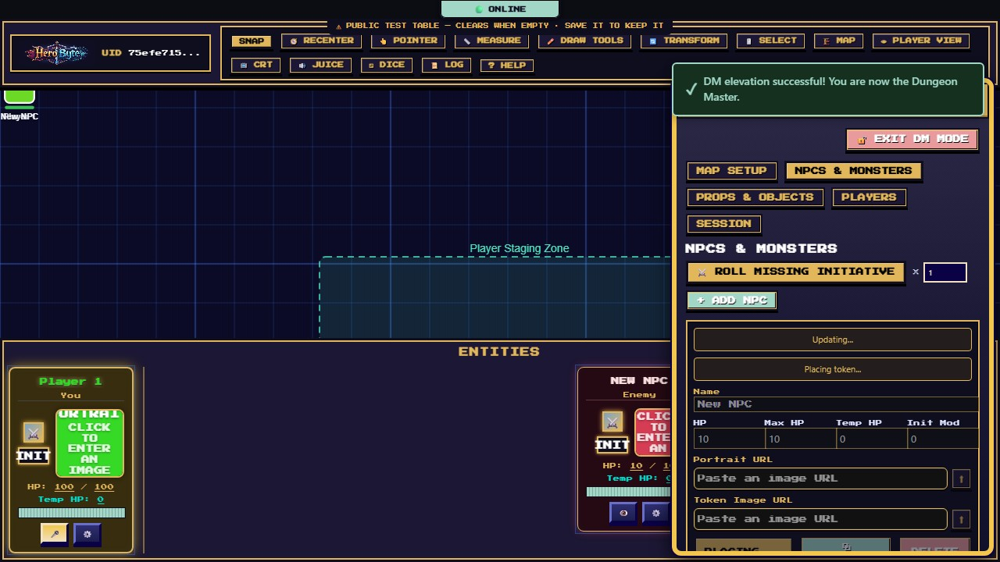
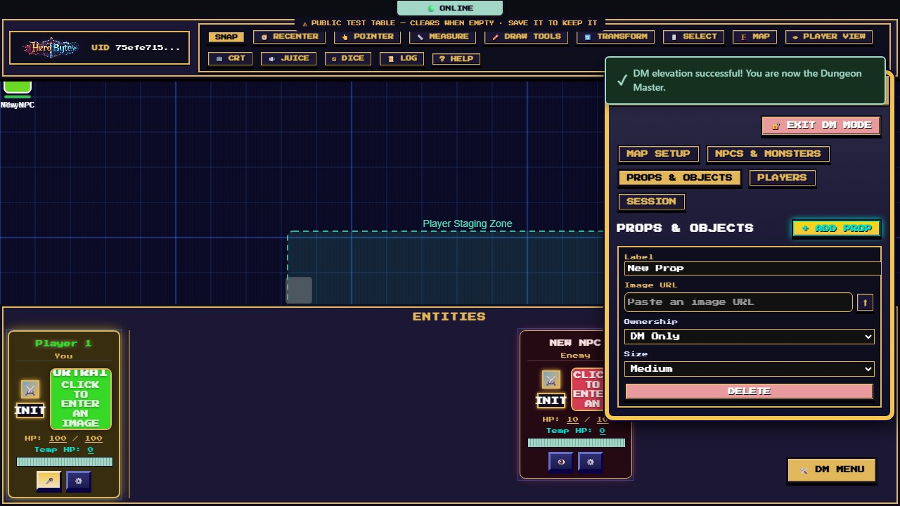
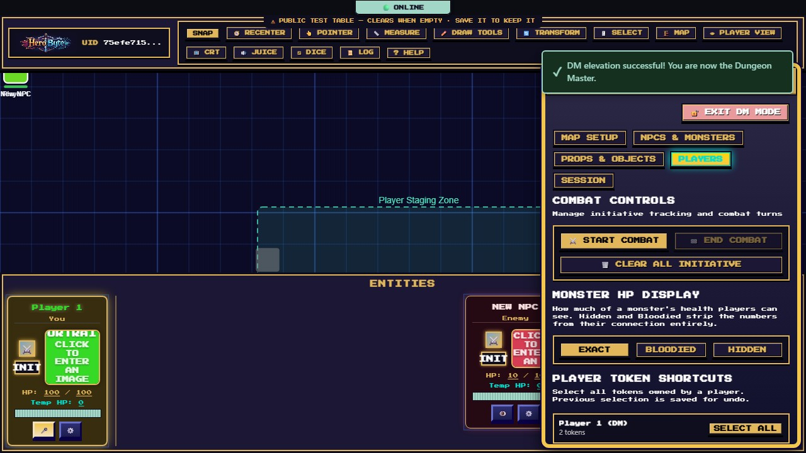
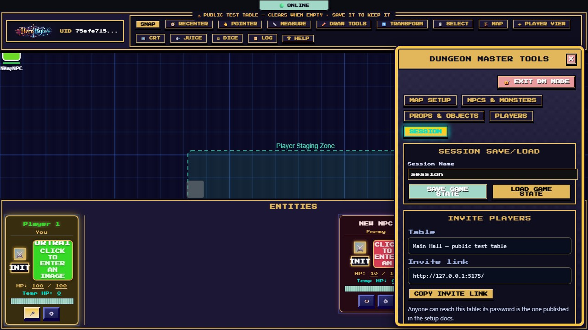
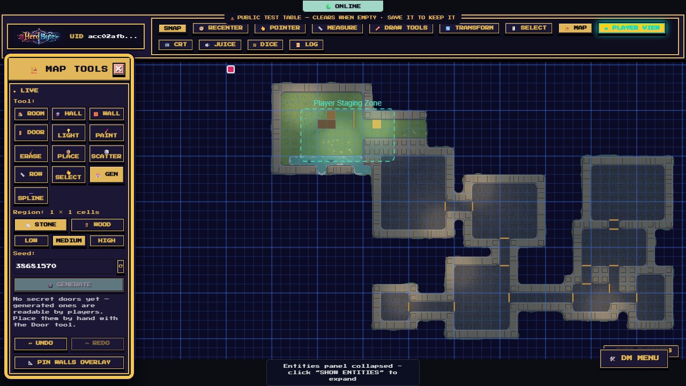

# DM Guide

Everything the Dungeon Master runs from — [elevate to DM](getting-started.md#becoming-the-dm) first, then open the **🛠️ DM MENU** (bottom-right). This guide covers the DM Menu's five tabs plus the DM-only toolbar powers. Building the map itself has [its own guide](map-editor-guide.md).

## Map Setup

Top to bottom:

- **Map Background** — **⬆ UPLOAD IMAGE** to use any battlemap image from your own device as the table; it's stored on your table's server and stays with the game. Or paste an image URL and **APPLY BACKGROUND** for art already online (the image's host must allow cross-origin loading). If you're authoring terrain with the [live map editor](map-editor-guide.md) instead, skip the background — a raster background underneath live terrain gets messy, and the editor will warn you.
- **HeroByte Map Studio** — the editable-map store behind the live editor: create a named blank map, reopen a **saved map**, **IMPORT JSON BACKUP**, or delete. (Day-to-day you'll rarely touch this — **▶ START LIVE MAP** in the editor creates and binds one for you.)
- **Map Transform** — scale, rotate, and offset the background image; **Map is locked** prevents anyone dragging the map by accident. Unlock only while adjusting.
- **Grid Controls** — grid cell size in pixels (10–500), **Square Size** in feet (what the measure tool reports per square), and **Diagonals**, the rule the whole table measures by: **5e** (every square costs the same — a two-square diagonal is 10 ft), **Pathfinder** (diagonals alternate 5-10, so the same diagonal is 15 ft), or **Euclidean** (straight-line distance in fractions of a square). The setting is per table and reaches every player, so nobody is measuring by a different rule. **🔒 GRID LOCKED** freezes the sizes.
- **Fog of War** — the master switch. Fog needs a built map with walls and doors (it computes line-of-sight from them), so publish something with the live editor first; until then the button explains itself. Once on, players see only what their tokens see — you keep X-ray vision unless you flip on the [player lens](#the-player-lens). Two things are worth knowing about what fog does for you: entities outside a player's sight are never _sent_ to them at all, so there is nothing to find in the browser's devtools; and once a player has seen a patch of ground it stays dimly lit for them afterwards, so nobody has to re-map a dungeon they already walked. That memory is theirs alone, it covers the ground only, and a monster that moves into a remembered room is still invisible until they can actually see it.
- **Sight Radius** — how far one token can see, in feet, set from that token's settings (the ⚙ on a player's card; on a phone, **PARTY** → **⚙ EDIT** on the row). It appears on player tokens only — fog is worked out from the tokens each player owns, so a radius on a monster would change nothing, and there is no control for it rather than one that quietly does nothing. Presets for **Unlimited**, **30/60/120 ft** and **Blind**, plus a custom value. **Unlimited** is the default and means sight stops only at walls — exactly how fog behaved before. This is the control that makes a dark dungeon dark: give the party 30 ft and a corridor becomes something they have to walk down. It is DM-only on purpose; a radius can only narrow what a player sees, so letting them clear their own would simply undo it. Setting one also makes fog dramatically cheaper to compute on a big generated map, so reach for it on large dungeons even for the performance alone.
- **Grid Alignment Wizard** — matching the table grid to a background image: **START ALIGNMENT**, click two opposite corners of one map square on the image, **APPLY ALIGNMENT**. The map scales and shifts so its grid meshes with the table's.
- **Player Staging Zone** — where new players spawn. Set center/size/rotation in tiles and **APPLY ZONE**; joining players appear at random spots inside it. Use the Transform tool to nudge the zone on the canvas; **ZONE UNLOCKED** toggles accidental-edit protection, **CLEAR ZONE** removes it.
- **Clear All Drawings** — wipes every player's ink from the map (confirmation required; cannot be undone).

## NPCs & Monsters

**+ ADD NPC** creates a monster with a full stat row:

- **Name, HP / Max HP / Temp HP, Init Mod, Portrait, Token Image** — same character plumbing as players. Both image fields take an **⬆ UPLOAD IMAGE** from your device or a pasted URL.
- **PLACE ON MAP** drops its token at the map's top-left corner cell — not at the center of your
  view — so recenter or drag it across from there. Pressing it again relocates that same token back
  to the corner rather than adding a second one.
- **⚔️ ROLL MISSING INITIATIVE** rolls a d20 + modifier for every NPC that doesn't have initiative yet — one click to get the whole opposing side into the turn order.
- NPC cards appear in the Entities panel labeled **Enemy**. The **👁️ eye button** on an NPC's card toggles whether players can see it at all — prep an ambush hidden, reveal it on the pounce. (Hidden NPCs stay visible to you.)
- **DELETE** removes the NPC and its token.

### Adding a pack at once

The **×N** field next to **+ ADD NPC** is how you stage an encounter: set it to 5, press the button (it renames itself **+ ADD 5 NPCS** so there's no doubt), and five arrive together — **numbered**, so the table can tell Goblin 3 from Goblin 5. Up to 20 at a time.

A second batch **carries on from the first** rather than repeating it: five goblins then three more gives you Goblin 1 through Goblin 8, never two sets fighting over the same numbers. Leave the field at 1 and the button behaves exactly as it always did.

**⧉ DUPLICATE** on any NPC card copies that monster — HP, portrait, token art and all — under the next free number. Build one goblin the way you want it, then press Duplicate four times. Duplicating **Goblin 3** gives you **Goblin 4** (or 9, if you're already up to 8): it continues the series rather than starting a new one.

A few notes worth knowing:

- **Names are the server's**, not yours to collide with — two DMs adding goblins at the same moment still get distinct numbers.
- A table stops at **500 characters**. If a batch would cross that line you get as many as fit rather than an error, because a table past the limit produces a session save that won't load back in.
- A duplicate of a **hidden** NPC is hidden too, so staging an ambush three deep doesn't reveal it.

NPCs are yours alone to edit: players can't rename, damage, or move them.

## Props & Objects

**+ ADD PROP** creates a map object (a chest, a boulder, a cart…):

- **Label** and **Image** — any image becomes a draggable map piece: **⬆ UPLOAD IMAGE** from your device, or paste a URL.
- **Ownership** — **DM Only** (players see it but can't touch), **Everyone**, or a specific player (hand the wizard their familiar).
- **Size** — the same six token sizes.

For _built-in_ scenery art (crates, tables, boats, standing stones…) you'll usually place assets with the [map editor's Place tool](map-editor-guide.md#-place-scatter-and-row--set-dressing) instead; Props shine for custom images and player-ownable objects.

## Players

- **Combat Controls** — **⚔️ START COMBAT** / **🏁 END COMBAT** and **🗑️ CLEAR ALL INITIATIVE**. (Combat also auto-starts the moment the first initiative is saved.) While combat runs, everyone sees the turn banner and ordered cards; see [the player guide](player-guide.md#initiative-and-combat).
- **Monster HP Display** — how much of a monster's health players see: **Exact** (numbers and bars), **Bloodied** (a coarse healthy/bloodied dot, 5e-style at half HP), or **Hidden** (nothing). Enforced on the server — in Bloodied and Hidden the numbers never reach a player's connection, so devtools show nothing either.
- **Player Token Shortcuts** — **SELECT ALL** grabs every token a player owns; useful for moving a whole party or checking what someone's left scattered around.

## Session

### Saving and loading sessions

**SAVE GAME STATE** downloads the entire table as one JSON file — tokens, characters (PCs _and_ NPCs), props, drawings, dice history, grid, fog state, the full live map with every terrain cell and door, and any uploaded images (inlined, up to 64 MB). The **Session Name** field just names the file. Private dice rolls (**DM** or **ME**) and whispers are left out on purpose: a save file is made to be handed to other people.

**LOAD GAME STATE** restores a save. Read the confirmation carefully: loading **replaces the table for everyone connected**. Players currently at the table keep their live connection and their own characters; everything else becomes the file's contents.

Habits that save campaigns:

- Save before ending every session, and name files by date (`heist-2026-07-31.json`).
- Save before risky experiments (mass-deleting, big map surgery).
- On free-tier hosting the server's disk can reset when it idles — a session file in your downloads folder is your real persistence.
- The save is a **DM artifact**: it contains secret doors, hidden NPCs, and GM notes in plain text. Don't hand it to players.

### Invite Players

Your table's code and a shareable link, with a one-click copy. Send the link to your party; **it deliberately carries no password**, so send that by a different channel. On a non-secure origin (a plain `http://192.168.x.x` LAN address, where browsers disable clipboard access) the link is shown in a selectable box to copy by hand.

This lives here rather than on the join screen because that's the only place it can be right: before you've joined a table there's nothing to invite anyone to.

### Table Security (private tables)

**UPDATE PASSWORD** changes this table's password live: everyone already connected stays, new joiners need the new password. **RESET TO DEFAULT** puts the development default back. Change the password when a table code leaks, or after a public one-shot.

### Save as a Private Table (the test table)

On the **Main Hall** this panel appears instead, because that table's passwords are fixed — both the table password and the DM password are the published defaults and cannot be changed, so the test table always stays open for everyone and is wiped once it has sat empty for an hour.

So if something you built there is worth keeping, copy it out: give it a **name**, a **table password** (6+ characters) and optionally a **DM password** (8+), then **SAVE & GO THERE**.

That mints a brand-new private table and copies the whole thing across — room state, the live map and all its documents, and the uploaded images — then drops you into it. Specifics worth knowing:

- **The Main Hall is untouched.** It carries on exactly as it was, and still clears on schedule.
- **The copy is yours**: its own passwords, its own code, and never auto-cleared.
- It's the DM's view that gets copied, so **secret doors and hidden NPCs come with it** rather than being quietly dropped.
- Images are shared by content, so the copy claims them too — clearing the Main Hall later can't delete pictures your new table is using.

## DM-only toolbar powers

### The player lens

**👁 PLAYER VIEW** shows you _exactly_ what players see — fog computed from the party's vision, secret doors hidden, DM overlays gone — while you keep every DM power. One click on, one click off.

Use it constantly while prepping: it's the difference between "I think that corridor is hidden" and "it is".

### The live map editor

**🏗️ MAP** opens the live authoring palette — rooms, walls, doors, terrain painting, lighting, and the dungeon generator, all appearing for players in real time. It has [its own guide](map-editor-guide.md).

### Everything else you now own

- **Move and transform anyone's tokens**, and lock/unlock objects (select several and use the Lock/Unlock bar).
- **Delete a player's token** from their card settings (⚙️ on their card → **🗑️ DELETE TOKEN**).
- **Edit any player's name, portrait, HP, and status effects** from their card.
- **Clear all drawings** (Map Setup tab) — the players' erasers only touch their own ink.
- **Doors**: click toggles open/closed like anyone, but **Alt-click** cycles the lock — and Alt-clicking a **secret** door reveals it to the table. Secret doors show for you as a dashed seam.
- **🔓 EXIT DM MODE** (top of the DM Menu) steps you back down to player.
