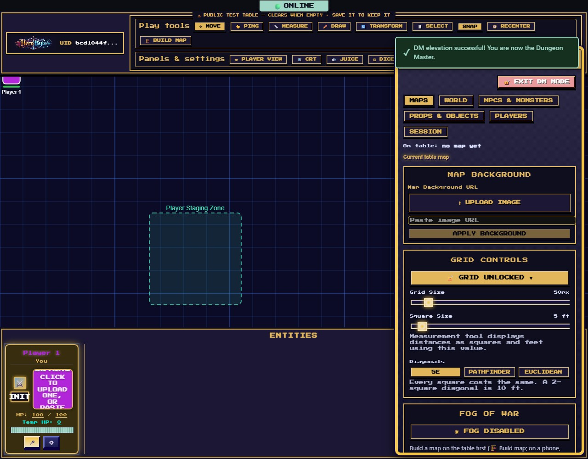
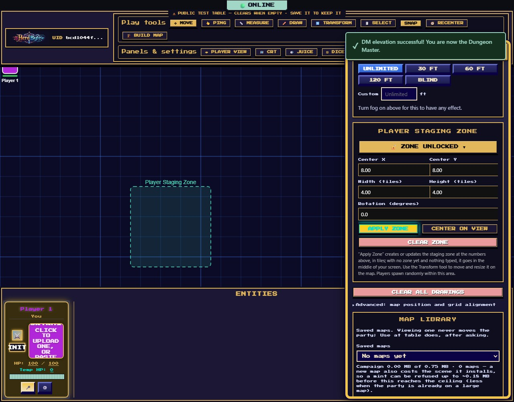
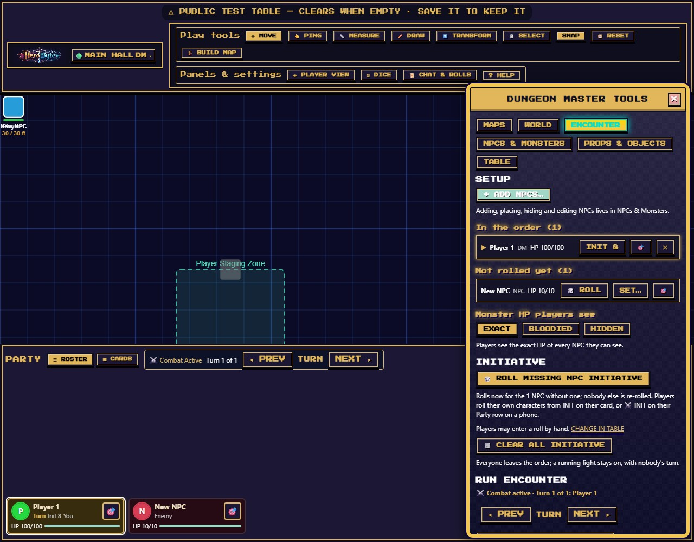
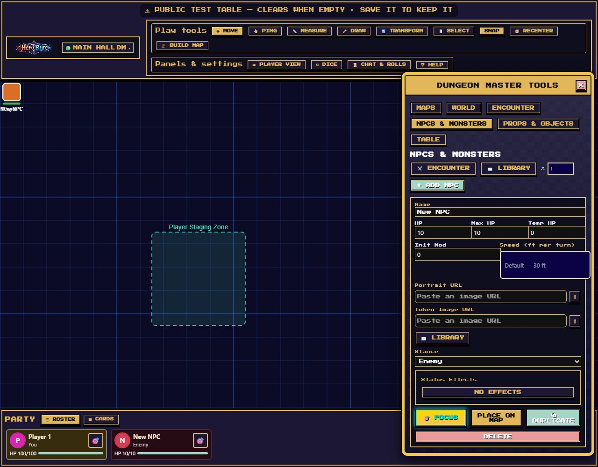
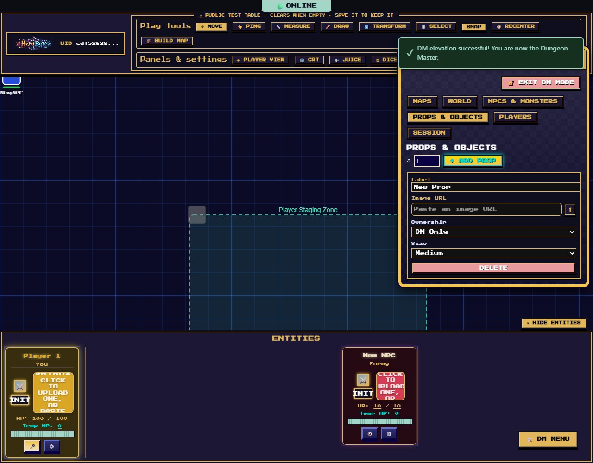
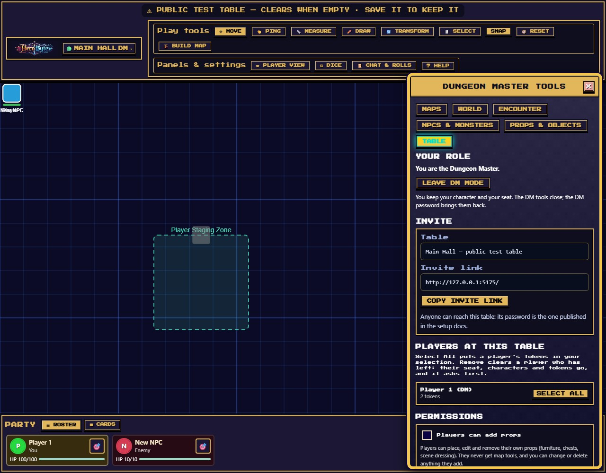
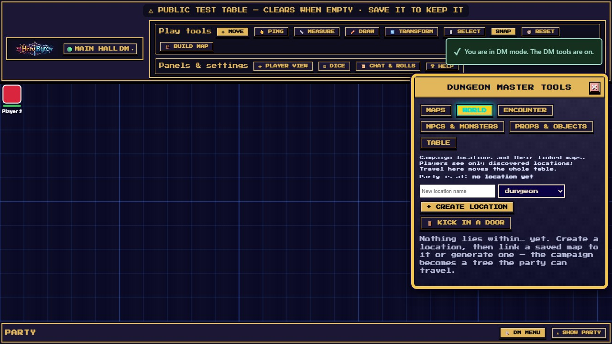
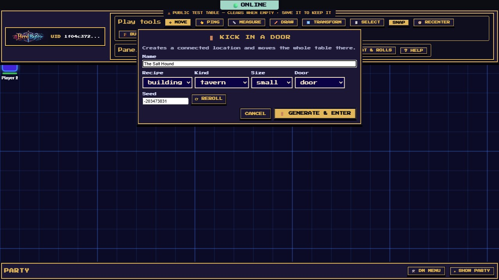
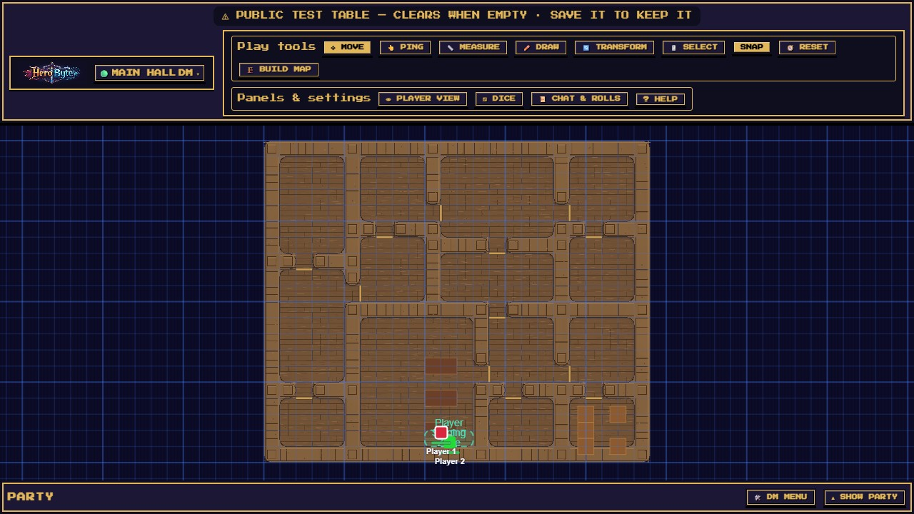
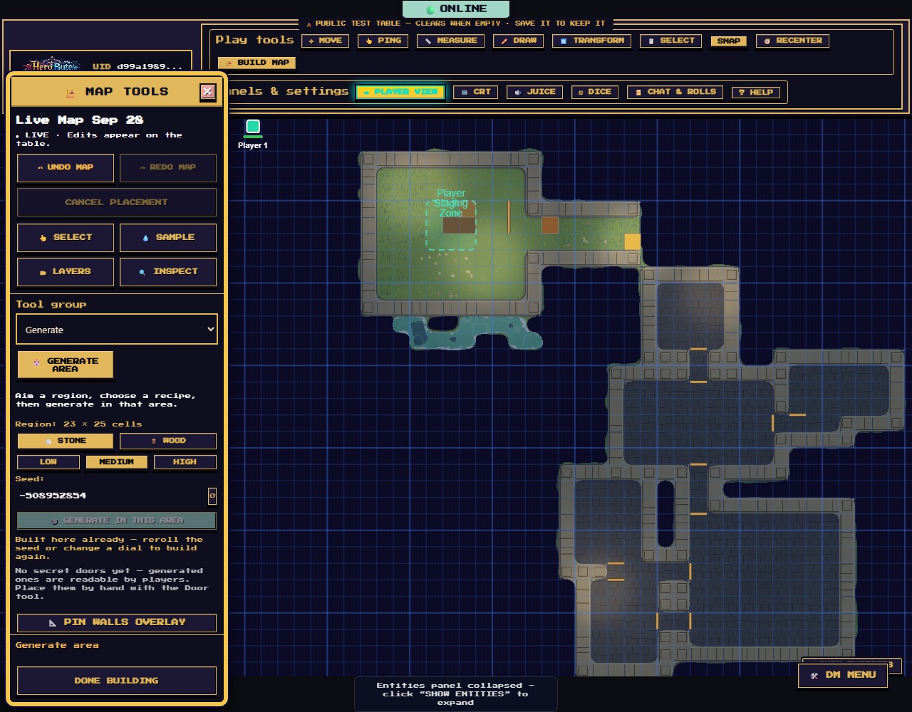

# DM Guide

Everything the Dungeon Master runs from — [enter DM mode](getting-started.md#becoming-the-dm) first, then open the **🛠️ DM MENU** (bottom-right). This guide covers the DM Menu's six tabs plus the DM-only toolbar powers. Building the map itself has [its own guide](map-editor-guide.md), and if you are deciding **how** to run a map at all — your own art, built by hand, or generated on the spot — start with [Running a Game](running-a-game.md).

## Maps

Maps are three different things, and this tab keeps two of them apart (the third, World, has [its own tab](#world-travel-and-the-kicked-in-door)). Its first line always says what the party is on — **On table: _name_** — and, when you have a different saved map open, **Viewing in library: _name_**. Opening a saved map only lets you look at it; the party never moves until you choose **Use at table** (or **Advanced → Publish map background**).

### Current table map

The settings of what the party sees now, top to bottom:

- **Map Background** — **⬆ UPLOAD IMAGE** to use any battlemap image from your own device as the table; it's stored on your table's server and stays with the game. Or paste an image URL and **APPLY BACKGROUND** for art already online (the image's host must allow cross-origin loading). If you're authoring terrain with the [live map editor](map-editor-guide.md) instead, skip the background — a raster background underneath live terrain gets messy, and the editor will warn you.
- **Grid Controls** — grid cell size in pixels (10–500), **Square Size** in feet (what the measure tool reports per square), and **Diagonals**, the rule the whole table measures by: **5e** (every square costs the same — a two-square diagonal is 10 ft), **Pathfinder** (diagonals alternate 5-10, so the same diagonal is 15 ft), or **Euclidean** (straight-line distance in fractions of a square). The setting is per table and reaches every player, so nobody is measuring by a different rule. **🔒 GRID LOCKED** freezes the sizes.
- **Fog of War** — the master switch. Fog needs a built map with walls and doors (it computes line-of-sight from them), so build one with **🏗️ Build map** first; until then the button explains itself. Once on, players see only what their tokens see — you keep X-ray vision unless you flip on the [player lens](#the-player-lens). Two things are worth knowing about what fog does for you: entities outside a player's sight are never _sent_ to them at all, so there is nothing to find in the browser's devtools; and once a player has seen a patch of ground it stays dimly lit for them afterwards, so nobody has to re-map a dungeon they already walked. That memory is theirs alone, it covers the ground only, and a monster that moves into a remembered room is still invisible until they can actually see it.
- **Sight Radius** — how far one token can see, in feet, set from that character's **Token settings** (select the character's row in the Party, then the ⚙ on its card; on a phone, **PARTY** → **⚙ EDIT** on the row). It appears on player tokens only — fog is worked out from the tokens each player owns, so a radius on a monster would change nothing, and there is no control for it rather than one that quietly does nothing. Presets for **Table Default**, **30/60/120 ft** and **Blind**, plus a custom value. **Table Default** is where a token starts and means it follows the table-wide setting below — and the empty box tells you what that currently is, reading **Table default — 60 ft** (or **— unlimited** when none is set, which is sight stopped only by walls, exactly how fog behaved before). So you can see what a token can actually see without leaving its card. This is the control that makes a dark dungeon dark: give the party 30 ft and a corridor becomes something they have to walk down. It is DM-only on purpose; a radius can only narrow what a player sees, so letting them clear their own would simply undo it. Setting one also makes fog dramatically cheaper to compute on a big generated map, so reach for it on large dungeons even for the performance alone.
- **Table Sight Default** — the same thing for the whole table at once, on the Maps tab just under Fog of War. Set **30 ft** here and every token that has no radius of its own sees 30 ft; it is the quickest way to say "this dungeon is dark" without visiting five character cards. A token you set individually always wins, in both directions — a character with darkvision keeps their 120 ft, and one you deliberately blinded stays blind even if the table default is generous. Clearing it (**Unlimited**, or emptying the custom box) lifts the darkness everywhere in one go. It also closes a gap the per-token control cannot: a player who deletes their only token and rejoins gets a fresh one with no radius on it, and before this setting existed that token could see the whole dungeon with nothing to warn you.
- **Movement** — a character's speed in feet per turn, set from the same settings, under **Token settings** (select the character's row in the Party, then the ⚙ on its card; on a phone, **PARTY** → **⚙ EDIT**; a monster's in **DM Menu → NPCs & Monsters**). In combat the token's plate reads what is left of it, refilled when the character's turn starts. The budget is advisory: an overspend turns the plate red and refuses nothing — this is a VTT, not a rules engine. Beside the speed, the settings also show what the character has used this turn and a **Reset** that zeroes it, for a mis-press or a spell that restores movement; it appears during combat for a character in the order, or for one that has already spent movement. A character you run yourself (the one you joined with, or one you add with **➕ Add Character** on your own card — it gets a token like anyone's) joins a fight the way a monster does: give it an initiative (from its own card's **INIT**, or its **Set…** in [Encounter](#encounter) — **Roll missing NPC initiative** covers NPCs only) and it takes its place in the order, its token wears the budget, and its turn start refills it; when combat ends it returns to your own group at the front of the Party even though its roll stays on file. Without an initiative it stays in that group with no plate budget — and if you move it during a fight the server still counts that, so its card shows the spend and a **Reset** until you clear it or combat ends. A character on your card is a party member as far as the table is concerned — and the table can see it is yours (its card wears the DM's gold face and reads "Dungeon Master"): its HP, its speed, its spend and its place in the order are visible to everyone, so run a creature whose numbers must stay secret as an NPC — there is no way to convert an existing character, so make it an NPC from the start (**DM Menu → NPCs**) or delete and recreate it there. (On a phone your characters sit under your own seat like anyone's — there is no separate DM group; a row's **⚔️ INIT** sets its initiative, a row with an initiative reads its **Init** and, on the turn holder, **▶ Turn**, and the row's **⚙ EDIT** carries the spend and the Reset.) The readout turns red past the speed, like the plate.
- **Player Staging Zone** — where new players spawn. Type the centre, size and rotation in tiles and **APPLY ZONE** puts the zone exactly there; the one exception is a first zone with nothing typed, which lands in the middle of your screen. **CENTER ON VIEW** moves the zone to the middle of your screen and keeps its size and rotation. Width and height are at least 1 tile. Joining players appear at random spots inside it. Use the Transform tool to nudge the zone on the canvas; **ZONE UNLOCKED** toggles accidental-edit protection, **CLEAR ZONE** removes it.
- **Clear All Drawings** — wipes every player's ink from the map (confirmation required; cannot be undone).
- **Advanced: map position and grid alignment** — collapsed, because you set these once per background image. It opens itself while an alignment is running, and stays open until you close it or leave the tab.
  - **Map Transform** — scale, rotate, and offset the background image; **Map is locked** prevents anyone dragging the map by accident. Unlock only while adjusting.
  - **Grid Alignment Wizard** — matching the table grid to a background image: **START ALIGNMENT**, click two opposite corners of one map square on the image, **APPLY ALIGNMENT**. The map scales and shifts so its grid meshes with the table's.

### Map library

Every saved map, whether or not it is on the table. The picker marks the table's map **● … · on table**, and two maps with the same name get a short **#id** so you can tell the copies apart.

- **View saved map** — opens the picked map here to look at: its size, revision and element count, its own **↶ Undo edit / ↷ Redo edit**, and its exports. Nothing on the table changes.
- **Use at table** — puts the picked map on the table for everyone, after a confirmation naming both maps. The scene it replaces is saved exactly as it stands and comes back when you use its map at the table again — as long as that map is still in the library. A scene whose map was deleted has nowhere to be saved: the confirmation says so, and only the player characters come along. If the picked map is a World location's, the confirmation also says that **🚩 Travel here** would move the party to its entrance and mark it discovered; Use at table does neither. And if that location's map was generated and fog is off at the table now, it warns that Use at table does not turn fog on — every player sees the whole map — unless the party left a scene on that map, whose own fog comes back with it; Travel here turns fog on for a first visit. From a table with only a background image nothing is saved: the image stays underneath the new map, with its NPCs, props and drawings (the confirmation says so). Disabled for the map that is already there.
- **DELETE** — removes a saved map for good (it asks first). Deleting the table's own map leaves the party in the current scene for now (a table backup still saves it), but that scene can no longer be edited, and it is not kept when another map replaces it: its NPCs, props, drawings, background and combat are lost then. Deleting any other map also deletes the scene the party left on it, if there is one. If a World location uses the map, the location becomes a promise again and the door links placed on it are lost. The confirmation says each of these when it applies.
- **Export map image (PNG / WebP / SVG)** — a picture of the map. **Export editable map (.json)** — the map itself, to keep or move to another table. Neither is a whole-table backup; that is **Download table backup** under [Backups](#backups).
- **＋ Create map in library** — a new blank map, opened here to view; the table stays where it is. **Import editable map (.json)** brings an exported map back as a new saved map.
- **Advanced → Publish map background** — the older way to put a map on the table: it bakes the viewed map into one flat image and makes that image the table's background. It asks before replacing a different saved map (an uploaded background image is replaced without asking). Later edits draw over that snapshot; **Use at table** draws the map live, so later edits show cleanly. Like Use at table, it warns when a generated World location's map would arrive with fog off.

To edit the table's map, use **🏗️ Build map** in the header. If you have a different saved map open, Build names both and offers **▶ Resume editing _table map_**; it never swaps maps by itself.

## Encounter

**DM Menu → Encounter** (on a phone, **♛ DM** → **Encounter**) is where a fight is prepared, rolled, run and ended. It has three parts:

- **Setup** — **+ Add NPCs…** opens [NPCs & Monsters](#npcs--monsters), where adding, placing, hiding and editing live. Below it, everyone who can fight: **In the order** (top first, the turn holder marked **▶** and outlined) and **Not rolled yet** — each row with its HP, **NPC / Player / DM** and, when it differs from the character's name, its seat, **hidden** for an NPC you've hidden with the 👁️ eye, and its shortcuts: **🎲 Roll** (a d20 now, with its stored modifier), **Set…** (the same initiative dialog as the card's **INIT**, where you may type a number by hand), **Init N** to change a value, **✕** to take it out of the order (if it held the turn, the turn passes to the next in order), and **🎯** while its token is on the map. Then **Monster HP players see** — **Exact** (numbers and bars), **Bloodied** (a coarse healthy/bloodied dot, 5e-style at half HP), or **Hidden** (nothing). Enforced on the server: in Bloodied and Hidden the numbers never reach a player's connection, so devtools show nothing either.
- **Initiative** — **🎲 Roll missing NPC initiative** asks the server to roll a d20 + modifier for every NPC that has none yet — nobody else is re-rolled, and the button is disabled, with the reason beside it, once every NPC has a value. Each creature gets its own named line in the roll log; a creature you've hidden with the **👁️ eye** — and, while fog is on over a built map, any NPC with a token, since the fog may hide it from someone — rolls into **your** log only, so the ambush stays an ambush. Players roll their own characters from their card's **INIT** (on a phone, **⚔️ INIT** on their row). Whether they may type a roll by hand is a table permission — the line here says which, and **Change in Table** takes you to it. **🗑️ Clear all initiative** empties the order; a running fight stays on, with nobody's turn.
- **Run encounter** — **⚔️ Start combat** gives the turn to the top of the order. Mind the other road in: **any initiative saved while no fight is running starts combat by itself, on that character's turn** — including after 🏁 End combat, since the old initiatives stay on file. Roll the NPCs before the players and the fight is already running on the first goblin rolled, whatever its number. Encounter shows a note whenever the turn is not at the top — after an ordinary NEXT too, since it cannot tell the two apart — and **⏮ Start at top of order** moves it there (it also starts the round over and refills everyone's movement). Then **◄ PREV / NEXT ►**, the status line (**Turn N of M:** and the holder's name), and **🏁 End combat**, which keeps every initiative on file. Anyone may still press PREV / NEXT — in the Party bar, or on a phone's turn strip, which names whose turn it is.

## NPCs & Monsters

**+ ADD NPC** creates a monster with a full stat row:

- **Name, HP / Max HP / Temp HP, Init Mod, Portrait, Token Image** — same character plumbing as players. Both image fields take an **⬆ UPLOAD IMAGE** from your device or a pasted URL.
- **Status Effects** and **🎯 FOCUS** — the same conditions picker as the NPC's window in the Party, and a button that centres your view on its token while that token is on the current map. On a phone this tab is where both live (**♛ DM** → **NPCs & Monsters**; the phone's Party lists seats, not NPCs), and Focus closes the DM screen so you see the token.
- **PLACE ON MAP** drops its token at the map's top-left corner cell — not at the center of your
  view — so reset the view or drag it across from there. Pressing it again replaces the old token with a fresh
  one at the corner (its position, lock, size and sight radius reset) rather than adding a second one.
- **⚔️ ENCOUNTER** opens [Encounter](#encounter), where initiative and the fight itself live (rolling the NPCs' missing initiative moved there).
- NPCs appear in the Party as rows wearing their **Stance** — **Enemy**, **Neutral** or **Ally** (see [The Library](#the-library-monsters-and-townsfolk) below) — with HP, conditions and, once its token is placed, **🎯**; a hidden one reads **Hidden** on your screen. Select an NPC's row for its card: the **👁️ eye button** there toggles whether players can see it at all — prep an ambush hidden, reveal it on the pounce. (Hidden NPCs stay visible to you.) Its **⚙️** window has the same two halves as a player's: **Character** (portrait, token art, **Status Effects**, initiative, **Delete NPC**) and **Token settings** (place, size, lock). Conditions you set there show on the NPC's row, card and token for everyone who can see it.
- **DELETE** removes the NPC and its token.

### Adding a pack at once

The **×N** field next to **+ ADD NPC** is how you stage an encounter: set it to 5, press the button (it renames itself **+ ADD 5 NPCS** so there's no doubt), and five arrive together — **numbered**, so the table can tell Goblin 3 from Goblin 5. Up to 20 at a time.

A second batch **carries on from the first** rather than repeating it: five goblins then three more gives you Goblin 1 through Goblin 8, never two sets fighting over the same numbers. Leave the field at 1 and the button behaves exactly as it always did.

**⧉ DUPLICATE** on any NPC card copies that monster — HP, portrait, token art, size, stance and the hidden flag — under the next free number. Temp HP, the initiative modifier, status effects and a movement speed you set do **not** ride: the copy starts its own fight at the defaults. Build one goblin the way you want it, then press Duplicate four times. Duplicating **Goblin 3** gives you **Goblin 4** (or 9, if you're already up to 8): it continues the series rather than starting a new one.

A few notes worth knowing:

- **Names are the server's**, not yours to collide with — two DMs adding goblins at the same moment still get distinct numbers.
- A table stops at **500 characters**. If a batch would cross that line you get as many as fit rather than an error, because a table past the limit produces a table backup that won't restore.
- A duplicate of a **hidden** NPC is hidden too, so staging an ambush three deep doesn't reveal it.

NPCs are yours alone to edit: players can't rename, damage, or move them.

### The Library: monsters and townsfolk

**📖 LIBRARY** next to **+ ADD NPC** opens the bundled token pack: 244 top-down pixel-art tokens — 184 monsters across 30 families, from goblins and skeletons to hags, elementals and mimics, and 60 townsfolk for taverns, shops, streets and children. **MONSTERS** / **TOWNSFOLK** narrows the pack; **Family** narrows further (Goblins, Tavern & inn, Shops & trades…); **Search** matches every word you type against names, ancestry, gender, setting and the pack's own tags, so `goblin archer`, `dice dwarf` and `kid kite` each find what you mean. Click a token and it arrives as a new NPC with its name, token art and portrait already filled in, and its token is born at the pack's size — an ogre lands large, a goblin small — which you can change on the token afterwards like any other. The **×N** field applies to a pick just as it does to the plain button: set it to 5 and click the goblin archer for five numbered archers.

An NPC that already exists can take a library token too. Its card's **📖 LIBRARY** button, under the token image field, swaps the art in place; the portrait follows only when it was empty or was itself a library image, so a portrait you chose stays yours.

Names remain visible on token cards. Keyboard focus shows **Token preview** without
adding anything; activating a card still immediately performs the action described
above the grid. The preview stays while you change search or category. The **THIS TABLE**
shelf is the table's own token shelf (DMs only), separate from the map object's
browser-local **My uploads** shelf.

**Mimics come in pairs.** The library holds a closed chest, barrel, dungeon door, sarcophagus and spellbook, each with its revealed monster. Add the closed object, place it, and when the party disturbs it press **🎭 REVEAL MIMIC** on its card: the token swaps to the monster in the same cell at the same size, and **🎭 DISGUISE** puts it back. The name stays whatever you called it, so a chest labelled "Old chest" is still "Old chest" with teeth. Either button also sets the Stance to match the face it just put on — **Enemy** on a reveal, **Neutral** on a disguise — so the card never contradicts the art.

**Stance** says where an NPC stands with the party, and it is what its Party row says and its card wears: a red card for **Enemy**, gold for **Neutral**, green for **Ally**. Every townsfolk in the pack arrives **Neutral** and every monster **Enemy**, and you can change either on the NPC's **Stance** select in the DM menu — including mid-scene, when the hired guard turns on them. It is a label and a colour, nothing more: initiative, movement and HP behave exactly as before.

Players see the stance you set, so a disguised enemy is one you **set Neutral** — and on a mimic the two 🎭 buttons do it for you: **🎭 DISGUISE** sets **Neutral**, **🎭 REVEAL MIMIC** sets **Enemy**, so the card stops calling a thing with teeth harmless the moment the party finds out, and stops calling a closed chest dangerous when you hide it again. A mimic shell you add as a **new** NPC still arrives **Enemy** like every other monster in the pack, so set it Neutral once when you place it.

Townsfolk are otherwise NPCs like any other and sit on your side of the table. The pack lives at `/tokens/` on the site, at the same paths the pack's own gallery uses, so a library token survives a table backup and restore like any other URL, and players see the art the moment the NPC is visible to them.

### Your own tokens

The **THIS TABLE** chip in the Library is the table's own shelf. **Add your own** takes an image — **⬆ UPLOAD** from your device, or a pasted `https://` link (an **imgur** direct link is the one that works end to end: the site can display it, copy it and thumbnail it. A **Discord** link must be a `media.discordapp.net` address to display at all, and Discord does not let another site read its images, so neither the copy nor the thumbnail can be made — you will see a line saying so. No other host is drawn.) — plus a name, a description, tags, a size and a **Stance**, so it searches and picks exactly like the pack's entries: tap **villager** and **halfling** for the innkeeper, type `prop` for a wagon, and a search like `dwarf smith` finds your tokens alongside the pack's. The seven **kind** chips set the Stance for you — **monster** and **boss** mean Enemy, **ally** means Ally, and **npc**, **traveler**, **villager** and **prop** mean Neutral; the last kind chip you tap wins, and un-tapping it gives the stance back. The ancestry chips say nothing about stance. A typed word does only if it is one of the seven kind words — typing `ally` sets Ally exactly as the chip does; anything else leaves the select alone (it starts at **Enemy**, like everything else with no stance set). The select overrides all of it whenever you disagree. In the Library grid your tokens wear a cyan border and an **ADDED** badge, and lead the grid when they match — while **MONSTERS**, **TOWNSFOLK** or a **Family** is chosen only pack art is shown, so pick **THIS TABLE** (or **All** and **All families**) to see your own again. The **✕** removes one from the shelf (on a phone it is a bar under the token rather than a corner cross, so it never covers the picture). The shelf is table state: a co-DM sees it, it is saved and restored with the table backup, and players never receive it. An uploaded image rides a table backup — and so does a pasted link, once HeroByte has kept a copy of it (below).

Adding a token usually takes a moment, because HeroByte renders it down to an 84px thumbnail first and keeps that with the table — which is what stops a 4000px phone photo from being decoded once per cell every time you open the picker. The pack's own art already ships an 84px tier, so a pasted `/tokens/` path skips the whole step. If the picture cannot be read you get the token anyway, without the thumbnail, and a line saying so.

**Keep a copy on this table** appears for any pasted `https://` link and is on by default. Whether the copy can actually be made depends on the host — imgur allows it, `media.discordapp.net` does not — and when it cannot, the link stays and a line under the form says so. When it can: it re-renders the picture as a PNG (at most 1254px on its long side) and stores that on the table, so the token survives the day imgur takes it down. It is a re-render, not a byte copy — an animated GIF becomes a still frame, so uncheck the box to keep the original and its animation. Unchecking keeps the link as the token's picture; the small thumbnail is still made either way. If the copy cannot be made (some hosts refuse to let another site read their images), the link stays and a line under the form says what was skipped. Either way the token works. An upload and the pack's own art have nothing to copy — they are already the table's — so no box appears for them.

## Props & Objects

**+ ADD PROP** creates a map object (a chest, a boulder, a cart…):

- **Label** and **Image** — any image becomes a draggable map piece: **⬆ UPLOAD IMAGE** from your device, or paste a URL.
- **Ownership** — **DM Only** (players see it but can't touch), **Everyone**, or a specific player (hand the wizard their familiar).
- **Size** — the same six token sizes.
- **×N** — type a count before pressing add and that many copies scatter around your view centre in one go, numbered (`Crate 1`…`Crate 6`). Made for crate piles and market stalls; the ceiling is 20 per press.

For _built-in_ scenery art (crates, tables, boats, standing stones…) you'll usually place assets with the [map editor's Place tool](map-editor-guide.md#-place--scatter-and--repeat-along-line--set-dressing) instead; Props shine for custom images and player-ownable objects.

## Table

**DM Menu → Table** is everything about the table itself, top to bottom: **Your role**, **Invite**, **Players at this table**, **Permissions**, **Backups** and **Security**. Open it from the **Table button**'s **⚙️ Table settings…** (the button is at the left of the header) or from the DM Menu's last tab; on a phone, **♛ DM → Table**, or **⚒ TOOLS → Table → ⚙️ Table settings…**. NPCs stay in [NPCs & Monsters](#npcs--monsters) and combat in [Encounter](#encounter).

### Your role

**You are the Dungeon Master**, with **LEAVE DM MODE**, which steps you back down to player. You keep your character and your seat; the DM tools close, and the DM password brings them back. The same button is in the header's Table menu, where **ENTER DM MODE** lives for players — see [Becoming the DM](getting-started.md#becoming-the-dm).

### Invite

Your table's code and a shareable link, with a one-click **Copy invite link**. Send the link to your party; **it deliberately carries no password**, so send that by a different channel. On a non-secure origin (a plain `http://192.168.x.x` LAN address, where browsers disable clipboard access) the link is shown in a selectable box to copy by hand.

A new table's next-steps card has the same copy as **Invite players**, and it is held until you are the DM. It lives in the table rather than on the join screen because that's the only place it can be right: before you've joined a table there's nothing to invite anyone to.

### Players at this table

Everyone who has joined, one row per player with a token count. Combat, turns and Monster HP are in [Encounter](#encounter); this is the list of people.

- **SELECT ALL** grabs every token a player owns; useful for moving a whole party or checking what someone's left scattered around.
- **REMOVE** — shown on a player who is **not at the table** (the row says so). It clears their seat: the roster row, their character sheets and their tokens on the map (a token still standing under an NPC is the NPC's, and stays), after a confirm that names the cost. There is no undo, though restoring an older table backup brings the character and its token back (not the seat). A seat dropped in the last minute reads **dropped just now** and waits, so a network blip cannot cost a player their characters; a browser left open on a login screen — even a second tab, even at another table — counts as here for five minutes, and the row cannot tell, so REMOVE then answers with a toast saying so. If one of those characters was taking its turn, the turn passes to the next in order instead of skipping a round. It is not a ban — the table password still lets them back in, as a new player. Players at the table cannot be removed; delete their characters instead.

### Permissions

Two switches for what players may do; beside each, the panel says what it lets them do.

#### Rolls entered by hand

Ticking **Players can enter rolls by hand** is for tables that roll physical dice. Players can type what they threw — for initiative, in the dice roller, or over a result the app already gave — and the entry lands in the shared log wearing a **BY HAND** badge, in its own colour, with anything it replaced struck through beside it. Nothing typed is disguised as an app roll, which is the point: your table is not being deceived by a number it watched someone throw, only by one it cannot tell apart.

Who may correct what: a player can rewrite **their own** rolls, and you can rewrite anybody's, because you adjudicate the table. Correcting the same roll twice keeps the **original** app roll struck through rather than the intermediate guess.

Untick it and the app's dice become the only way in **for players**. You keep hand entry either way — the switch exists for you to grant, not to take a vow.

#### Player props

Ticking **Players can add props** opens a **📦 PROPS** window for everyone at your table (on a phone it's **Tools → Props**): upload or paste an image, name it, pick a size, optionally scatter **×N** copies. It's made for shared set dressing — a player conjures a chest in an image generator and places it for you while you narrate.

Player props belong to whoever made them. A player can re-label, re-image, resize, move, scale, rotate, and delete **their own props only** — the server refuses everything else, whatever their client claims. They never gain any part of the map editor, and you can always edit, re-home, or delete anything they add from the Props tab above.

Untick it to close the tools again. Anything already placed stays on the table, and owners can still _move_ what's theirs (prop ownership has always worked that way) — they just can't add, edit, or remove props until you re-enable it.

### Backups

A backup is a file you keep. Three kinds exist and each picker names what it is handed: **Download table backup** / **Restore table backup…** here are the **whole table**; **Save character** / **Load character…** in a character's ⚙️ settings are **one character** (plus that player's own drawings, if they have any — loading onto someone else's character sets that character only, and leaves their drawings alone); **Export editable map** / **Import editable map** under Maps → Map library are **one map**. The server also keeps the table saved between visits (the public test table is wiped once it has sat empty); a backup is what you keep yourself, to move the table or bring an earlier map back.

**Download table backup** downloads the entire table as one JSON file — tokens, characters (PCs _and_ NPCs), props, drawings, dice history, grid, fog state, the full live map with every terrain cell and door, and any uploaded images (inlined, up to 64 MB). The **Backup file name** field just names the file. Private dice rolls (**DM** or **ME**) and whispers are left out on purpose, so a backup never carries anyone's private messages — but it still holds secret doors, hidden NPCs and GM notes, so keep it to yourself.

**Restore table backup…** restores one. Hand it an editable map or a character file and it is refused straight away, by name, with nothing loaded and no confirmation: the message says where that file belongs (a map goes to **Import editable map (.json)** under Maps → Map library, a character to **Load character…** in its ⚙️ settings). Most files that are none of the three are refused as *not a table backup*, with a pointer to **Download table backup**; a file that looks half like a backup (it has a `snapshot`, `tokens` or `players`) still names the first part that is wrong. For a real backup, read the confirmation carefully: restoring **replaces the table for everyone connected**: the map, the NPCs, props, drawings and settings become the file's (a monster that is in both the table and the file stays where it stands now; one the file lacks goes, token and all). Everyone with a seat on the table's roster keeps their own characters and tokens as they are now, whether or not they are connected at the moment (a character of theirs that the file has and the table no longer does comes back), and nobody's DM status changes — who is the DM stays with the DM password, whatever the file says. What does come back as the file had it is each seat's own record: its name, portrait, HP and conditions.

**How big can a campaign get?** A backup has to restore in one message, and the server accepts 1 MB per message. So a table holds at most 64 maps, and everything that mints a map — **＋ Create map in library**, **Import editable map (.json)**, a generated dungeon or building, a kicked-in door — is weighed first (an import is identified before it is weighed, so a file of the wrong kind is named rather than measured): a mint that would push the campaign's export past 0.75 MB is refused, and the refusal tells you both numbers. The weigh counts the new map's own bytes and the scene it installs when the party stands on it (its compiled walls, terrain and scenery) in place of the scene they are leaving, so a mint can be refused up to about 0.45 MB before the campaign reaches 0.75 MB — less for a smaller map, or when the party is already on a large one. The line beside the map list reads **Nearly full** from about 0.30 MB for that reason. A generated map costs its own bytes plus that scene: a `large` warehouse is about 460 KB all in, a `large` tavern about 200 KB, a `large` shop or house about 135 KB, a `large` high-density dungeon about 280 KB. So a fresh campaign holds two large warehouses, five large taverns (four to six by the roll), seven or eight large shops or houses, or three high-density large dungeons; medium maps: four or five warehouses, nine or ten taverns, ten or eleven shops or houses, twelve dungeons. The line beside the map list says where you are — **Room for more maps**, **Nearly full**, **Full** or **Too big to restore** — and its tooltip holds the exact size against the 0.75 MB ceiling. Delete a map you are done with to make room. **Download table backup** says two sizes: what the table weighs on the wire (what a restore sends — the images are saved too but not counted) and what the file takes on disk; if play has carried a table past the wire limit anyway, it warns that the file will not restore — delete a map or two and download again.

Habits that save campaigns:

- Download a backup before ending every session, and name files by date (`heist-2026-07-31.json`).
- Download one before risky experiments (mass-deleting, big map surgery).
- On free-tier hosting the server's disk can reset when it idles — a backup file in your downloads folder is your real persistence.
- A table backup is a **DM artifact**: it contains secret doors, hidden NPCs, and GM notes in plain text. Don't hand it to players.

### Security

**Change table password** changes this table's password live: everyone already connected stays, new joiners need the new password. **Reset to default** asks first, then gives the table the Main Hall's password, so anyone who has the table's code and that password could join with it: use it on purpose, never as a tidy-up on a table you keep. Change the password when a table code leaks, or after a public one-shot. The DM password is not changed here: it is set when the table is created, or by the first person who enters DM mode on a table made without one — which is why the next-steps card holds **Invite players** until you are the DM.

#### Save as a Private Table (the test table)

On the **Main Hall** this panel appears instead, because that table's passwords are fixed — both the table password and the DM password come from the server's settings (the published defaults when none are set) and cannot be changed in the app, so anyone with the server's Main Hall password can use the test table, and by default it is wiped once it has sat empty for an hour.

So if something you built there is worth keeping, copy it out: give it a **name**, a **table password** (6+ characters) and optionally a **DM password** (8+), then **SAVE & GO THERE**.

That mints a brand-new private table and copies the whole thing across — room state, the live map and all its documents, and the uploaded images — then drops you into it. Specifics worth knowing:

- **The Main Hall is untouched.** It carries on exactly as it was, and still clears on schedule.
- **The copy is yours**: its own passwords, its own code, and never auto-cleared.
- It's the DM's view that gets copied, so **secret doors and hidden NPCs come with it** rather than being quietly dropped.
- Images are shared by content, so the copy claims them too — clearing the Main Hall later can't delete pictures your new table is using.

## World, travel, and the Kicked-In Door

Your campaign is a **tree of maps**, and HeroByte can travel the whole table between them — or build a new one for you on the spot.

### The World tab

**DM Menu → World.** Campaign locations and their linked maps. Every place in your campaign is a location; the tab says where the party is (**Party is at: _name_**). A location with no map yet is a **promise** (⬒) — about a hundred bytes of "there is a tavern here", costing nothing until the party actually walks in. A location with a map is **mapped** (▣). Nothing on this tab moves the party except **🚩 Travel here** and the Kicked-In Door.

- **+ Create location** — name it and pick a kind; it becomes a top-level location (those are listed by name). (Only a kicked-in door nests a new location under the one you were on.)
- **🎲 Generate map for location…** on a promise — pick a recipe and its dials, then **🎲 Generate map for _name_**, and the engine builds a saved map for it. The party stays where it is until you choose Travel here.
- **🔗 Link existing map** — cash a promise with a map you built yourself. Locations and maps pair one to one.
- **🚩 Travel here** — moves the _whole table_ to that location, after asking. The scene you leave is suspended exactly as it stands: tokens, open doors, drawings, initiative, fog. Come back and it resumes — unless its map was deleted: then there is nowhere to keep it, only the player characters come along, and the confirmation says so. From a table with no saved map at all (only a background image, say), nothing is suspended: on a first visit its background, NPCs, props and drawings come along into the new location.
- **👁 Discovered** — players only ever see locations you have marked discovered. Undiscovered ones do not reach their screens at all: not the name, not the kind, not the fact that anything is there. Traveling somewhere discovers it automatically.

### 🚪 The Kicked-In Door

The party just kicked in a door you never prepped. **Press G.** ([Running a Game](running-a-game.md#c--kick-in-a-door) walks this one step by step, and shows how it combines with the other two ways of putting a map on the table.)

A small panel opens with the name prefilled, the recipe's dials, and a seed. Change what you like and hit **🚪 Generate & enter** (or Enter) — the panel says what it does: it creates a connected location and moves the whole table there. **⟳ Reroll** only changes the seed. Seconds later the whole table is standing in a new, stocked place — fog on, the camera on the party, and the party _inside the entrance_ rather than in solid rock.

- The new location hangs **under the one you were on**, and it is already discovered, so the players see its name the moment they arrive.
- On the map you left there is now a 🚪 sprite where the party was standing. On the new map there is one at the entrance leading **back** — click it, confirm, and the old scene resumes as you left it: open doors, drawings, initiative, fog.
- **Travel re-places the travelling party**, there and back. The scene resumes, but the party tokens are set down together at the destination's entrance — or, on a map with no entrance marked, at its centre. Coming back from a kicked-in door that means the middle of the old map rather than the doorway you left by; drag them where you want them.
- **A table that was never in World is adopted by its first kick**: the map you are on becomes the campaign's first location, named after its document and discovered. You do not have to set anything up beforehand.
- **You need a live map to kick from** — there is nothing to suspend and nothing to put a door on without one. A background image does not count. If the table has no live map, the panel says so and offers **▶ START LIVE MAP** in place of a dead Generate & enter button; click it and Generate & enter enables itself a moment later.
- If the door does not budge within twenty seconds you get a toast. The panel has closed by then: press **G** (or **🚪 Kick in a door**) to reopen it, set the name again if you had changed it, and press **🚪 Generate & enter** — it retries safely, without building the place twice.

The same panel is on the World tab as **🚪 KICK IN A DOOR**, and on a phone it is the second verb on the DM screen (**♛ DM → 🚪 Kick in a door**), with a **⏳ Kicking…** chip over the dock while it works.

### The recipes

- **Dungeon** — rooms joined by corridors, doors between them, a brazier in most rooms, and a DM-only key on the notes layer saying what lives there. Dials: theme (stone/wood) and density.
- **Building** — a **tavern**, **shop**, **warehouse** or **house**: a footprint partitioned into rooms by real, visible walls, interior doors, exactly one front door with the party arriving just inside it, a light per room, DM-only room keys written for that kind, and the furniture the catalog can offer — tables in a tavern's common room, crates along a warehouse's walls, a counter in a shop.

Every recipe is **deterministic**: the same seed and dials always produce the same place. Note a seed down and you can rebuild that tavern exactly, forever.

That cuts both ways, so treat a generated room key as a **prep note, not a secret**. Players never receive the keys — they are stripped from every frame that reaches a player's browser — but the map they _can_ see is built from the same seed, so someone determined enough to read HeroByte's source could work back to what the keys say. Anything that must stay hidden belongs in your own notes.

## DM-only toolbar powers

### The player lens

**👁 PLAYER VIEW** shows you _exactly_ what players see — fog computed from the party's vision, secret doors hidden, DM overlays gone — while you keep every DM power. One click on, one click off.

Use it constantly while prepping: it's the difference between "I think that corridor is hidden" and "it is".

### The live map editor

**🏗️ Build map** opens the live authoring palette — rooms, walls, doors, terrain painting, lighting, and the dungeon generator, all appearing for players in real time. It has [its own guide](map-editor-guide.md).

### Everything else you now own

- **Move and transform anyone's tokens**, and lock/unlock objects (select several and use the Lock/Unlock bar).
- **Delete a player's token** from their card settings (select their row in the Party, ⚙️ on their card → **Token settings** → **🗑️ DELETE TOKEN**; on a phone, **PARTY** → **⚙ EDIT** on their row). The same **Token settings** resize it and lock it.
- **Move a player character to another seat** from its **Token settings** → **Owner** (on a phone, **PARTY** → **⚙ EDIT** on its row). The character and its token go to that player together: they move it, their fog is lit by it, and it joins their own rows in the Party. Player characters only — an NPC stays yours, because handing one over would change what fog and hidden monster HP show that player.
- **Edit any player's name, HP, portrait, and status effects** from their card. Click an HP number to type it, or drag along the bar, as the player would; on a phone, the HP on their row in **PARTY** works the same way.
- **Clear all drawings** (Maps tab → Current table map) — the players' erasers only touch their own ink.
- **Doors**: click toggles open/closed like anyone, but **Alt-click** cycles the lock — and Alt-clicking a **secret** door reveals it to the table. Secret doors show for you as a dashed seam.
- **LEAVE DM MODE** (DM Menu → Table → Your role, or the header's Table menu) steps you back down to player.
