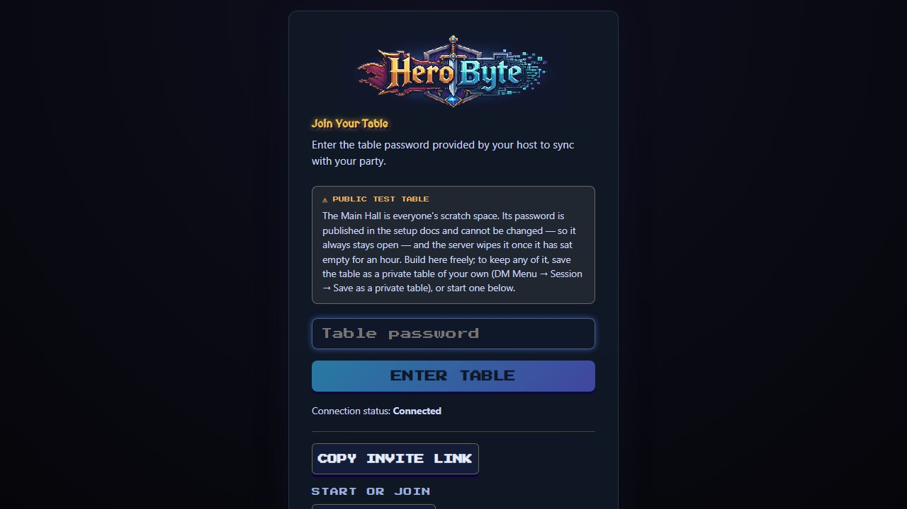
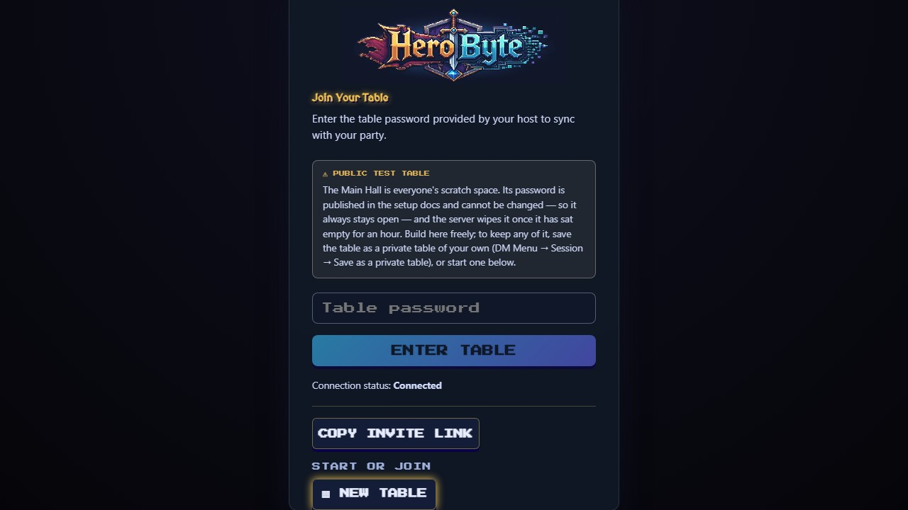
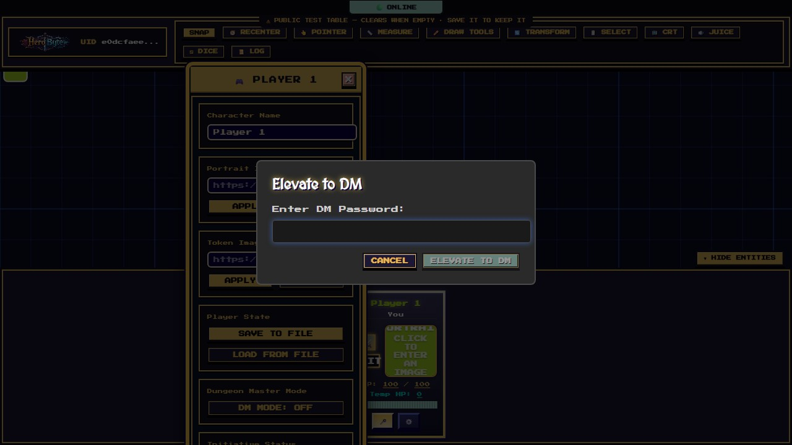
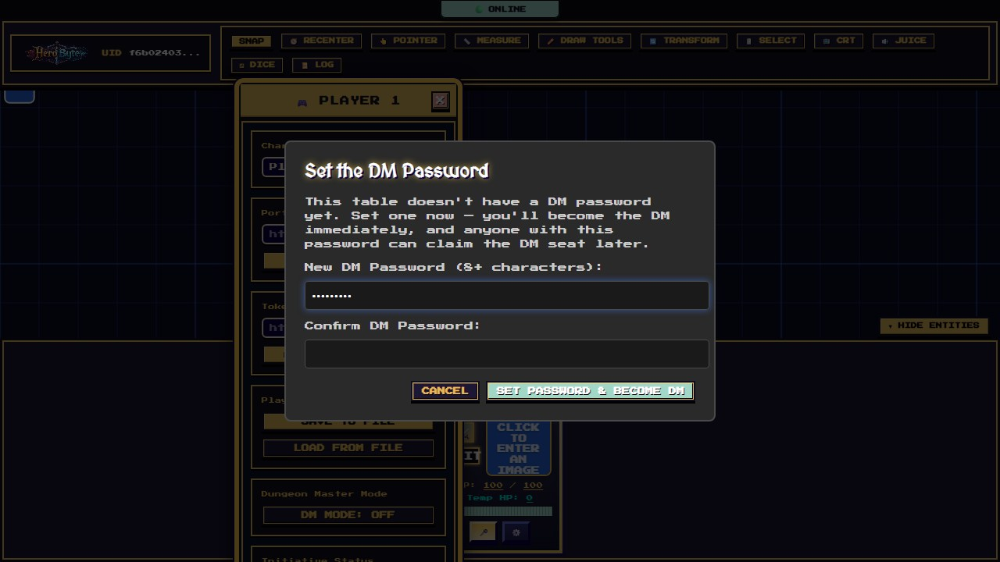

# Getting Started

Everything in HeroByte happens at a **table** — one shared game space with its own map, tokens, dice log, and passwords. This page covers getting yourself (and your party) to a table.

## Joining a table

Open the app in a modern browser (Chrome, Edge, or Firefox recommended). You'll land on the join screen:

1. Check the **Connection status** line says `Connected`.
2. Type the **table password** your host gave you.
3. Press **ENTER TABLE**.

That's it — your token appears on the map, and your player card shows up in the **Entities** panel at the bottom.

A few useful details:

- **Wrong password?** The error appears in red and your typed password stays in the field so you can spot the typo. Passwords are case-sensitive.
- **It remembers you.** The password is stored for that table (per browser tab session), so a reload drops you straight back in. If your connection blips mid-game, HeroByte reconnects and re-authenticates automatically — you'll just see a brief `Reconnecting…` banner in the corner.
- **One tab per table.** If you open the same table in a second tab, the older tab pauses with an "open in another tab" notice (only one live connection per device). Use **RECLAIM THIS TAB** to switch back.
- On a locally hosted server, the development table password is `Fun1` unless the host changed it.

## The Main Hall is the public test table

Every server starts with one table, the **Main Hall**. It is permanently a scratch space:

- **Its passwords are public and fixed.** Both the table password and the DM password are the ones printed in the setup docs, and **neither can be changed** — not by you, not by anyone. That's deliberate: if they could be changed, one visitor could padlock a public demo and its host would lose their own test bed with no way back in.
- **It clears itself.** Once it has sat empty for an hour, the server wipes it: tokens, maps, drawings, and uploaded images all go. That keeps the shared space usable instead of letting it silt up (and keeps its upload quota from filling).
- You'll see this on the join screen, and a **⚠ PUBLIC TEST TABLE** marker sits under the connection banner while you're in it.

Build there freely — that's what it's for. Just don't leave anything there you want to keep.

### Keeping what you built there

If a scratch session turns into something worth saving, copy it to a table of your own: **DM Menu → Session → Save as a Private Table**. Give it a name and a password (and optionally a DM password) and press **Save & Go There**.

That mints a brand-new private table carrying **everything across** — the map, tokens, NPCs, drawings, uploaded images — and drops you into it. The Main Hall is untouched and carries on clearing as usual. Your new table is private, has its own passwords, and is **never auto-cleared**.

For a game you're planning in advance, [create a private table](#creating-a-private-table) from the join screen instead.

## Switching tables, invites, and codes

There's one login. If you belong to more than one table, a **Table** picker appears directly above the password field — choose the table, type its password, press **ENTER TABLE**. (With only the Main Hall to go to, the picker stays hidden; one option isn't a choice.) Tables you've named show up by name rather than by code.

Below the password field:

- **Copy invite link** copies a URL like `https://your-host/?room=table-k3f9x2` that lands friends directly on the join screen for that table. The link carries **no password** — share that separately.
- **Forget this table** drops a private table from this browser's list. You'll need its code to get back in.
- **Join by code**: paste a table code (like `table-k3f9x2`) and press **JOIN**.

Your browser remembers up to 12 tables. The server deliberately publishes no list of tables, so that list — plus the codes themselves — is how private tables stay findable.

## Creating a private table

Any player can start a fresh, private table — no DM powers needed. This is where real games live: a private table has its own password, its own DM password, and is **never auto-cleared**.

1. Press **▦ NEW TABLE**.
2. Give it a **name** (e.g. "Sunday Game") so it's recognisable in your table list later.
3. Choose a **table password** (6+ characters) — this is what your players will type to get in.
4. Optionally choose a **DM password** (8+ characters) — whoever knows it can become that table's DM. (Skipped it? No problem — the first person who tries to enter DM Mode on the new table is offered to set it right there.)
5. Press **CREATE PRIVATE TABLE**.

HeroByte mints a random table code (like `table-k3f9x2`), drops you straight in, and you can share the invite link + password with your party.

Good to know:

- A private table's password is **its own** — the Main Hall password never unlocks a private table, and vice versa.
- Each private table also gets its own DM password, separate from the Main Hall's.
- Tables persist on the server between sessions (on hosted free tiers a long-idle server may reset — the DM should export a session save as backup; see the [DM Guide](dm-guide.md#saving-and-loading-sessions)).

## Becoming the DM

Any player at a table can elevate to **Dungeon Master** with that table's DM password:

1. Open your player card's **⚙️ settings** (bottom-right of your card in the Entities panel).
2. Under **Dungeon Master Mode**, press **DM MODE: OFF**.
3. Enter the DM password and press **ELEVATE TO DM**.

You'll get a confirmation toast, plus three new powers in the top toolbar — **🏗️ MAP** (the [live map editor](map-editor-guide.md)), **👁 PLAYER VIEW** (the player lens), and the **🛠️ DM MENU** button in the bottom-right (the [DM Guide](dm-guide.md) covers it all).

Notes:

- **First DM on a fresh private table?** If the table was created without a DM password, your first elevation attempt offers to set one on the spot — you become the DM the moment it's saved:

  

- On a locally hosted server the development DM password is `FunDM` unless changed.
- After five wrong attempts the server locks elevation for 15 seconds.
- To step down, open the DM Menu and press **🔓 EXIT DM MODE** (or toggle DM Mode off in your settings). You'll need the password again to re-elevate.
- More than one player can hold DM powers at the same time if you share the password — handy for co-DMs.

## Which browser? Which device?

- **Desktop** Chrome, Edge, or Firefox get the full experience.
- **Phones and tablets** get a streamlined touch layout automatically — see [the Player Guide's mobile section](player-guide.md#playing-on-a-phone-or-tablet).
- Voice chat needs a secure origin (`https://` or `localhost`) for microphone access.
