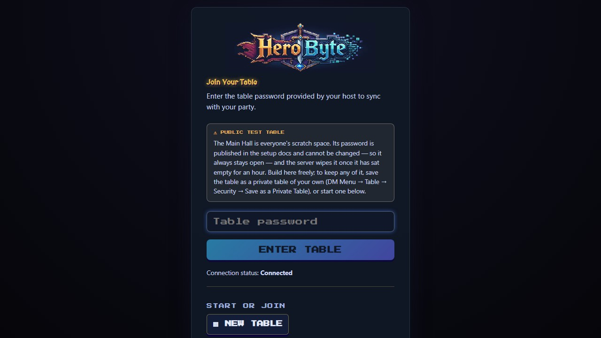
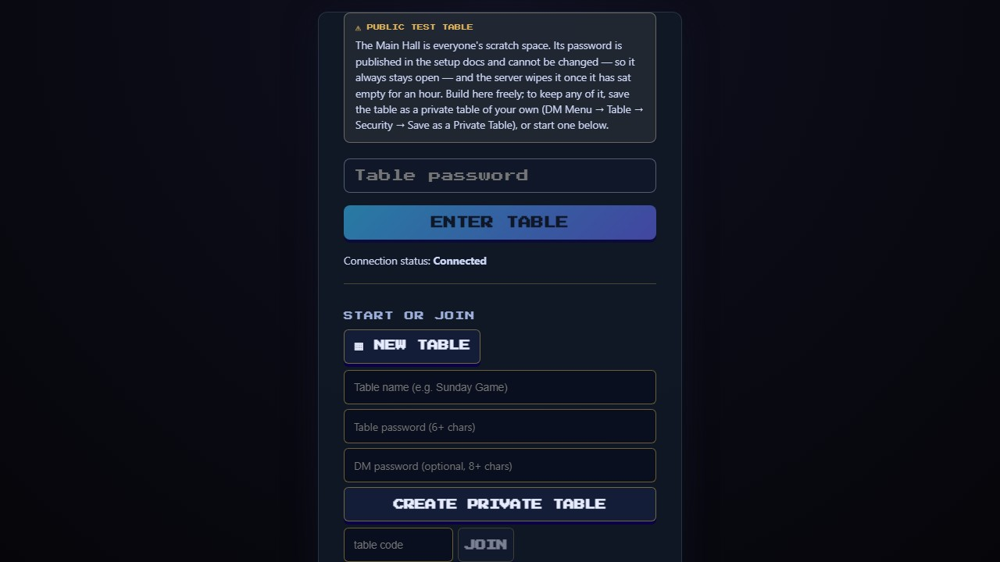
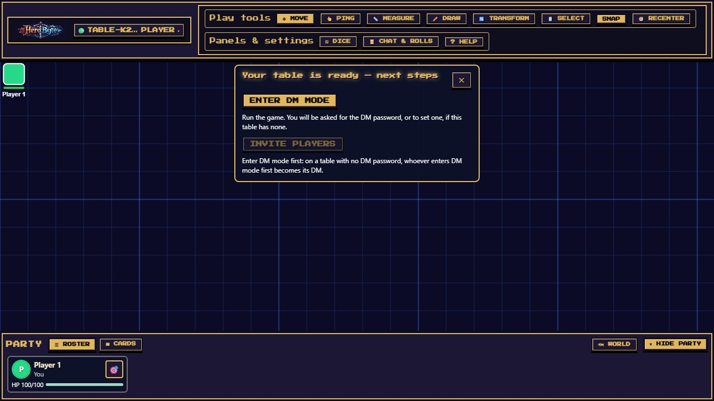
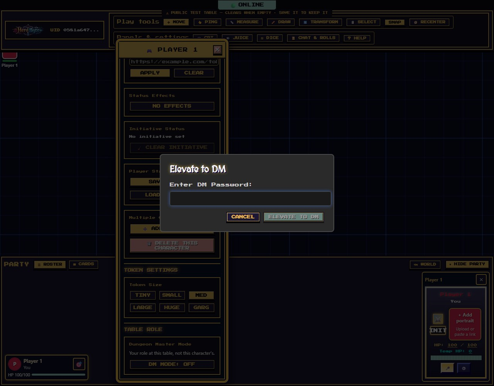
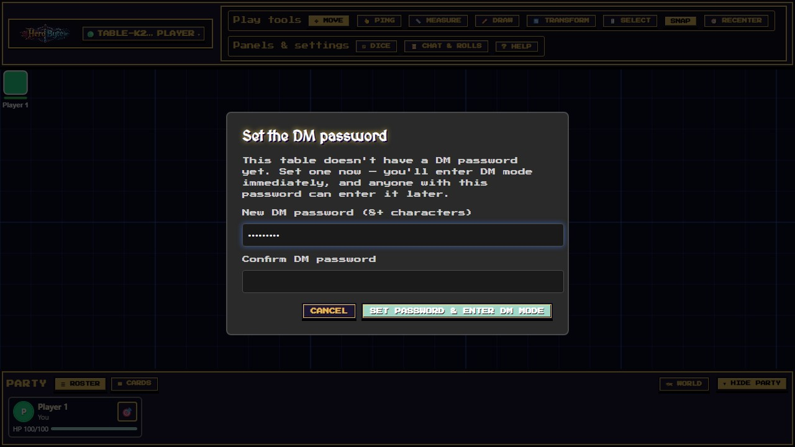

# Getting Started

Everything in HeroByte happens at a **table** — one shared game space with its own map, tokens, dice log, and passwords. This page covers getting yourself (and your party) to a table.

## Joining a table

Open the app in a modern browser (Chrome, Edge, or Firefox recommended). You'll land on the join screen:

1. Check the **Connection status** line says `Connected`.
2. Type the **table password** your host gave you.
3. Press **ENTER TABLE**.

That's it — your token appears on the map, and your character gets a row in the **Party** at the bottom (select it for your full character card). If the table has a built map on it — one made with **🏗️ Build map**, or a saved map put on the table with **Use at table** or World travel, not a plain uploaded background image — the view starts centred on your token, so you are not staring at unexplored fog wondering whether anything loaded, and the same happens when you reload. Three things narrow that: it needs that built map; it aims at your token only while you run a single character (with two it goes to the party's start zone instead, or stays put); and it happens once on arrival, so a first map put on the table after you join leaves your view alone — though switching the table from one map to another recentres everyone on the new map's staging zone or middle.

A few useful details:

- **Wrong password?** The error appears in red and your typed password stays in the field so you can spot the typo. Passwords are case-sensitive.
- **It remembers you.** The password is stored for that table (per browser tab session), so a reload drops you straight back in. If your connection blips mid-game, HeroByte reconnects and re-authenticates automatically — you'll just see a brief `Reconnecting…` and then `Re-authenticating…` notice just under the header (on a phone, under the connection chip at the top). Your browser also keeps a session key for the table, so a reload or a blip brings you back as the same person — DM powers included — for up to six hours. (On the Main Hall the key lasts only until the table wipes itself: see below.)
- **One tab per table.** If you open the same table in a second tab of the same browser, the older tab pauses with an "open in another tab" notice (only one live connection per device). Use **RECLAIM THIS TAB** to switch back.
- **One device at a time.** Opening your table from a _different_ browser or device while the first is still connected shows "Held in another window" — that device has no session key, so it cannot take your seat (and neither can anyone else who knows the table password). The seat stays reserved for the first device while it is connected and for up to six hours after it disconnects, so keep playing there, or wait. If you cannot — the first device is gone and this browser has lost its key — try again once; if that still fails, **START A FRESH SESSION** appears, and it gives this browser a new identity: you join as a new player and cannot get back into your old character; it and its token stay at the table until the DM deletes them (the Main Hall clears itself once empty, after an hour by default), the old name lingers in the DM's Table tab until the DM removes it there (**DM Menu → Table → Players at this table → REMOVE**), and any DM powers on that browser are gone until you enter the DM password again. Coming back on a new device once the old one has been gone more than six hours works too, but you enter the DM password again.
- On a locally hosted server, the development table password is `Fun1` unless the host changed it.

## The Main Hall is the public test table

Every server starts with one table, the **Main Hall**. It is permanently a scratch space:

- **Its passwords are fixed.** The table password and the DM password are each the server's setting, or the one printed in the setup docs where the server sets none, and **neither can be changed** from the app — not by you, not by anyone. That's deliberate: if they could be changed, one visitor could padlock a public demo and its host would lose their own test bed until the server restarted.
- **It clears itself.** Once it has sat empty (an hour by default), the server wipes it: players, characters, tokens, maps, drawings, and uploaded images all go. That keeps the shared space usable instead of letting it silt up (and keeps its upload quota from filling).
- You'll see this on the join screen, and a **⚠ PUBLIC TEST TABLE** marker sits at the top of the header while you're in it.

Build there freely — that's what it's for. Just don't leave anything there you want to keep.

### Keeping what you built there

If a scratch session turns into something worth saving, copy it to a table of your own: **DM Menu → Table → Security → Save as a Private Table**. Give it a name and a password (and optionally a DM password) and press **Save & Go There**.

That mints a brand-new private table carrying **everything across** — the map, tokens, NPCs, drawings, uploaded images — and drops you into it. The Main Hall is untouched and carries on clearing as usual. Your new table is private, has its own passwords, and is **never auto-cleared**.

For a game you're planning in advance, [create a private table](#creating-a-private-table) from the join screen instead.

## Switching tables, invites, and codes

There's one login. If you belong to more than one table, a **Table** picker appears directly above the password field — choose the table, type its password, press **ENTER TABLE**. (With only the Main Hall to go to, the picker stays hidden; one option isn't a choice.) Tables you've named show up by name rather than by code.

Below the password field:

- **▦ NEW TABLE** creates a private table (see below).
- **Join by code**: paste a table code (like `table-k3f9x2`) and press **JOIN**.
- **Forget this table** drops a private table from this browser's list. You'll need its code to get back in.

Your browser remembers up to 12 tables. The server deliberately publishes no list of tables, so that list — plus the codes themselves — is how private tables stay findable.

**Inviting people happens inside the table**, not here. Once you are the DM, the **Invite players** button on your next-steps card copies the link (it waits until you have entered DM mode); any time after, **DM Menu → Table → Invite** shows the table's code and a link to copy. (Before you've joined anything there's no table to invite anyone to.) The link carries **no password** — send that separately.

## Creating a private table

Any player can start a fresh, private table — no DM powers needed. This is where real games live: a private table has its own password, its own DM password, and is **never auto-cleared**.

1. Press **▦ NEW TABLE**.
2. Give it a **name** (e.g. "Sunday Game") so it's recognisable in your table list later.
3. Choose a **table password** (6+ characters) — this is what your players will type to get in.
4. Optionally choose a **DM password** (8+ characters) — whoever knows it can become that table's DM. (Skipped it? No problem — the first person who tries to enter DM mode on the new table is offered to set it right there.)
5. Press **CREATE PRIVATE TABLE**.

HeroByte mints a random table code (like `table-k3f9x2`) and drops you straight in — as an ordinary player. A card offers the two things to do next, **Enter DM mode** and then **Invite players**; nothing on it happens by itself. Entering DM mode asks for the DM password — or, if you skipped it, to set one — and **Invite players** stays greyed out until you have been the DM, so the card does not hand the link out before you have claimed the seat (on a table with no DM password, whoever enters DM mode first becomes its DM); once you have, it stays available even if you leave DM mode. Close the card with its **✕** whenever you like; until you do, it comes back on a reload of that tab.

Share the invite link and the table password with your party (separately — the link never carries the password).

Good to know:

- A private table's password is **its own** — the Main Hall password never unlocks it, and vice versa, **unless its DM presses Reset to default** (DM Menu → Table → Security), which gives it the Main Hall's password: anyone with the table's code could then join.
- Each private table also gets its own DM password, separate from the Main Hall's.
- Tables persist on the server between sessions (on hosted free tiers a long-idle server may reset — the DM should download a table backup; see [Backups](dm-guide.md#backups) in the DM Guide).

## Becoming the DM

Any player at a table can enter **DM mode** with that table's DM password. DM mode is the table's, not a character's, so it lives in the **Table menu**:

1. Press the **Table button** at the left of the header — it shows the table's name and a dot for the connection (a DM also sees **DM** on it; your role is in the menu). (On a phone: **⚒ TOOLS → Table**.) Right after you create a table, the next-steps card's **Enter DM mode** does the same thing.
2. Under **Your role**, press **ENTER DM MODE**.
3. Type the DM password and press **ENTER DM MODE**.

You'll get a confirmation toast, plus two new buttons in the top toolbar — **🏗️ Build map** (the [live map editor](map-editor-guide.md)) and **👁 PLAYER VIEW** (the player lens) — and the **🛠️ DM MENU** button at the right of the Party bar (the [DM Guide](dm-guide.md) covers it all). On a phone, the dock's **◇ Reset** slot becomes **♛ DM**. The Table menu now also offers **⚙️ Table settings…**, which opens the DM Menu on its **Table** tab.

Notes:

- **A wrong password** keeps the dialog open with the reason shown, the cursor back in the field with what you typed selected, and you a player until one is right.
- **First DM on a fresh private table?** If the table was created without a DM password, your first attempt offers to set one on the spot — you become the DM the moment it's saved:

  

- On a locally hosted server the development DM password is `FunDM` unless changed.
- After five wrong attempts the server locks elevation for 15 seconds.
- To step down, open the Table menu and press **LEAVE DM MODE** (it is also at the top of **DM Menu → Table**). You keep your character and your seat; the DM tools close, and the password brings them back.
- More than one player can hold DM powers at the same time if you share the password — handy for co-DMs.

## Which browser? Which device?

- **Desktop** Chrome, Edge, or Firefox get the full experience.
- **Phones and tablets** get a streamlined touch layout automatically — see [the Player Guide's mobile section](player-guide.md#playing-on-a-phone-or-tablet).
- Voice chat needs a secure origin (`https://` or `localhost`) for microphone access.
