# Map Editor Guide

HeroByte's map editor runs **on the live table**: every room, wall, door, and brushstroke appears for your players the moment you commit it. No export step, no "load map" — you build the dungeon around the party, even mid-session.

It's DM-only: [elevate first](getting-started.md#becoming-the-dm), then press **🏗️ MAP** in the top toolbar. On a phone or tablet the door is a different one — see [On a phone or tablet](#on-a-phone-or-tablet) at the end.

## Starting a live map

The palette opens with one button:

**▶ START LIVE MAP** creates a fresh editable map (date-stamped, huge — 8192×8192), binds it to the table, and lights up the **● LIVE** badge. From now on every edit auto-compiles and broadcasts; you'll see a brief `saving…` flicker as each commit lands.

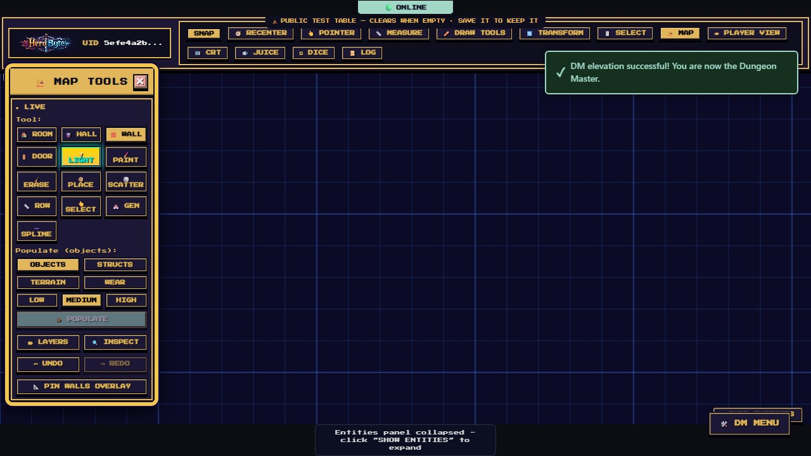

Things to know before your first wall:

- **Escape** cancels an in-progress drag; pressing it again (with nothing in progress) leaves map-edit mode. The map _stays_ live — closing the palette never unbinds it, and reopening resumes where you left off.
- **↶ UNDO / ↷ REDO** at the palette's foot work on map edits (Ctrl+Z / Ctrl+Y while in the mode). Each drag, stroke, or generate is exactly one undo step.
- Tokens don't respond to clicks while you're editing — leave the mode to move them.
- If the table still has a raster background image, the palette warns you: live terrain and a background photo fight visually. Clear the background (DM Menu → Map Setup) for a clean canvas.

## 🏠 Room and 🚇 Hall — the structural tools

**Room** drags a rectangle; on release you get floor terrain, a painted wall band, and a real blocking wall around the perimeter — one committed room, one undo step. The preview shows the true baked art plus a live `cols × rows` readout while you drag.

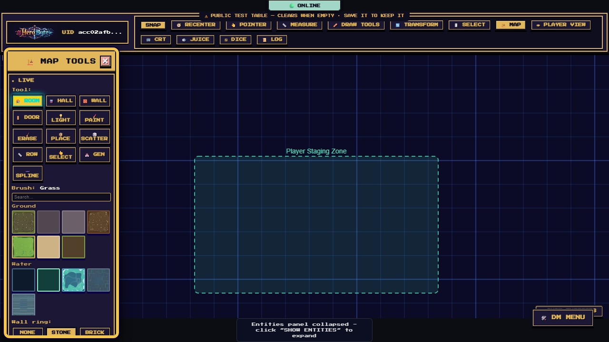

- The **brush deck** (below the tools) chooses the floor — any of the 34 terrain families.
- **Wall ring:** picks the wall style — **None, Stone, Brick, Timber, Dark**.

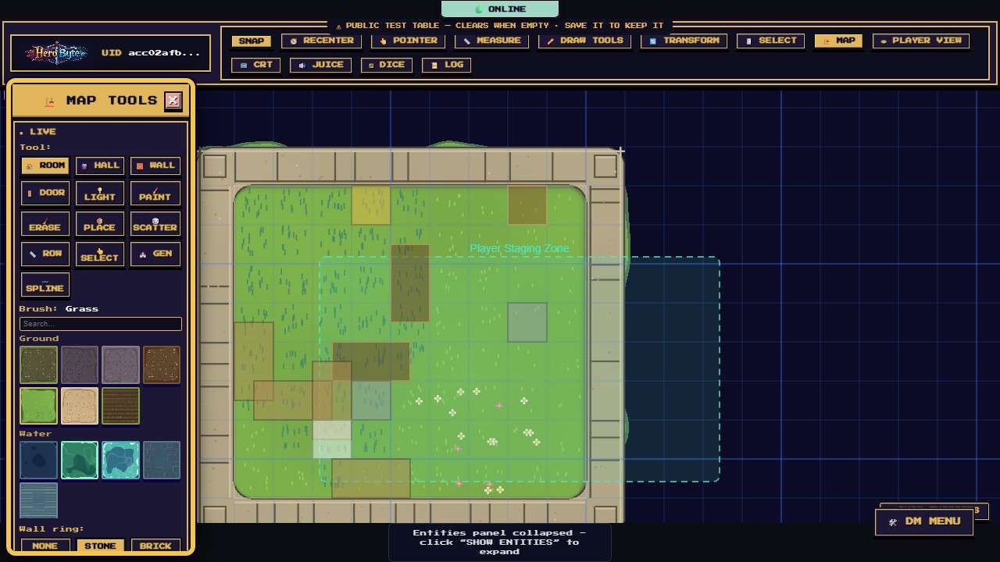

**Hall** is the corridor sibling: drag along its length, choose **Width (cells)** 1–4, and only the two long sides get walls — the ends stay open for connecting. Halls and rooms are polite neighbors: where they touch an existing floor, the shared wall band steps aside.

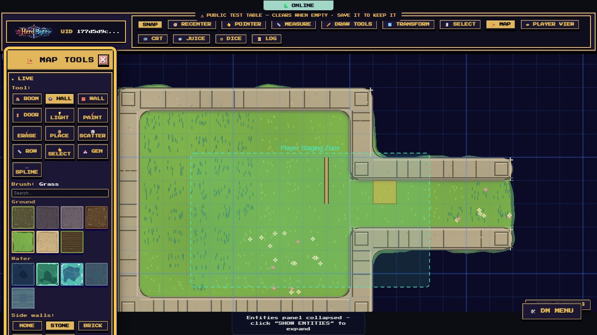

## 🧱 Wall and 🚪 Door

- **Wall**: drag point-to-point for one straight blocking wall. Walls are invisible to players — they exist to block movement and sight (fog). While editing you always see them as a translucent overlay; **📐 PIN WALLS OVERLAY** keeps that overlay up after you leave the mode (players never see it).
- **Door**: drag across a wall to set a door — its length is the drag, its angle follows. Doors author **closed**.

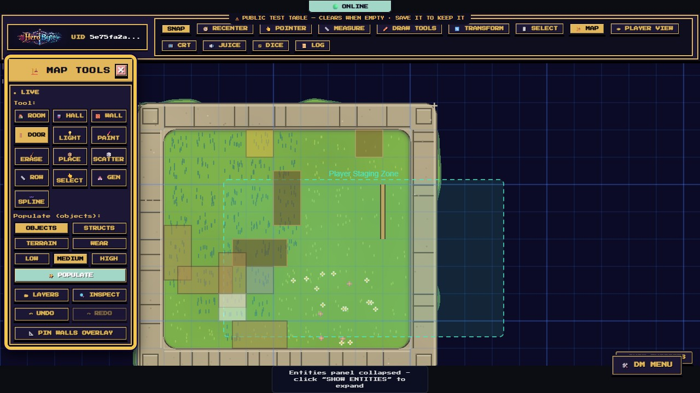

Door states go beyond open/closed — select a door with **👆 Select**, open **🔍 Inspect**, and the door section offers **Closed / Open / Locked / Secret** plus a width field:

- **Locked** — players get "Door is locked"; you can force it (Alt-click a door at the table cycles its lock).
- **Secret** — invisible to players entirely, dashed seam for you. Alt-click reveals it when the rogue finds it.

At the table, anyone can click a door to swing it — creak and slam included.

## 💡 Light — torches and night

Click to drop a warm torch pool (fixed radius). The trick is in the **Layers panel**: the **Lighting layer's opacity is the ambient light level** — `1` is full day; drag it down and the map cools into night, and your torch pools start to glow.

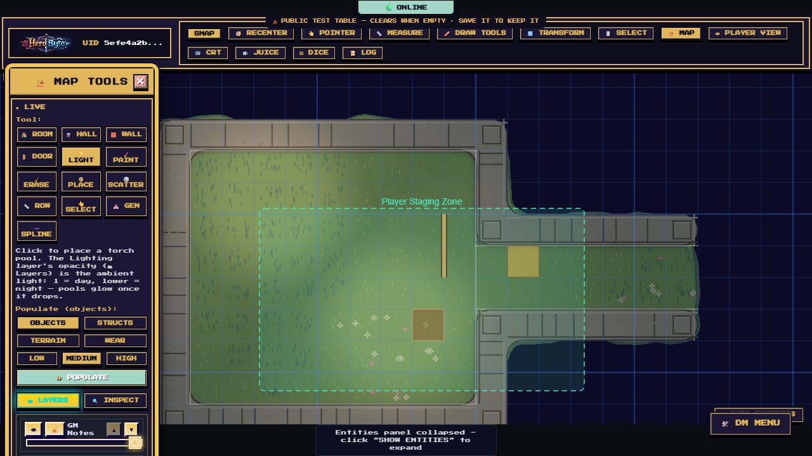

Some placed assets (street lamps, braziers) are **emissive** and cast their own glow automatically — no Light click needed.

## 🖌️ Paint and 🧹 Erase — freehand terrain

**Paint** brushes terrain cell-by-cell as you drag; each stroke is one undo. The **brush deck** is your palette:

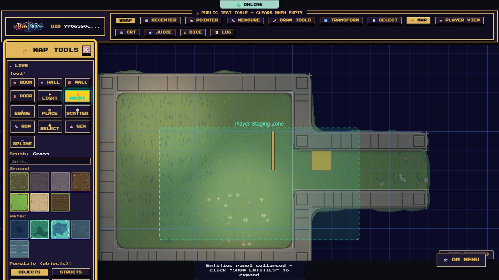

- **Eight shelves**: Ground (grass, dirt, sand, paths, cavern floor…), Water (including abyss depths and bioluminescence), Molten (lava and cooled crust), Stone (floors, walls, stairs, cliffs, a dais), Wood (plank floors, bridges, timber walls), Roofs, Canopy, and Crystal — 34 families total.
- **Search** filters instantly; **right-click a tile to pin it** to a ★ Pinned shelf; your six most recent brushes keep a Recent shelf warm. Hover a tile for a preview card and a one-line description.
- Terrain is procedural: water finds its depth, cliffs get contact shadows, grass mottles — you paint intent, the renderer does the art.

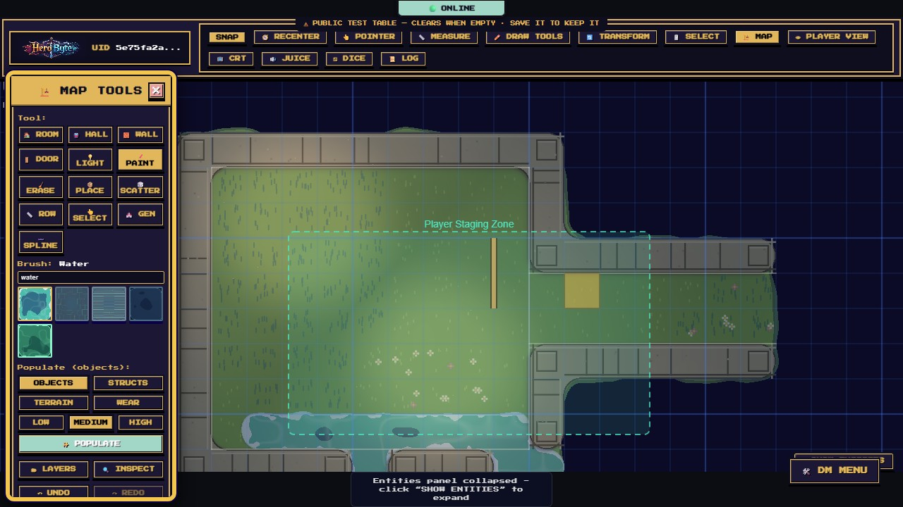

**Erase** clears painted terrain the same way (one stroke, one undo). It only erases terrain paint — placed objects come off with Select + Inspect → DELETE.

## 📦 Place, 🎲 Scatter, and 📏 Row — set dressing

Three tools share one **asset picker**:

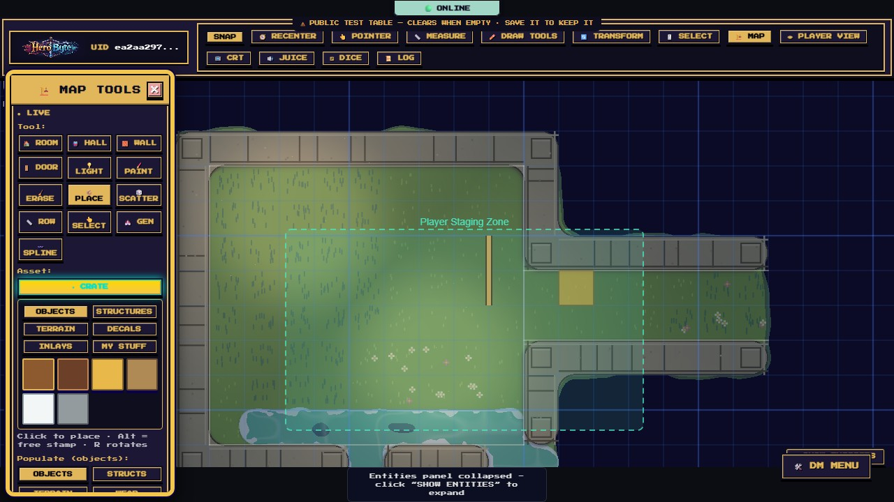

- **Objects** (crates, tables, boats, standing stones…), **Structures**, **Terrain** (stamp a terrain patch as an object), **Decals** (scorch craters, stains, wax drips), **Inlays** (medallions, rugs, tracery), and **My Stuff** — **⬆ UPLOAD IMAGE** turns your own PNG/JPEG/WebP/GIF into a placeable asset.
- **Place**: click to drop grid-snapped; **hold Alt** for a free-floating stamp at any angle; **R / Shift+R** rotates in 15° steps. A ghost previews the exact landing spot.
- **Scatter**: one click throws a natural-looking cluster of seven — same spot, same scatter, so you can undo and redo identically.
- **Row**: drag a line and the asset repeats along it with lived-in jitter and the occasional gap — fences, torch-lined corridors, market stalls.
- **Eyedropper**: **Ctrl/Cmd-click** anything on the map (with Place, Scatter, or Paint armed) to sample it as your active asset or brush.

## ✨ Populate — instant set dressing

After you commit a room or hall, the **Populate** block targets it: pick a category — **Objects, Structs, Terrain, Wear** — and a density (low / medium / high), and translucent ghosts preview the exact stamps. **✨ POPULATE** commits the fill: furniture hugs walls, clutter respects doorways, and the whole fill is one undo.

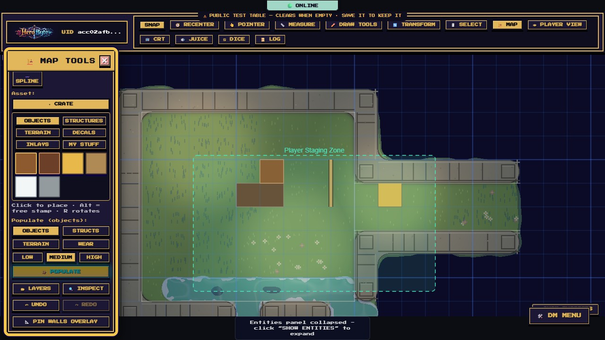

## 🏰 Gen — the dungeon generator

Drag a region (at least **20×20 cells** — zoom out if needed), pick a theme (**🪨 Stone / 🪵 Wood**) and density, and press **🎲 GENERATE**:

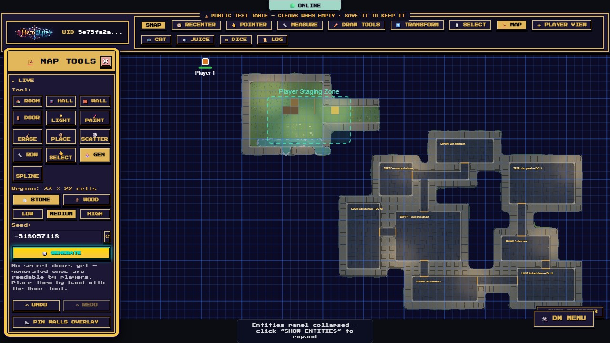

- The server lays rooms, corridors, wall bands, doors (authored closed), lights, and scatter — and lands it all as **one undo step**. Don't like it? Undo, **⟳** re-roll the seed, generate again. The same seed always builds the same dungeon.
- Generated dungeons contain **no secret doors, deliberately** — a generated "secret" could be reverse-engineered from the data players receive. Add secrets by hand with the Door tool where only you know to look.

## 👆 Select and 🔍 Inspect — precision edits

**Select** clicks the topmost placed element (stamps, tiles, splines); **Inspect** then edits it numerically: X/Y, scale, rotation, layer, a **Hidden** checkbox, **DELETE** — and the door state controls. Walls and lights aren't clickable; they're managed by their tools and undo.

## 〰️ Spline — rope, chain, ribbon, filigree

Drag two anchors: **Rope** and **Chain** sag naturally; **Ribbon** and **Filigree** run straight. Dockside rigging, chained gates, ceremonial bunting.

## 🗂 Layers

Six layers, top to bottom: **GM Notes, Lighting, Walls & Doors, Objects, Terrain, Background** — each with visibility, lock, reorder, and an opacity slider (remember: Lighting's opacity _is_ the ambient light). Background ships locked so you can't paint under the floor by accident. GM Notes never reach players.

## The quick wheel

**Right-click anywhere on the canvas** (while editing) for the radial quick wheel: Room, Wall, Paint, and Erase on top, plus your four go-to brushes (pinned and recent favorites fill the slots). Escape or click away to dismiss.

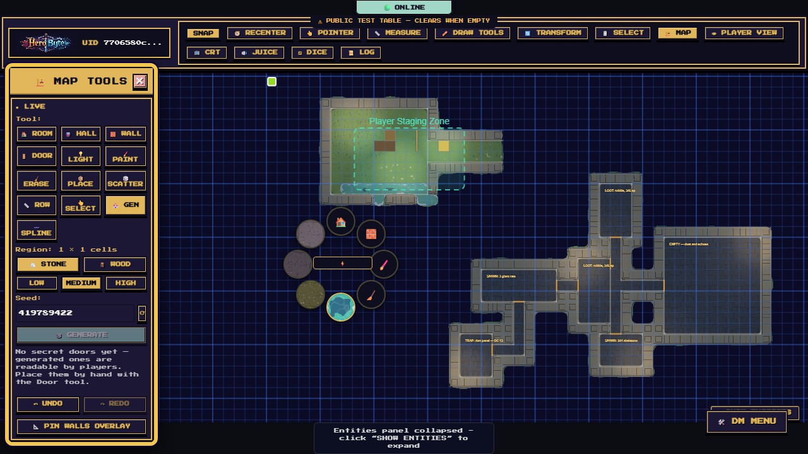

## What players see (and don't)

While you build, players receive every committed edit instantly — terrain, doors, lighting, the lot. They never receive:

- **Secret doors** (stripped server-side, not just hidden),
- the **GM Notes** layer,
- anything **Hidden** or on a hidden layer,
- the **walls overlay** (walls themselves are invisible; they act through fog and movement).

Flip on **👁 PLAYER VIEW** any time to see the table through their eyes — and keep building while you're in it.

## Cheat sheet

| Shortcut                    | Effect                                        |
| --------------------------- | --------------------------------------------- |
| **Esc**                     | Cancel drag → close wheel → leave map-edit    |
| **Ctrl/Cmd+Z / Ctrl/Cmd+Y** | Undo / redo map edits                         |
| **Right-click**             | Quick wheel                                   |
| **R / Shift+R**             | Rotate pending stamp ±15° (Place/Scatter/Row) |
| **Alt + click** (Place)     | Free stamp, unsnapped, rotated                |
| **Ctrl/Cmd + click**        | Eyedropper — sample asset or terrain          |
| **Alt + click a door**      | Cycle lock / reveal secret (at the table)     |

## On a phone or tablet

The editor is not desktop-only. On a touch layout it is a **mode**: the dock at the bottom of the screen is replaced by the palette, and nothing covers the map.

**Getting in:** **DM** (dock slot five) → **🏗️ Edit the live map**. The DM screen closes itself on the way — the mode needs the whole canvas, so it will not sit behind the menu you just used.

The dock becomes five slots:

| Slot                | What it does                                                                                                                                                                            |
| ------------------- | --------------------------------------------------------------------------------------------------------------------------------------------------------------------------------------- |
| **✕ Exit**          | Leaves the mode. The map stays live.                                                                                                                                                    |
| **⚒ Tool**         | Opens the sheet: **▶ Start live map** before you have one, then **🏠 Room**, **▬ Wall** and **◇ Recenter**. Picking a tool closes the sheet, because you picked it in order to use it. |
| **↶ Undo / ↷ Redo** | The same map-edit history the desktop palette drives. Both stay greyed until the map is live.                                                                                           |
| **⨯ Abort**         | Abandons the drag in progress.                                                                                                                                                          |

**Room and Wall are the two tools here**, and both are a drag: press, move, lift. The rest of the toolbox (doors, terrain, place, generate) is still desktop-only.

Two things behave differently from a mouse, and both are worth knowing before your first drag:

- **Lifting your finger commits.** There is no Escape key, which is what **⨯ ABORT** is for — press it with a second finger while the first is still down, and the release lands nothing.
- **A second finger always means the camera.** Reach for a pinch mid-drag and the drag is _discarded_, not committed — you wanted to zoom, not to stamp a half-built room on the table.

**Start live map** is the same button as on desktop and creates the same document, so a map begun on a tablet opens on a laptop and the other way round. Rotating the device, or resizing a window across the phone/desktop boundary, keeps the mode armed and simply swaps which palette you get.
