# Player Guide

You've [joined a table](getting-started.md) — here's everything you can do at it.

## The table at a glance

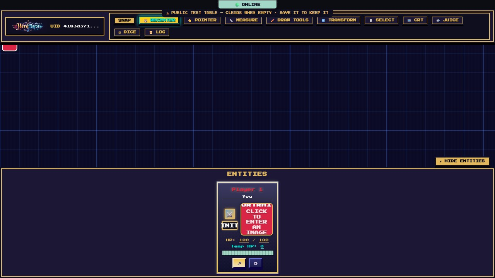

- **Top toolbar** — tools and toggles. Hover any button for a tooltip. Tools are exclusive: picking one turns the previous one off, and clicking the active tool turns it off again.
- **Map canvas** — the shared battlemap. Everything here syncs live to every player.
- **Entities panel** (bottom) — a card for every character at the table: the party, the DM, and any visible NPCs. **▼ HIDE ENTITIES** collapses it.
- **🟢 ONLINE** (top center) — your connection to the server.

### Moving around the map

| Action             | How                                                                                                  |
| ------------------ | ---------------------------------------------------------------------------------------------------- |
| Pan                | Drag empty map space (with no tool active), or **middle-mouse drag** (works even with a tool active) |
| Zoom               | Mouse wheel — zooms toward your cursor (0.1× to 8×)                                                  |
| Reset the camera   | **🧭 RECENTER**                                                                                      |
| Jump to your token | The ⚔️ button on your player card (**Focus camera on token**)                                        |
| Touch              | One finger pans, two fingers pinch-zoom                                                              |

## Your character card

Your card in the Entities panel is your character sheet in miniature:

- **Name** — click it to edit inline.
- **Portrait** — open **⚙️** settings and **⬆ UPLOAD IMAGE** a portrait straight from your device — on a phone, that's your camera roll. (Clicking the **+ ADD PORTRAIT** square also takes a pasted image URL, and any image URL still works.) When you talk on voice, your portrait glows and swells.
- **HP** — click either number in `HP: 100 / 100` to type a new value (Enter or click away to save), or **drag along the HP bar** to scrub it. The bar shifts color as you drop: green, amber, red.
- **Temp HP** — a separate pool absorbed before regular HP; click to edit.
- **⚔️ / INIT** — status effects and initiative (covered below).
- **🎤** — voice chat (covered below).
- **⚙️** — opens your full settings window.

### The settings window (⚙️)

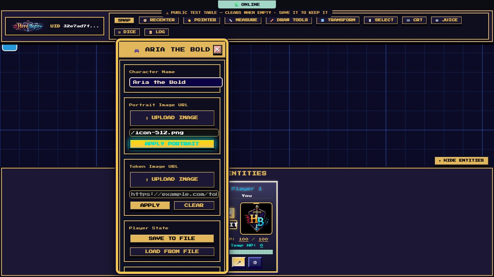

Everything about your character in one draggable window:

- **Character Name**, **Portrait**, and a **Token Image** — give your portrait and map token custom art: **⬆ UPLOAD IMAGE** from your device (camera roll on a phone), or paste an image URL. **CLEAR** the token image to go back to a colored ring.
- **Player State → SAVE TO FILE / LOAD FROM FILE** — download your character (name, HP, portrait, token, position, status effects, your drawings) as a JSON file and restore it later — handy insurance between sessions, or for moving your character to another table.
- **Dungeon Master Mode** — see [Becoming the DM](getting-started.md#becoming-the-dm).
- **Initiative Status** — your current initiative, with a **🧹 CLEAR INITIATIVE** reset.
- **Token Size** — Tiny, Small, Medium, Large, Huge, or Gargantuan (half a cell up to 3 cells).
- **Status Effects** — a checklist of 38 conditions (Prone, Poisoned, Blessed, Rage, Concentration…). Up to three show as emoji medallions on your portrait and token; the rest roll up into a `+N` bubble.
- **Multiple Characters → ➕ ADD CHARACTER** — run a second PC (or a familiar): each character gets its own card, token, HP, and initiative.

## Tokens

Your token is your presence on the map:

- **Nameplate and HP bar** — every token wears its character's name, and a thin health bar when you're allowed the numbers (your party always; monsters at the DM's discretion — a red dot means bloodied). Names hold their size at any zoom.

- **Move** — drag it. With **SNAP** on (top toolbar) it clicks to grid cells; everyone sees your drag live.
- **Recolor** — double-click your token for a new random color.
- **Select** — click it. **Shift-click** adds to a selection, **Ctrl/Cmd-click** toggles. With the **🖱️ SELECT** tool you can drag a marquee to grab several tokens and drawings at once, then drag any one of them to move the whole group.
- **Resize / rotate** — with the **🔄 TRANSFORM** tool, click a token for Photoshop-style handles: 8 scale handles plus a rotation handle above (rotation snaps to 45°; hold **Ctrl/Cmd** to rotate freely). The center crosshair drags the object.
- **Delete** — select and press **Delete** (you can only delete what you own; a confirm dialog lists the exact casualties).
- **Locked** tokens (🔒 badge) can't be moved or deleted until unlocked — DMs use this to pin scenery and important pieces.
- **Ping** — double-click (or double-tap) empty map space to drop a quick ping everyone sees, in any tool mode.

You can only move **your own** tokens. The DM can move everyone's.

## Dice

Press **⚂ DICE** for the roller and **📜 LOG** for the shared history.

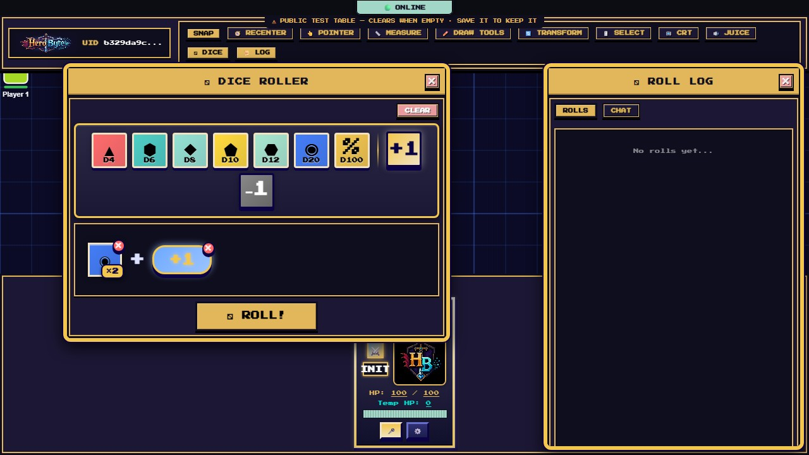

1. Click dice to add them to the tray — **d4, d6, d8, d10, d12, d20, d100** — and click again for more of the same (a `×N` badge appears; click the badge to type an exact count).
2. Add **+1 / −1** modifier chips; click a chip to type any value (−99 to +99).
3. Pick **NORMAL / ADV / DIS** and **TABLE / DM / ME** (below).
4. Press **⚂ ROLL!**

The dice tumble, land with a satisfying rattle, and the result panel breaks down every die:

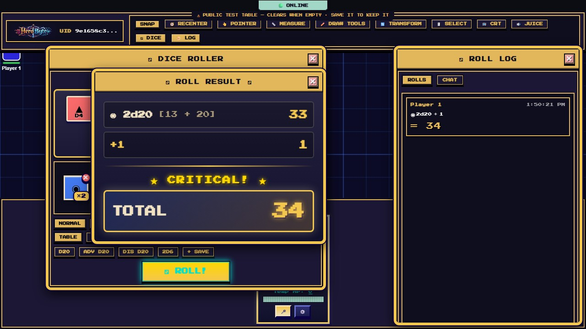

- Natural 20 on a d20 → a gold **★ CRITICAL! ★** banner (and a sting). Natural 1 → **✖ FUMBLE! ✖**.
- Every roll lands in the **📜 ROLL LOG** with your name, timestamp, formula, and total — shared with the whole table, newest first. Long formulas collapse; click an entry for its full breakdown.

### Advantage and disadvantage

**ADV** rolls the first die of your formula twice and keeps the higher; **DIS** keeps the
lower. The discarded dice stay in the breakdown, struck through, so you can see what you
got away with. The log tags the entry **ADV** or **DIS**.

### Who sees a roll

- **TABLE** — everyone. The default.
- **DM** — you and the DM only.
- **ME** — you only, the DM included.

A hidden roll is not merely hidden in other people's app: it is never sent to them. Their
browser has no copy to find. (Within reason: this protects you from the other people at
your table, not from someone determined to impersonate one of them — HeroByte identifies
players by a browser-supplied id today.)

### Macros

**d20**, **ADV d20**, **DIS d20** and **2d6** are always there. Build any roll and press
**+ SAVE** to name it and keep it. Saved macros live in **this browser** — they do not
follow you to another device.

### The dice are the server's

You do not roll — the server does. Your browser sends the formula ("2d20 + 5") and nothing
else; the server rolls it, adds it up, and stamps your name on it from your connection.
There is no number in the message for a modified client to change, and no name field to
put someone else's in.

## Drawing, measuring, pointing

### ✏️ Draw Tools

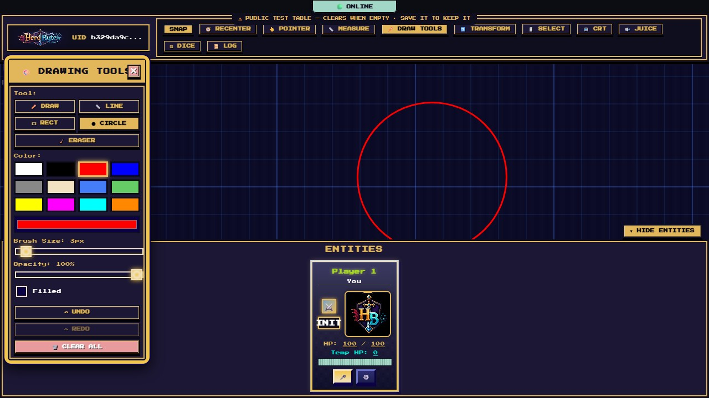

A draggable toolbox with five tools — **Draw** (freehand), **Line**, **Rect**, **Circle**, **Eraser** — plus four **area templates** (below), 12 preset colors, a full color picker, **brush size** (1–50 px), **opacity**, and a **Filled** checkbox for shapes.

- Drawings sync to everyone, live as you draw.
- **Undo/redo** (buttons, or **Ctrl+Z / Ctrl+Y** while draw mode is active) affect **your own** drawings only.
- The **Eraser** is surgical on freehand strokes: dragging across one removes just the crossed section and leaves the rest. Lines, rects, and circles are all-or-nothing.
- You can erase, move and delete only your own drawings; the DM can remove anyone's. **🗑️ CLEAR ALL** wipes the whole map — that one is DM-only.

### Area templates

Under **Templates** in the same toolbox: **◯ Circle** (a burst or sphere), **◺ Cone**, **▢ Square** (a cube), and **▬ Line**. Drag from the point of origin outward — the origin snaps to the grid, and the size snaps to whole squares, so a template always reads as a round number of feet. Release and it lands on the map labelled with its size (`15 ft cone`), filled faintly enough to see the tokens standing inside it.

Templates are ordinary drawings: they take your color and opacity, they undo and redo, the eraser removes them, and everyone at the table sees them. A cone is drawn to 5e's rule — as wide at its far edge as it is long.

### 📏 Measure

Click a start point, and a dashed line follows your cursor with a live readout like `3 Squares (15 ft)`; click again to freeze it, click a third time to start fresh.

**The whole table sees your line while you draw it**, labelled with your name, so "is Grak in range?" is one question with one answer. Putting the tool away clears it again.

Distance is counted by the table's **diagonal rule**, which the DM sets (5e by default: every square costs the same, so a two-square diagonal is 10 ft). Feet-per-square is a DM setting too; 5 ft is the default.

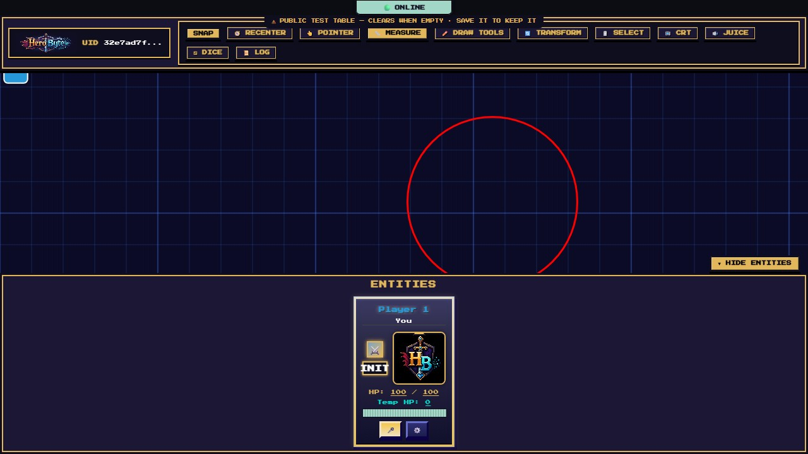

### 👆 Pointer

Your cursor becomes a pulsing ring; click to plant a ping — a colored burst with your name under it, visible to the whole table for 3 seconds, with a chime.

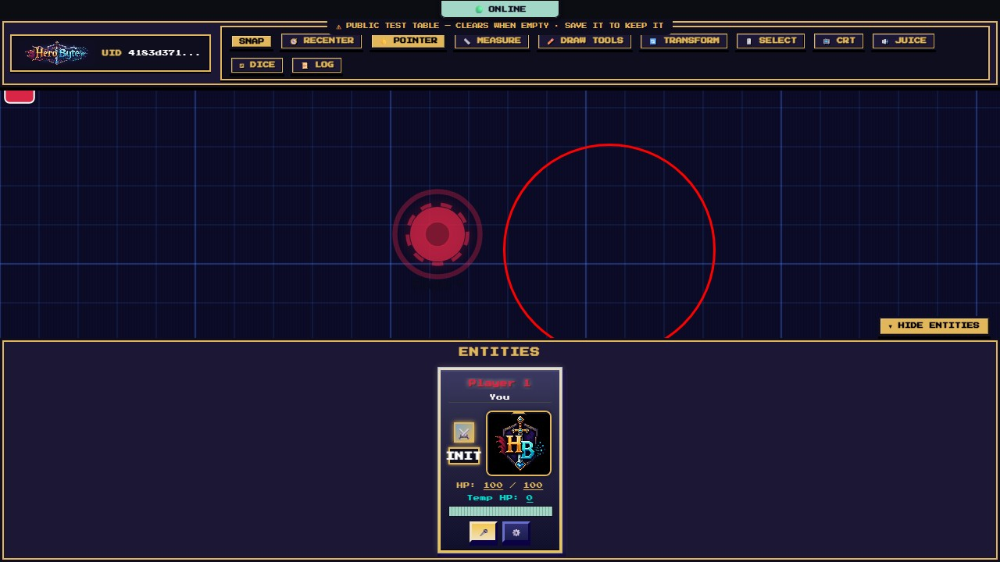

## Voice chat

Press the **🎤** on your own card and grant the browser's microphone permission. That's the whole setup:

- Voice is **peer-to-peer** (WebRTC) between everyone at the table.
- When someone talks, their **portrait glows green and scales up** — an at-a-glance "who's speaking".
- Press the button again (now **🔇**, red) to switch the mic fully off.
- Headphones are strongly recommended to avoid echo. Microphone access requires `https://` or `localhost`.

## Initiative and combat

Press **INIT** on your card to set initiative:

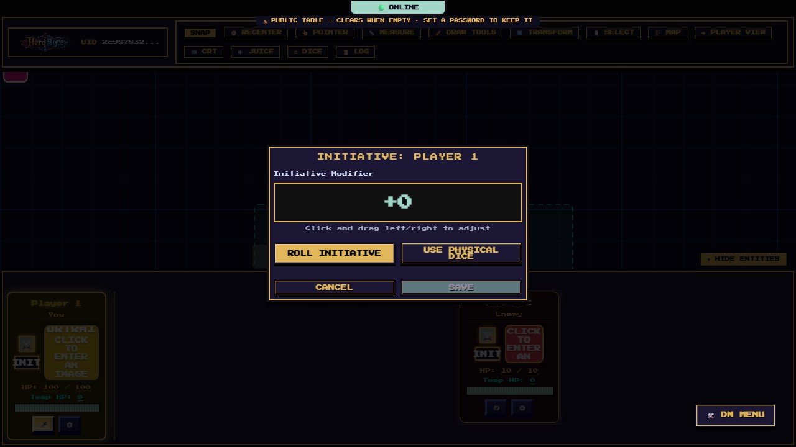

- Drag the **Initiative Modifier** number left/right (or roll with it at 0), then **ROLL INITIATIVE** — or press **USE PHYSICAL DICE** and type the d20 you rolled at your real table.
- **The first initiative saved starts combat** for the whole table: cards reorder by initiative, a **⚔️ Combat Active** banner appears with `Turn N of M`, and the current combatant's card glows gold.

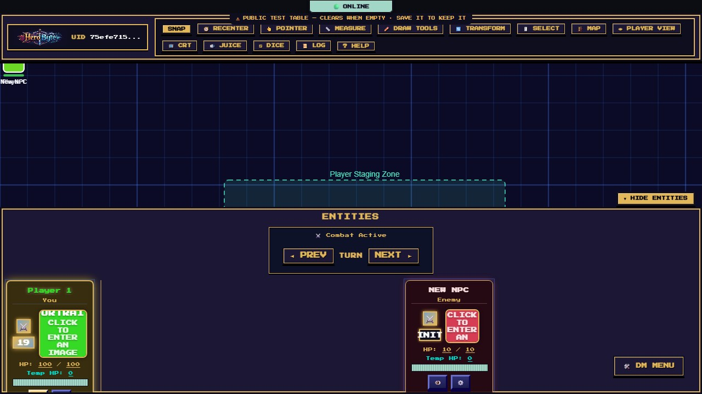

- **◄ PREV / NEXT ►** advance the turn (any player can nudge it; a chime marks each turn change).
- On **your** turn, your card says **🎯 YOUR TURN**.
- Ending combat and clearing everyone's initiative are DM controls.

## Doors, fog, and what you can see

When the DM runs a built map (walls, doors, fog of war):

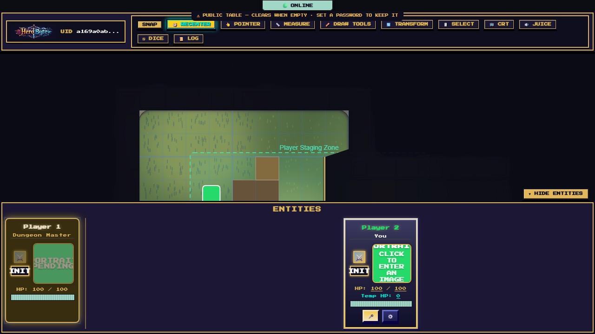

- **Fog of war** hides everything your characters can't see. Vision radiates from **your own tokens** and is blocked by walls and closed doors — move, and your view moves with you.
- **Doors are clickable**: click to open or close (everyone hears the creak/slam). A small gold square marks a **locked** door — only the DM can open those.
- **Secret doors exist.** You won't see them until the DM reveals one — to you it's just wall.
- At night the whole map cools and darkens, and torches, braziers, and other glowing props cast light pools.

## Look & feel

- **📺 CRT** — scanlines, bloom, and a monitor bezel for the full retro-dungeon experience. Purely local to you.
- **🔊 JUICE** — the game-feel panel: **Motion** (Full / Subtle / Off) for animations, plus sound mute and volume. HeroByte respects your OS "reduce motion" setting by default. Damage and healing float off cards and tokens as rising `-7` / `+4` numbers.

## Playing on a phone or tablet

On a small or touch screen, HeroByte switches to a full-screen map with a five-button dock — no setup required:

|                                                                              |                                                 |
| ---------------------------------------------------------------------------- | ----------------------------------------------- |
| 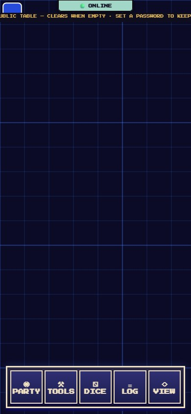 | 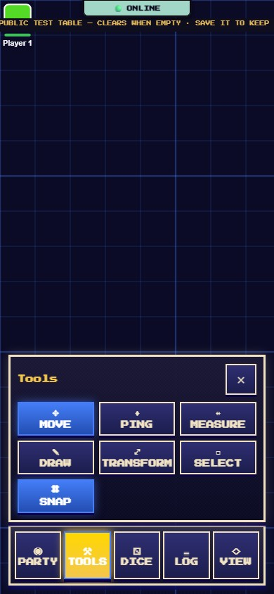 |

- **◉ PARTY** — the party drawer: portraits, HP (tap or drag to edit), status effects, and — on your own row — **⚙️ EDIT** for name, portrait, and DM mode.
- **⚒ TOOLS** — Move, Ping, Measure, Draw (a compact strip: tool, size, color, undo/redo), Transform, Select, and Snap.
- **⚂ DICE** — a full-screen roller; the result appears as a tap-to-dismiss card.
- **≡ LOG** — the shared roll history. **◇ VIEW** recenters the camera.

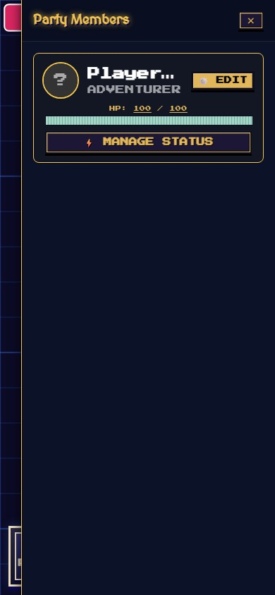

One finger pans, two fingers pinch-zoom. A few desktop-only extras (CRT, game-feel settings, DM map authoring, player-state files) don't exist on mobile.
