# Player Guide

You've [joined a table](getting-started.md) — here's everything you can do at it.

## The table at a glance

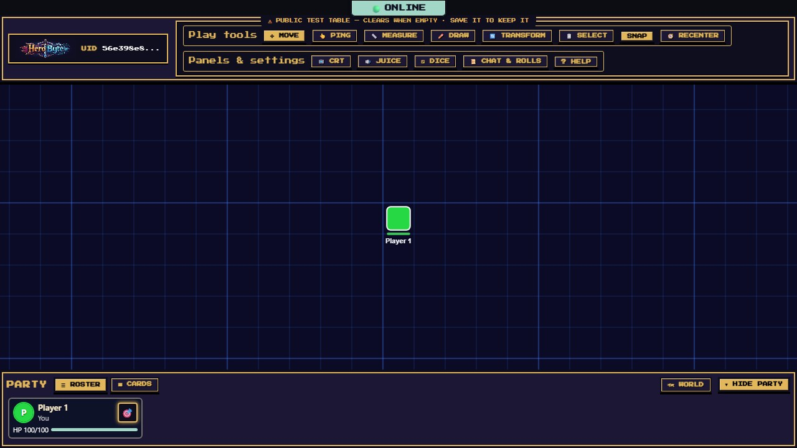

- **Top toolbar** — tools and toggles. Hover any button for a tooltip. Tools are exclusive: picking one turns the previous one off, and clicking the active tool turns it off again.
- **Map canvas** — the shared battlemap. Everything here syncs live to every player.
- **Party** (bottom) — one compact row for every character at the table: the party, the DM's, and any visible NPCs. Each row shows a portrait, the name, HP, any conditions and, while that character's token is on the map, **🎯** (focus the map on it; **—** when it isn't); a row reads **You** for your own characters, and another player's character named differently from their seat also shows the seat's name, so you can tell whose it is. Select a row for that character's full card; **▦ CARDS** shows every card at once and **☰ ROSTER** goes back to the rows; **▼ HIDE PARTY** folds the panel down to its bar. The bar also holds **🗺 WORLD** and, when your DM allows it, **📦 PROPS**, so they never sit on top of a card.
- **Table button** (top left) — the table's name and a dot for your connection to the server (🟢 online, 🔴 offline); a DM also sees **DM** on it, and a player sees no role word (your role is in the menu). It opens the [Table menu](#the-table-menu).

### The Table menu

The **Table button** opens a small menu about the table and about you, not about one character:

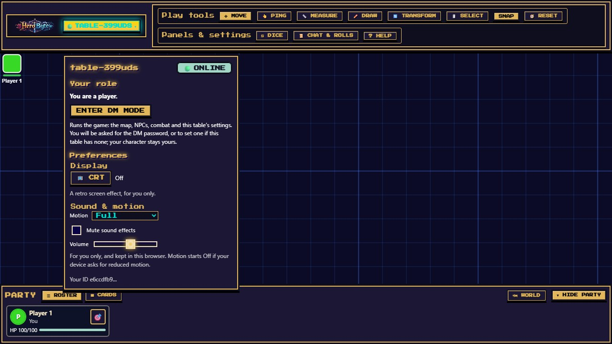

- **Your role** — **You are a player**, with **ENTER DM MODE**, which asks for the table's DM password (see [Becoming the DM](getting-started.md#becoming-the-dm)). When you are the DM it says so and offers **LEAVE DM MODE** and **⚙️ Table settings…**.
- **Preferences** — yours alone and remembered in this browser: **Display → 📺 CRT**, and **Sound & motion** (see [Look & feel](#look--feel)).
- **Your ID** — the start of your seat's identifier, which the header used to print as “UID”.

On a phone the same menu is a screen: **⚒ TOOLS → Table**.

### Moving around the map

| Action             | How                                                                                                  |
| ------------------ | ---------------------------------------------------------------------------------------------------- |
| Pan                | Drag empty map space (with no tool active), or **middle-mouse drag** (works even with a tool active) |
| Zoom               | Mouse wheel — zooms toward your cursor (0.1× to 8×)                                                  |
| Reset the camera   | **🧭 RESET** (**RESET VIEW** on a phone) — moves the view back to the map's top-left corner (the origin, 0, 0) at 1× zoom (100%). Not the middle of the map, and not always where you started      |
| Jump to your token | **🎯** on your row in the Party — with two characters, each row focuses its own token                 |
| Touch              | One finger pans, two fingers pinch-zoom                                                              |

## Your character card

The Party lists characters, not players: if you run two, you have two rows, and each keeps its own HP, conditions, token and **🎯**. Select your row (its portrait or name) and your card opens beside the rows — your character sheet in miniature. **✕** or **Esc** closes it; selecting another row switches to that character.

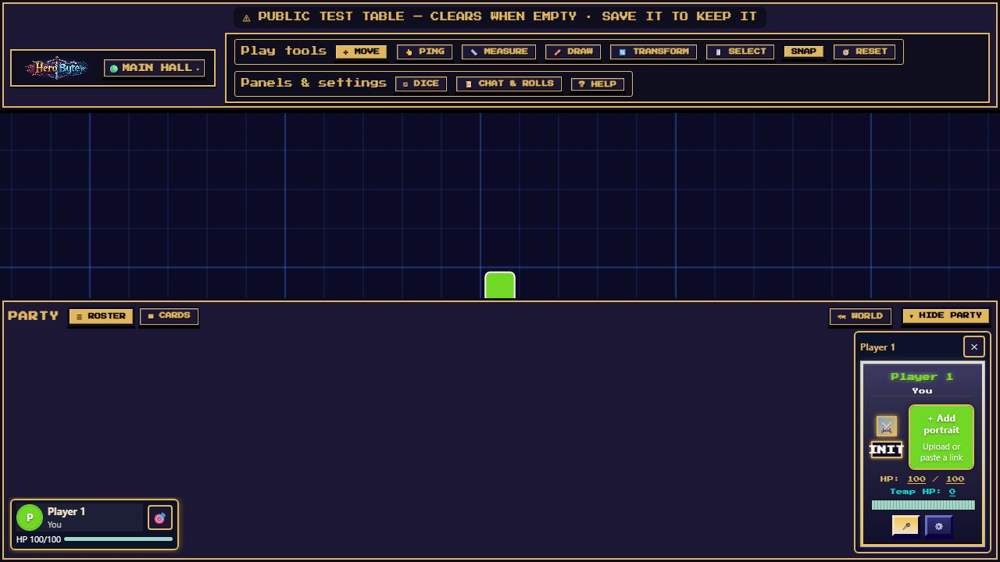

- **Name** — click it to edit inline.
- **Portrait** — open **⚙️** settings and **⬆ UPLOAD IMAGE** a portrait straight from your device — on a phone, that's your camera roll. (Clicking the **+ Add portrait** square opens the same settings, where a pasted image URL also works.) On a PC, when you talk on voice, your portrait glows and swells.
- **HP** — click either number in `HP: 100 / 100` to type a new value (Enter or click away to save), or **drag along the HP bar** to scrub it. The bar shifts color as you drop: green, amber, red.
- **Temp HP** — a separate pool absorbed before regular HP; click to edit (on a phone, tap the number on your row in **◉ PARTY**).
- **⚔️** — centres the map on this character's token; it also wears up to three condition medallions (covered below). **INIT** — initiative (covered below).
- **🎤 / 🔇** — once you are in the voice call, your mic button: **🎤** while you are live (press to mute), red **🔇** while you are muted (press to unmute) (covered below).
- **⚙️** — opens your full settings window.

### The settings window (⚙️)

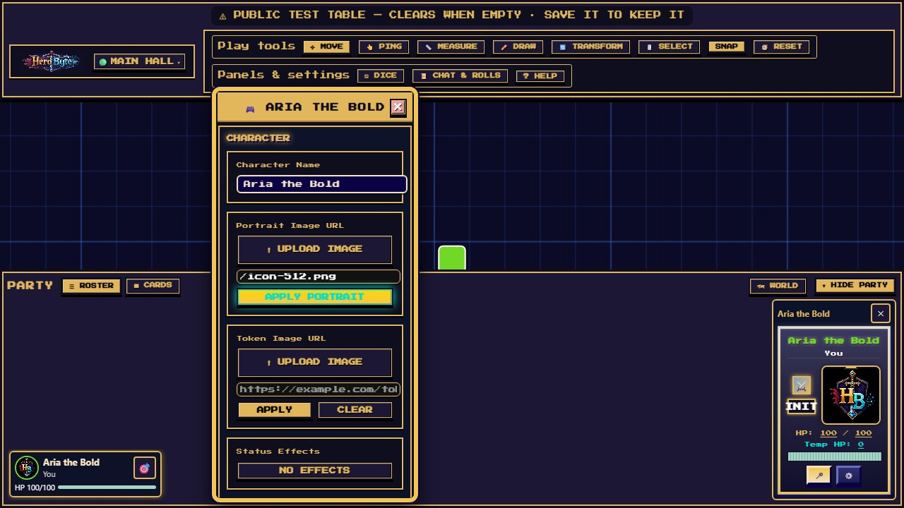

One draggable window per character, in two halves — what the character is, and how its token behaves:

**Character**

- **Character Name**, **Portrait**, and a **Token Image** — give your portrait and map token custom art: **⬆ UPLOAD IMAGE** from your device (camera roll on a phone), or paste an image URL. **CLEAR** the token image to go back to a colored ring.
- **Status Effects** — a checklist of 38 conditions (Prone, Poisoned, Blessed, Rage, Concentration…). They belong to this character only: your other character's row, card and token do not wear them. Up to three show as emoji medallions on the portrait and token; the rest roll up into a `+N` bubble.
- **Initiative Status** — this character's current initiative, with a **🧹 CLEAR INITIATIVE** reset (on a phone too: **⚙️ EDIT** on your row).
- **Character file → Save character / Load character…** — download this character (its name, HP, portrait, token, position and status effects, plus your drawings if you have any) as a JSON file and restore it later — handy insurance between sessions, or for moving your character to another table. Drawings belong to you rather than to one character, so loading a file that holds drawings replaces the drawings you have on the map with the file's, and a file with none leaves yours alone. It is one character's file and never the table: a table backup (the DM's) and an editable map are different files, and each picker tells you what it was handed if you pick the wrong kind. On a phone the same two buttons are in the row's **⚙️ EDIT** sheet.
- **Multiple Characters → ➕ ADD CHARACTER** — run a second PC (or a familiar): each character gets its own row, card, token, HP, and initiative. **🗑️ Delete this character** removes the one this window belongs to.

**Token settings**

- **Token Size** — Tiny, Small, Medium, Large, Huge, or Gargantuan (half a cell up to 3 cells). Your DM can resize it too. While it is locked, no one can resize it. Sight radius, movement speed and the token lock are the DM's to set, so they appear only in the DM's window.

## Tokens

Your token is your presence on the map:

- **Nameplate and HP bar** — every token wears its character's name, and a thin health bar when you're allowed the numbers (your party always; monsters at the DM's discretion — a red dot means bloodied). Names hold their size at any zoom.

- **Move** — drag it. With **SNAP** on (top toolbar) it clicks to grid cells; others receive its new position when you release it. Or step it from the keyboard: **WASD** / **arrows** move it one cell (Q E Z C for the diagonals; hold a key to walk). With nothing selected the keys move your own token, as long as you run just the one character (with a second, pick the one you mean first) — except while you are typing, and **↑/↓** page a panel you last clicked into or scrolled, such as Chat & Rolls (WASD and ←/→ still walk). With **🖱️ SELECT** or **🔄 TRANSFORM** armed the keys move only the piece you have picked (nothing picked, nothing moves); **✏️ Draw**, the grid-alignment wizard and atlas-link take the keys entirely. To move something else you may move, pick it with SELECT or TRANSFORM first.
- **Recolor** — double-click (or double-tap) your token for a new random color.
- **Select** — click it. **Shift-click** adds to a selection, **Ctrl/Cmd-click** toggles. With the **🖱️ SELECT** tool you can drag a marquee to grab several tokens and drawings at once, then drag any one of them to move the whole group.
- **Resize / rotate** — with the **🔄 TRANSFORM** tool, click a token for Photoshop-style handles: 8 scale handles plus a rotation handle above (rotation snaps to 45°; hold **Ctrl/Cmd** to rotate freely). The center crosshair drags the object.
- **Delete** — select and press **Delete** (you can only delete what you own; a confirm dialog lists the exact casualties). Props are deleted in the **Props** panel. A phone has no Delete key: **Tools → Draw → Erase drawings** or **Undo drawing** for your drawings; your own token cannot be deleted on a phone (ask the DM to remove it, or use a computer).
- **Locked** tokens (🔒 badge) were locked by the DM — DMs use this to pin scenery and important pieces. No one can move or delete them, the DM included, until the DM unlocks them.
- **Ping** — double-click (or double-tap) empty map space to drop a quick ping, in any tool mode. A player's ping reaches the DM and the players who can see that spot; a DM's ping reaches everyone.

You can only move **your own** tokens. The DM can move everyone's.

## Table chat and whispers

Open **📜 Chat & Rolls → Chat**, or **Chat** in the phone dock. Choose **Everyone**
for table talk or **Whisper to [name]** for a private message, then press **SEND**
or Enter. Whispers go to the sender's and recipient's table seats; being the DM does
not grant access to other players' whispers. A connected seat is protected against
another person claiming it. After a seat is fully offline and its session-token
grace expires, someone with the table password can claim it and read whispers
retained for that seat. This is the same offline-identity limit as private rolls.

If the selected recipient is removed from the table, your draft stays in the box
and sending is blocked. Choose a recipient again or explicitly choose **Everyone**
before sending, even if the removed seat returns. New whispers keep the recipient's
name as it was when sent; older messages fall back to the current roster name, or
“unknown” when that name is unavailable. Closing the panel or switching to Rolls
clears an unsent draft.

## Dice

Press **⚂ Dice** for the roller and **📜 Chat & Rolls → Rolls** for dice history.
On a phone, open **Chat** in the dock. Chat opens first; your last tab is remembered
for your player in this browser session when you close it or switch layouts.

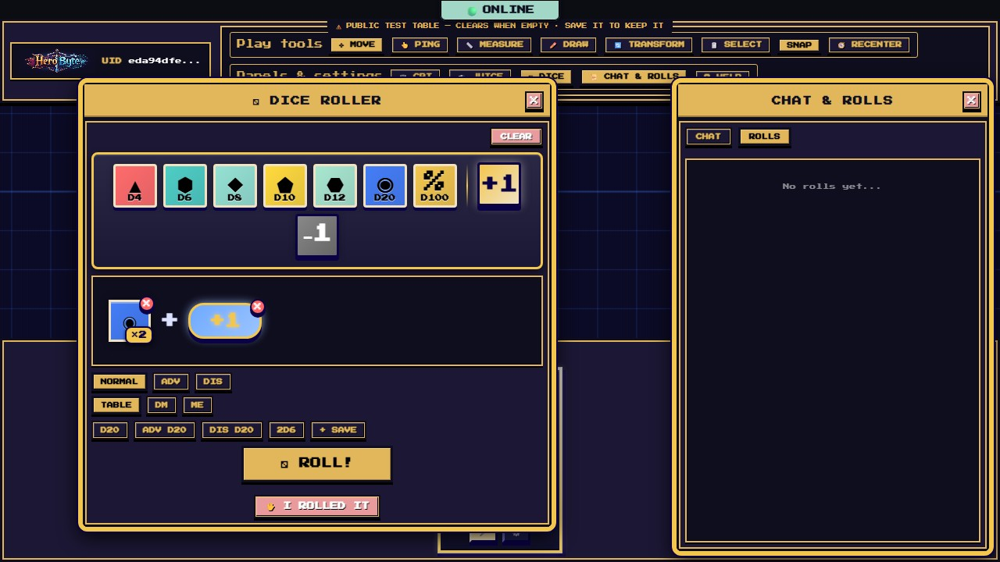

1. Click dice to add them to the tray — **+d4, +d6, +d8, +d10, +d12, +d20, +d100** (each is an **Add d20**-style builder: it rolls nothing yet) — and click again for more of the same (a `×N` badge appears; click the badge to type an exact count).
2. Add **+1 / −1** modifier chips; click a chip to type any value (−99 to +99).
3. Pick **NORMAL / ADV / DIS** and **TABLE / DM / ME** (below).
4. Press **⚂ ROLL!**

The dice tumble, land with a satisfying rattle, and the result panel breaks down every die:

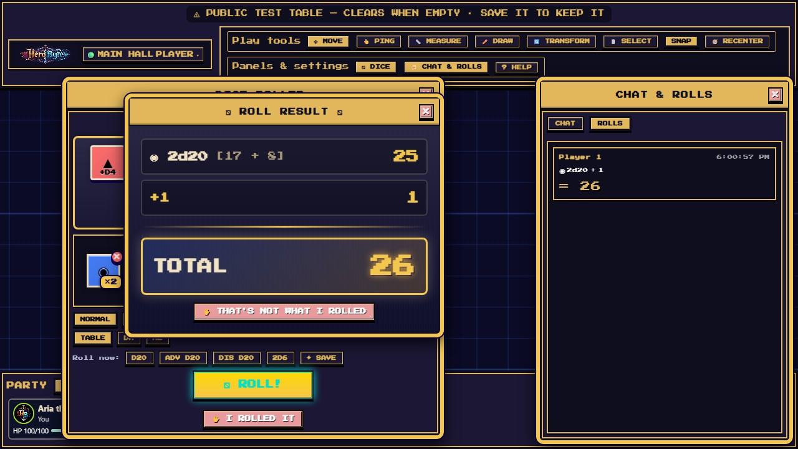

- Natural 20 on a d20 → a gold **★ CRITICAL! ★** banner (and a sting). Natural 1 → **✖ FUMBLE! ✖**.
- Every roll lands in **Chat & Rolls → Rolls** with your name, timestamp, formula, and total, newest first. Its TABLE / DM / ME audience still applies. Long formulas collapse; click an entry for its full breakdown.

### Rolling real dice instead

If your table rolls physical dice, HeroByte will take your word for it — and say so, loudly, so nobody has to wonder which numbers came from the app.

There are two ways in, and they cover the two moments you need them:

- **Before rolling.** Build the formula if you like, then press **✋ I ROLLED IT** instead of ROLL and type what the dice came to. You do not have to build anything first — with an empty tray, type `17` and that is what lands.
- **After rolling.** The result panel offers **✋ THAT'S NOT WHAT I ROLLED**. Type the real number and the log entry is rewritten in place: the app's total struck through, yours beside it.

Either way the entry wears a **BY HAND** badge in the log, in its own colour, with anything it replaced struck through. Nothing typed is ever dressed up as something the server rolled. Correct the same roll twice and the struck-through number stays the app's **original** roll, which is the one worth being able to check.

You can correct your own rolls; the DM can correct anybody's. On a phone, only the roll you just made, on its result card before you close it; correcting an older roll from the log is desktop only. And your DM can switch hand entry off for players entirely (**DM Menu → Table → Permissions**), in which case the app's dice are the only way in.

### Advantage and disadvantage

**ADV** rolls the first die of your formula twice and keeps the higher; **DIS** keeps the
lower. The discarded dice stay in the breakdown, struck through, so you can see what you
got away with. The log tags the entry **ADV** or **DIS**.

### Who sees a roll

- **TABLE** — everyone. The default.
- **DM** — you and whoever is in DM mode — including someone who enters DM mode later, who sees the earlier DM rolls still in the log — and no one else.
- **ME** — only you. No other player or DM receives the roll.

The line under the three buttons spells out who sees the one you picked, so a phone does not need a hover.

A hidden roll is not merely hidden in other people's app: it is never sent to them. Their
browser has no copy to find. While you are at the table, your seat is yours: another browser
claiming your id gets nothing and cannot knock you off. (Within reason: someone with the table
password could still claim your seat hours after you leave (or as soon as the server restarts for an update), as a plain player — so hidden
rolls protect you from the other people at your table, not from one who waits for you to go.)

### Macros

The **Roll now:** row rolls at once, one press one roll: **d20**, **ADV d20**, **DIS d20** and **2d6** are always there (a screen reader hears **Roll d20 now**). Build any roll and press
**+ SAVE** to name it and keep it. Saved macros live in **this browser** — they do not
follow you to another device.

### The dice are the server's

You do not roll — the server does. Your browser sends the formula ("2d20 + 5") and nothing
else; the server rolls it, adds it up, and stamps your name on it from your connection.
There is no number in the message for a modified client to change, and no name field to
put someone else's in.

## Drawing, measuring, pointing

### ✏️ Draw

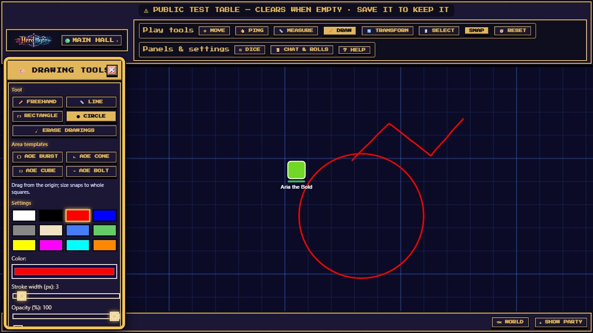

The desktop toolbox and phone sheet use **Tool → Settings → History**, followed by
**Done drawing**. Choose **Freehand**, **Line**, **Rectangle**, **Circle**, or
**Erase drawings**, or one of the four **area templates** below. Settings include
**Color**, **Stroke width (px)** from 1–50, and **Opacity (%)**. Rectangle and Circle
also offer **Filled**. Desktop includes 12 preset colors; both layouts have a color
picker. Your settings stay selected when the layout changes. The screenshot above
shows the desktop window's Tool, Area templates and Settings sections; scroll the window for History.

On the phone, **Hide controls** makes room on the map while your drawing tool stays
active. The compact row keeps **Undo drawing**, **Redo drawing**, **Cancel stroke**
and **Done drawing** available. Opening and closing Tools or Help keeps that compact
row. **Show controls** restores the tools and your selected settings; **Done drawing**
exits drawing mode. Starting Draw again opens the settings sheet.

- A completed drawing syncs to everyone when you finish the stroke or shape.
- Choose **✥ Move** in the header (phone: **Tools → Move**) to put the toolbox away and return to moving tokens and panning the map.
- **Undo/redo** (buttons, or **Ctrl+Z / Ctrl+Y** while draw mode is active) affect **your own** drawings only.
- **Erase drawings** affects annotations, with **Eraser width (px)** as its only setting.
  Crossing a freehand stroke removes that section; other drawing shapes are removed
  whole. Partial freehand erasing supports Undo; whole-shape deletion currently does not.
- You can erase, move and delete your own drawings, and any older drawing that has no owner;
  the DM can remove anyone's. A drawing the DM has locked stays as it is for everyone until
  the DM unlocks it — the eraser and Delete say so instead of removing it.
  **Clear all drawings** removes every unlocked annotation, with confirmation, and is DM-only.
  Terrain painting and **Erase terrain** are separate Build map tools.

### Area templates

Choose **AoE Burst** (a circle), **AoE Cone**, **AoE Cube** (a square) or **AoE Bolt** (a line) under desktop
**Area templates**, or in the phone's Tool group; once one is active, a line beside the buttons (under them on a desktop, above them on a phone) says what shape it draws. Drag from the point of origin
outward — the origin snaps to the grid, and the size snaps to whole squares, so a
template reads as a round number of feet. Release and it lands on the map labelled
with its size and shape (`15 ft cone`; a Burst reads `20 ft circle` — its radius — a Cube `15 ft square`, a Bolt `30 ft line`), with an automatic translucent fill. Stroke width changes
the outline; the drag determines the area. There is no separate Filled toggle.

Templates use your color. Opacity changes the outline and translucent fill; the size
label stays visible, including at 0% opacity. Creation supports Undo/Redo, and the
eraser removes the template. Everyone at the table sees it. A cone is drawn to 5e's
rule — as wide at its far edge as it is long.

### 📏 Measure

Click a start point, and a dashed line follows your cursor with a live readout like `3 Squares (15 ft)`; click again to freeze it, click a third time to start fresh.

**The whole table sees your line while you draw it**, labelled with your name, so "is Grak in range?" is one question with one answer. Putting the tool away clears it again.

Distance is counted by the table's **diagonal rule**, which the DM sets (5e by default: every square costs the same, so a two-square diagonal is 10 ft). Feet-per-square is a DM setting too; 5 ft is the default.

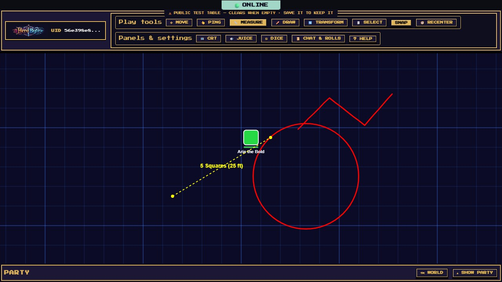

### 👆 Ping

Your cursor becomes a pulsing ring; click to plant a ping — a colored burst with your name under it, visible for 3 seconds, with a chime, to the DM and to every player who can see that spot (with fog on, a player whose fog covers the spot does not see a player's ping); a DM's ping reaches everyone, fog or not.

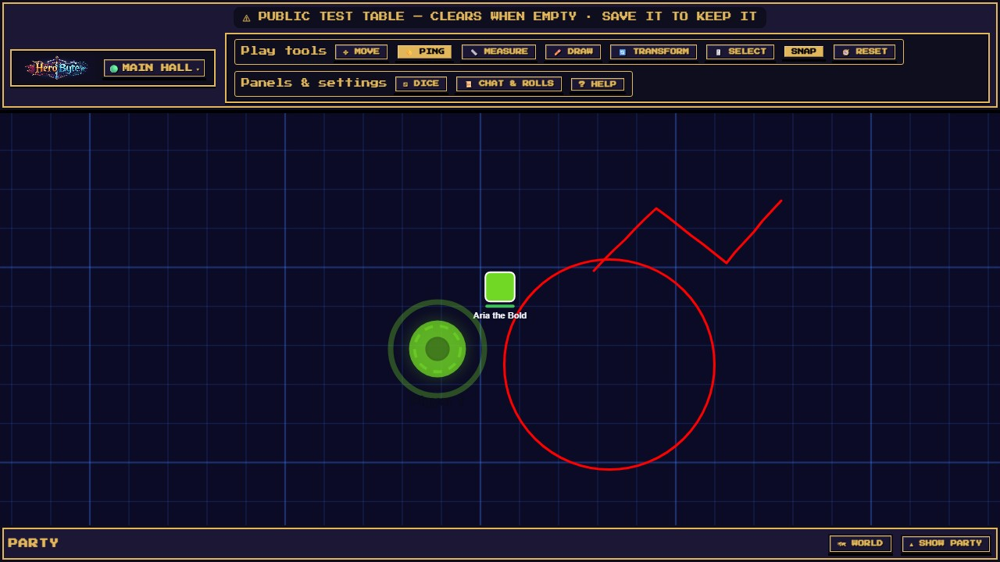

## Props (when your DM turns them on)

If your DM ticks **Players can add props** in their menu, a **📦 PROPS** button appears in the Party bar at the bottom (on a phone: **Tools → Props**). It turns any picture into a piece of the scene:

- **Add a prop** — upload an image or paste a URL, give it a label, pick a size, press **+ ADD PROP**. It lands at the centre of your view; drag it into place. Generate a treasure chest in your favorite image tool and put it on the table while the DM describes the room — that's exactly what this is for.
- **Scatter** — set **×N** before adding and that many copies land in a loose pile, numbered, each grabbable on its own.
- **Reshape it** — the **🔄 Transform** tool puts scale and rotate handles on your props, the same handles drawings get.
- **Yours are yours** — you can edit and delete only the props _you_ created. The DM can adjust or remove anything.

If the button isn't there, the table has props switched off — ask your DM.

## Voice chat

Voice works like joining a Discord call: one press to join, and you hear everyone in it.

- **Join:** press **🎤 Join voice** — in the header's **Panels & settings** row on a PC; on a phone, at the top of **Party**, or on the voice chip at the top of the map while a call is running. Your browser asks for the microphone (some ask on every visit).
- **Before you join** you can see whether a call is running and how many are in it (for example **2 in call**).
- **Mute / Unmute** silences your mic and keeps you in the call: you still hear everyone. On a PC your card's mic button does the same once you are in.
- **Leave voice** hangs up.
- On a PC, a **🎧** on a character's card (select a row in the Party, or show every card with **▦ CARDS**) marks someone in the call and **🔇** someone muted, and when someone talks their **portrait glows green and scales up**. On a phone, the top of **Party** lists who is in the call by name, with **(muted)** beside anyone muted.
- **It comes back by itself.** After a network blip, however long, you are back in the call in the same muted or unmuted state. After a reload you are too (some browsers ask for the microphone again first; if the table takes more than a minute to let you back in, press **Join voice**). Closing the tab and opening it again, or a browser restoring it, does not rejoin: press **Join voice**. If your browser blocks the sound until you tap, a **🔊 Tap to hear voice** button appears.
- If someone shows as **Can't reach _name_**, your two browsers could not connect directly; HeroByte keeps trying. Voice goes straight between players' browsers, with no relay server, so a phone on mobile data behind some carriers may not connect: Wi-Fi works best. Someone whose connection dropped without leaving can also show this, and stay listed in the call, for a few minutes.
- Because voice connects browsers directly, everyone in the call with you can find your internet (IP) address with their browser's developer tools (HeroByte never shows it), and while you are in a call with anyone else, your browser asks a Google server and a Twilio server to look your address up. If you don't join voice, nothing is shared.
- If your mic stops (for example it is unplugged), HeroByte takes you out of the call and says so beside **Join voice**; press it to come back. If others stop hearing you while you still look live, press **Leave voice**, then **Join voice**.
- On a phone, locking the screen or switching apps can cut the mic (a browser rule no web page can change). If the others stop hearing you, press **Leave voice**, then **Join voice**.
- Headphones are strongly recommended to avoid echo. Microphone access requires `https://` or `localhost`.

## Initiative and combat

Press **INIT** on your card (select your row in the Party, or show every card with **▦ CARDS**; on a phone, **⚔️ INIT** on your row in **Party**) to set initiative:

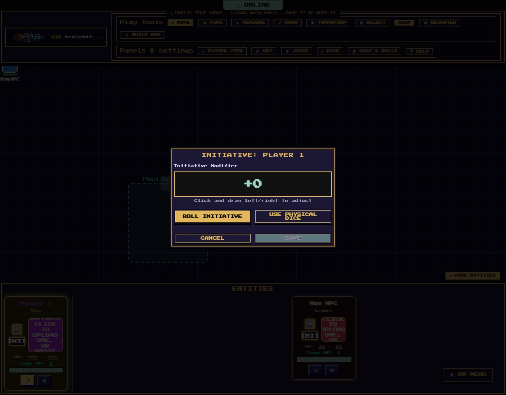

- Set the **Initiative Modifier** — drag the number left/right, or press **−** / **+** — then **ROLL D20 NOW**. The **server** throws the die, on the same generator the dice roller uses, and the result appears in the roll log for the whole table with your character's name on it. The dialog closes itself — there is nothing further to save.
- Or press **ENTER A ROLL BY HAND**, type the d20 you rolled at your real table, and press **SAVE INITIATIVE**. That reaches the log too, badged **BY HAND** — see [Rolling real dice instead](#rolling-real-dice-instead), which works the same way everywhere else you roll. If your DM has turned hand entry off, the dialog says so instead of offering the button.
- **Any initiative set while no fight is running starts combat** for the whole table, on that character's turn (when no fight is running, the dialog says so before you press): on desktop the Party reorders by initiative, its bar shows **⚔️ Combat Active** with `Turn N of M`, and the current combatant's row reads **Turn** in a white outline (its card, when shown, wears a white ring in a gold glow — a DM's own card has a gold border of its own, so the ring is the cue, not the colour). On a phone, see [Playing on a phone or tablet](#playing-on-a-phone-or-tablet).

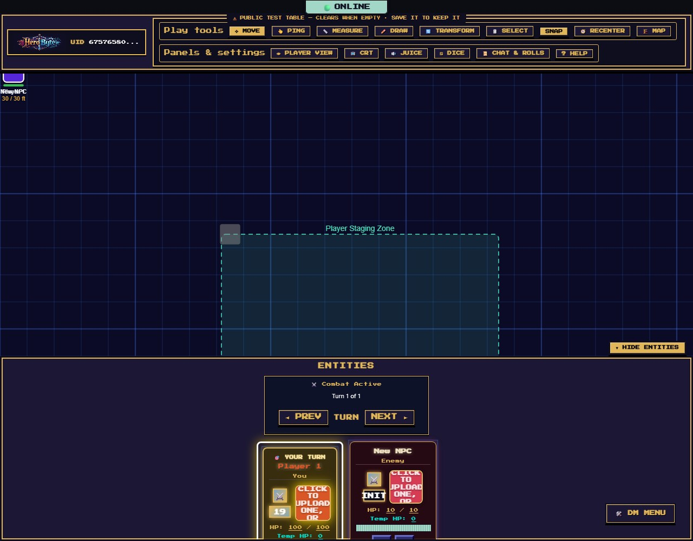

- **◄ PREV / NEXT ►** advance the turn (any player can nudge it; a chime marks each turn change).
- On **your** turn, your card says **🎯 YOUR TURN**.
- Ending combat and clearing everyone's initiative are DM controls.

## Doors, fog, and what you can see

When the DM runs a built map (walls, doors, fog of war):

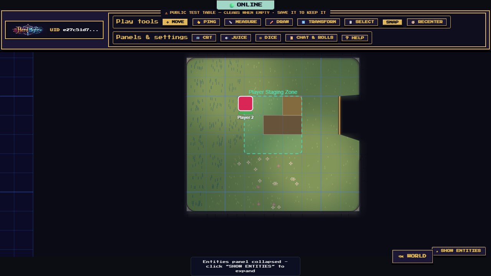

- **Fog of war** hides everything your characters can't see. Vision radiates from **your own tokens** and is blocked by walls and closed doors — move, and your view moves with you.
- **Your token may have a sight limit.** The DM can give any token a radius in feet — a torch, darkvision, a blindfold — and beyond it you see nothing even down an open corridor. Unset means you see as far as the walls allow, which is how every table worked before. Ask your DM; there is no player control for it, by design (a limit only ever narrows what you can see, so being able to switch it off would just undo the dark).
- **Somewhere you have already been stays dimly lit.** Once your tokens have seen a patch of map it is remembered and drawn shaded rather than black, so you can find your way back through a dungeon you have explored. It is only a memory of the GROUND — anything that has wandered in since is still hidden, because the table never sent it to you. The memory is stored in your own browser, per table and per map, so it does not follow you to another device and clears when the DM publishes a different map.
- **Doors are clickable**: click to open or close (everyone hears the creak/slam). A small gold square marks a **locked** door — only the DM can open those.
- **Secret doors exist.** You won't see them until the DM reveals one — to you it's just wall.
- At night the whole map cools and darkens, and torches, braziers, and other glowing props cast light pools.

## The World Map

**🗺 WORLD** (on a phone, **⚒ TOOLS → World**) opens your campaign map: every place your party has actually discovered, in a tree, with **◀ you are here** on the one you are standing in.

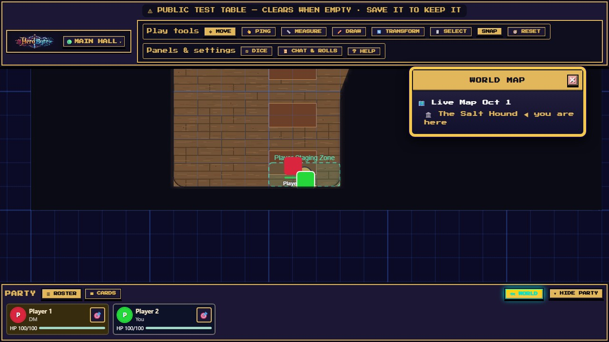

Places your DM has not revealed are not on it — and they are not hidden from it either, they were never sent to your browser at all.

Some maps have **🚪 door, stair or signpost sprites** on them — a way through to somewhere else. They are signposts, not buttons: your **DM** opens them, and when they do the whole table travels together. When you arrive somewhere new you will often find yourselves in a marked **entrance** — a dashed box just inside the door — which is simply where the party walks in.

## Look & feel

Both live in the [Table menu](#the-table-menu) under **Preferences**. They are yours alone: nobody else at the table sees them change, and each is remembered in this browser.

- **Display → 📺 CRT** — scanlines, bloom, and a monitor bezel for the full retro-dungeon experience.
- **Sound & motion** — **Motion** (Full / Subtle / Off) for animations, **Mute sound effects**, and **Volume**. HeroByte respects your OS "reduce motion" setting by default. Damage and healing float off cards and tokens as rising `-7` / `+4` numbers.

## Playing on a phone or tablet

Initiative works on a phone too: **⚔️ INIT** on your character's row in **Party** opens the same dialog, each row that has an initiative reads its **Init** and, on the character whose turn it is, **▶ Turn**, and while combat runs the turn strip at the top of the map names whose turn it is, just below **◄ PREV / NEXT ►** (**Turn: —** when nobody holds the turn, or when it is a creature you cannot see) (your spend and the DM's Reset are in each row's **⚙ EDIT**).

On a small or touch screen, HeroByte switches to a full-screen map with a five-button dock — no setup required:

|                                                                              |                                                 |
| ---------------------------------------------------------------------------- | ----------------------------------------------- |
| 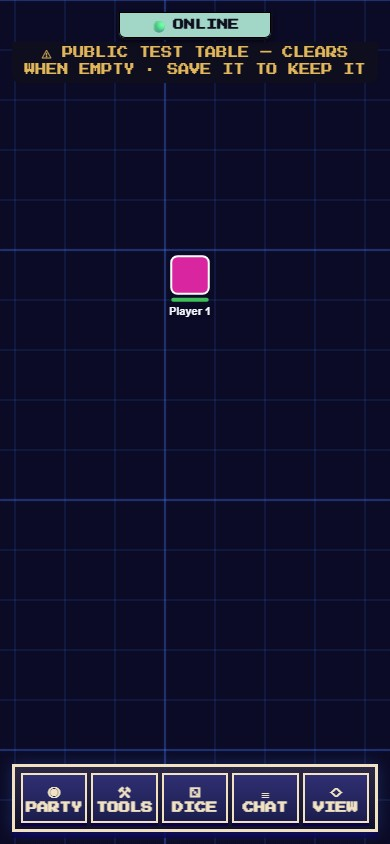 | 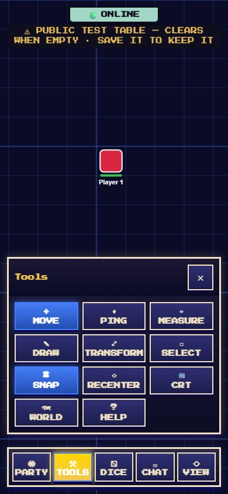 |

- **◉ PARTY** — the party screen: the voice call at the top (**🎤 Join voice**, or **Mute** / **Leave voice** and who is in the call), then each player's seat as a heading with their characters listed under it — portraits, HP (tap or drag your own to edit), status effects, **🎯 FOCUS** (closes the screen and centres the map on that character's token), and — on your own rows — **⚔️ INIT** (your character's initiative) and **⚙️ EDIT** for name, portrait, token size, **➕ Add Character**, and **Save character / Load character…**.
- **⚒ TOOLS** — Move, Ping, Measure, Draw (opens the drawing sheet; Hide controls makes room on the map), Transform, Select, Snap, Reset view (moves the view back to the map's top-left corner at 100% zoom), **Table** (your role and Preferences), and Help. Players also have World, plus Props when the DM allows players to add them.
- **⚂ DICE** — a full-screen roller; the result appears as a tap-to-dismiss card.
- **≡ Chat** — opens **Chat & Rolls** full screen for table messages, whispers, and dice history. **◇ RESET** does the same reset (back to the map's top-left corner, 100% zoom); if you're the DM, that slot reads **♛ DM** and opens the full DM menu — the same six tabs as the desktop window (Maps, World, Encounter, NPCs & Monsters, Props & Objects, Table) behind a swipeable chip row. Reset view in TOOLS covers the camera for a DM.

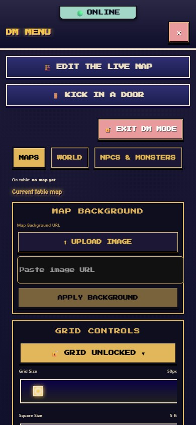

Party and Chat & Rolls open as full screens: close them with the **✕**, or drag their title bar downward to flick them away. The connection (🟢 ONLINE / 🔴 OFFLINE) is the first line of every full screen's header, above its title (and at the top of the full-screen dice roller), and the first line at the top of the map, above the turn strip — laid out with them, not painted over them. When the table drops, a **Reconnecting…** note joins that column under it, and on a desktop hangs from the bottom edge of the header.

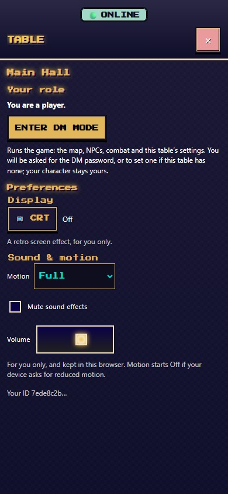

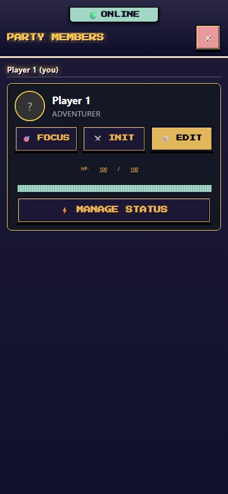

To move a piece by steps on a phone: **TOOLS → □ Select**, tap the piece, and a d-pad appears in its sheet (hold a direction to walk; the map scrolls to keep the piece in view — the whole piece and its nameplate when the strip above the sheet has room, otherwise its top edge).

One finger pans, two fingers pinch-zoom. Preferences (CRT, Sound & motion) are in **TOOLS → Table**, and character files are in a row's **⚙️ EDIT**. DM map authoring also works on mobile — see [On a phone or tablet](map-editor-guide.md#on-a-phone-or-tablet) in the map editor guide.
